# 处理文本数据


## 本章内容

- 为大型语言模型训练准备文本
- 将文本拆分为单词和子词词元
- 使用字节对编码进行更高级的文本词元化
- 使用滑动窗口方法抽样训练示例
- 将词元转换为供大型语言模型输入的向量

在上一章中，我们概述了大型语言模型（LLM）的结构，了解到这些模型是在大量文本上预训练的。我们特别关注了基于 Transformer 架构的仅解码器 LLM，这是 ChatGPT 等流行 GPT 类 LLM 的基础。

在预训练阶段，LLM 按词逐步处理文本。通过使用下一词预测任务训练拥有数百万到数十亿参数的 LLM，模型展现了强大的能力。之后，这些模型可以进一步微调，以遵循指令或执行特定任务。但在我们能实现和训练 LLM 之前，需要先准备训练数据集，这是本章的核心内容，如图 2.1 所示。

图 2.1：构建 LLM 的三个主要阶段，包括实现 LLM 架构和数据准备过程，预训练 LLM 的基础模型，以及对基础模型进行微调，使其能够执行个人助手或文本分类等任务。
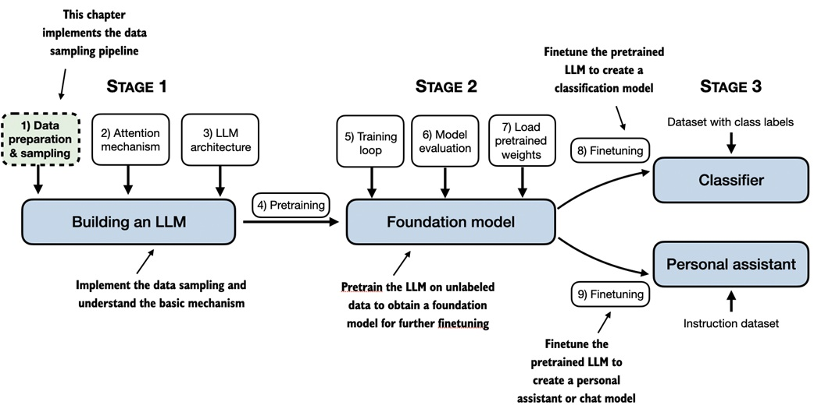
在本章中，您将学习如何准备用于训练 LLM 的输入文本。这包括将文本分解为单词和子词词元，然后对其进行编码，以供 LLM 使用。您还将了解字节对编码等高级词元化方法，这在 GPT 等主流 LLM 中被广泛应用。最后，我们将实现一种抽样和数据加载策略，以生成下一章训练 LLM 所需的输入-输出对。

## 2.1 理解词嵌入

深度神经网络模型，包括 LLM，无法直接处理原始文本。由于文本是类别型的，它与用于实现和训练神经网络的数学运算不兼容。因此，我们需要一种方法将单词表示为连续数值向量。（不熟悉计算环境中的向量和张量的读者可以参考附录 A，章节 A2.2 了解张量。）

将数据转化为向量格式的过程通常称为“嵌入”。我们可以使用特定的神经网络层或其他预训练的神经网络模型，将不同的数据类型（如视频、音频和文本）转化为嵌入，如图 2.2 所示。

图 2.2：深度学习模型无法直接处理视频、音频和文本等数据的原始形式。因此，我们使用嵌入模型将这些原始数据转化为密集的向量表示，以便深度学习架构能够理解和处理。此图特别展示了将原始数据转换为三维数值向量的过程。
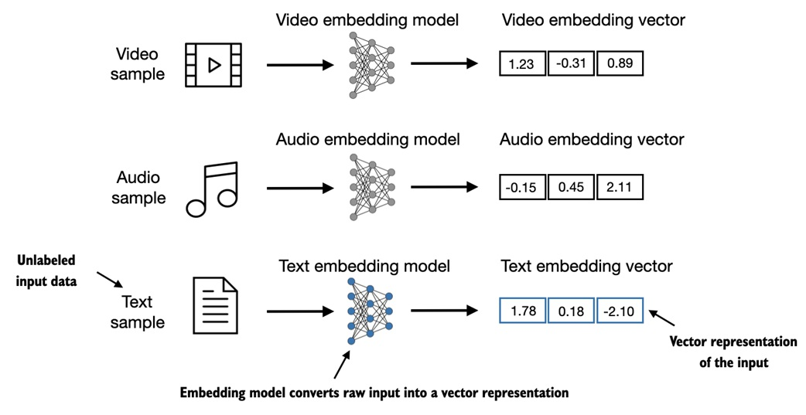
正如图 2.2 所示，我们可以通过嵌入模型处理多种不同的数据格式。但需要注意的是，不同的数据格式需要不同的嵌入模型。例如，适用于文本的嵌入模型并不适用于音频或视频数据。

嵌入的核心在于将离散对象（如单词、图像甚至整个文档）映射到连续的向量空间中，其主要目的是将非数值数据转换为神经网络能够处理的格式。

尽管词嵌入是最常见的文本嵌入形式，但还有句子、段落甚至整个文档的嵌入。句子或段落嵌入常用于检索增强生成，这是一种结合生成（如生成文本）与检索（如搜索外部知识库）以生成文本时提取相关信息的技术，超出本书范围。由于本书目标是训练类似 GPT 的 LLM，即逐词生成文本，因此本章将重点放在词嵌入上。

多种算法和框架可用于生成词嵌入，较早且广泛使用的一个例子是 Word2Vec 方法。Word2Vec 通过预测目标词的上下文或相反方向来训练神经网络架构生成词嵌入。Word2Vec 的核心理念是出现在相似上下文中的词语往往具有相似的含义。因此，当将词嵌入投射到二维空间进行可视化时，可以看到相似词聚集在一起，如图 2.3 所示。

图 2.3：如果词嵌入是二维的，我们可以将其绘制在二维散点图中以进行可视化。使用类似 Word2Vec 的词嵌入技术后，代表相似概念的词通常会在嵌入空间中靠近。例如，不同类型的鸟在嵌入空间中比国家和城市更接近。
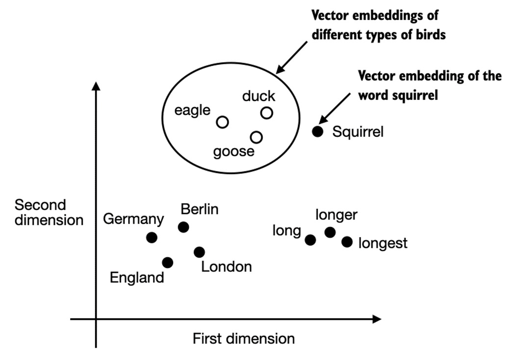
词嵌入的维度可以从一维到上千维不等。正如图 2.3 所示，为了可视化，我们可以选择二维词嵌入。更高的维度可能捕捉到更多细微关系，但会牺牲计算效率。

虽然我们可以使用预训练模型（如 Word2Vec）生成机器学习模型的嵌入，但 LLM 通常会生成其自身的嵌入，它们是输入层的一部分，并在训练过程中不断更新。相对于使用 Word2Vec，将嵌入优化为 LLM 训练的一部分的优势在于嵌入会根据特定任务和数据进行优化。本章稍后将实现这种嵌入层。此外，LLM 还可以生成上下文化的输出嵌入，这将在第三章中讨论。

然而，高维嵌入在可视化方面存在挑战，因为我们的感官认知和常见的图形表示通常仅限于三维或以下，这也是图 2.3 中仅展示二维嵌入的原因。然而，在使用 LLM 时，我们通常采用更高维度的嵌入。以 GPT-2 和 GPT-3 为例，嵌入大小（通常指模型隐藏状态的维度）会根据具体的模型变体和大小而变化，这是一种性能和效率的权衡。

接下来的章节将介绍准备 LLM 嵌入所需的步骤，包括将文本拆分为单词、将单词转化为词元，以及将词元转化为嵌入向量。

## 2.2 文本词元化

本节介绍如何将输入文本拆分为独立的词元，这是创建 LLM 嵌入所需的预处理步骤。这些词元可以是单词或特殊字符，包括标点符号，如图 2.4 所示。

图 2.4：本节所涵盖的 LLM 文本处理步骤。我们将输入文本拆分为独立的词元，这些词元可以是单词或标点符号。在接下来的部分中，我们将文本转换为词元 ID 并创建词元嵌入。
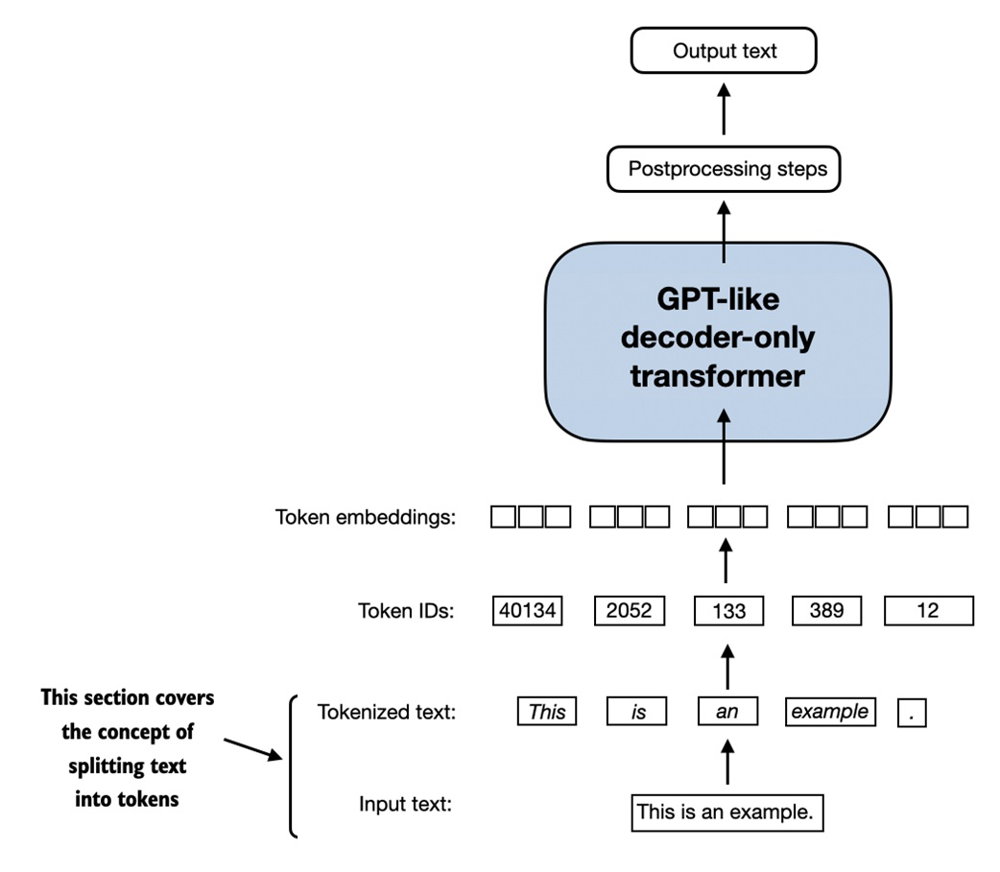
为了演示 LLM 训练，我们将使用 Edith Wharton 的短篇小说《The Verdict》（《判决》），这是已进入公共领域的文本，允许用于 LLM 训练任务。该文本可在 Wikisource 获取（[链接](https://en.wikisource.org/wiki/The_Verdict)），您可以将其复制并粘贴到文本文件中，我们将该文件命名为“the-verdict.txt”。可以使用 Python 的标准文件读取工具加载它：

#### 代码示例 2.1：将短篇小说作为文本示例导入 Python

```python
with open("the-verdict.txt", "r", encoding="utf-8") as f:
    raw_text = f.read()
print("Total number of characters:", len(raw_text))
print(raw_text[:99])
```

输出示例：

```plaintext
Total number of characters: 20479
I HAD always thought Jack Gisburn rather a cheap genius--though a good fellow enough--so it was no
```

我们的目标是将这篇 20479 字符的短篇小说分解为单词和特殊字符，以便在后续章节中将其转化为嵌入。

#### 文本样本大小

在 LLM 训练中，通常会处理上百万篇文章和数十万本书，文本数据量高达数 GB。不过，出于教学目的，使用较小的文本样本（如一本书）足以说明文本处理的主要思想，并能在常规硬件上合理运行。

#### 如何有效地拆分文本

如何最有效地将文本拆分为词元列表？为此，我们将利用 Python 的正则表达式库 `re` 进行示例操作。（无需记住正则表达式语法，因为本章后面将使用预构建的词元化工具。）

使用一些简单的示例文本，我们可以使用 `re.split` 命令并通过以下语法按空白字符拆分文本：

```python
import re
text = "Hello, world. This, is a test."
result = re.split(r'(\s)', text)
print(result)
```

输出：

```plaintext
['Hello,', ' ', 'world.', ' ', 'This,', ' ', 'is', ' ', 'a', ' ', 'test.']
```

简单的词元化方案可以将示例文本拆分为单词和空白字符以及标点符号。不过，有些单词仍附带标点符号，而我们希望这些标点符号能够作为独立的列表项。我们不会将文本全部转为小写，因为大写能帮助 LLM 区分专有名词和普通名词，理解句子结构，并学习正确的文本生成格式。

接下来，我们修改正则表达式，以空白字符 `\s`、逗号和句号 `[,.]` 进行拆分：

```python
result = re.split(r'([,.]|\s)', text)
print(result)
```

输出结果：

```plaintext
['Hello', ',', '', ' ', 'world', '.', '', ' ', 'This', ',', '', ' ', 'is', ' ', 'a', ' ', 'test', '.', '']
```

列表中仍包含空白字符，可以选择将其移除，以获得更简洁的输出：

```python
result = [item for item in result if item.strip()]
print(result)
```

输出：

```plaintext
['Hello', ',', 'world', '.', 'This', ',', 'is', 'a', 'test', '.']
```

#### 是否移除空白字符

在开发简单词元化器时，是否将空白字符编码为单独字符取决于应用需求。移除空白字符可以减少内存和计算需求，但保留空白字符可能对对空白敏感的模型（如 Python 代码）更有帮助。这里为简单化，我们移除了空白字符。

我们进一步修改词元化方案，使其能够处理其他标点符号，如问号、引号和双短横线等：

```python
text = "Hello, world. Is this-- a test?"
result = re.split(r'([,.:;?_!"()']|--|\s)', text)
result = [item.strip() for item in result if item.strip()]
print(result)
```

输出：

```plaintext
['Hello', ',', 'world', '.', 'Is', 'this', '--', 'a', 'test', '?']
```

如图 2.5 所示，当前的词元化方案能够成功处理文本中的各种特殊字符。

图 2.5：我们实现的词元化方案将文本拆分为单词和标点符号。在此示例中，示例文本被拆分为 10 个独立词元。
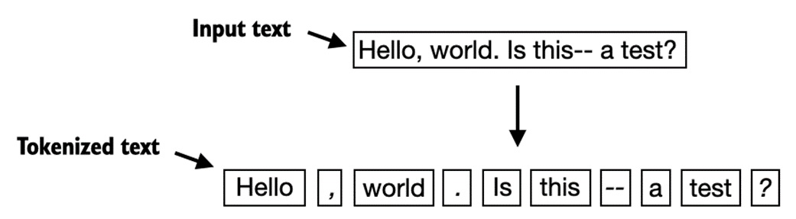

#### 将词元化应用于整个短篇小说

现在我们已经实现了一个基本的词元化器，让我们将其应用于 Edith Wharton 的短篇小说：

```python
preprocessed = re.split(r'([,.?_!"()']|--|\s)', raw_text)
preprocessed = [item.strip() for item in preprocessed if item.strip()]
print(len(preprocessed))
```

输出：

```plaintext
4649
```

文本中词元数量为 4649（不含空白字符）。

快速查看前 30 个词元：

```python
print(preprocessed[:30])
```

输出表明词元化器在处理文本方面效果良好，各个单词和特殊字符已整齐分开：

```plaintext
['I', 'HAD', 'always', 'thought', 'Jack', 'Gisburn', 'rather', 'a', 'cheap', 'genius', 
```

## 2.3 将词元转换为词元 ID

在上一节中，我们将 Edith Wharton 的短篇小说分割为独立的词元。在本节中，我们将这些词元从 Python 字符串转换为整数表示，即所谓的词元 ID。该转换是将词元 ID 转换为嵌入向量之前的中间步骤。

为了将词元映射到词元 ID，我们需要先构建一个所谓的“词汇表”。这个词汇表定义了如何将每个独特的单词和特殊字符映射到唯一的整数，如图 2.6 所示。

图 2.6：我们通过将训练数据集中的文本词元化来构建词汇表。将这些独立的词元按字母顺序排序并移除重复项后，生成一个包含所有唯一词元的词汇表，该词汇表定义了每个唯一词元到唯一整数值的映射。
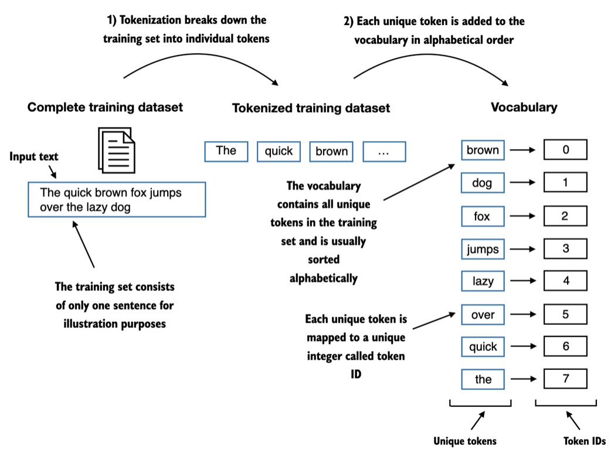
在上一节中，我们将 Edith Wharton 的短篇小说的词元赋值给一个名为 `preprocessed` 的 Python 变量。现在，我们可以创建所有唯一词元的列表并按字母顺序排序，以确定词汇表的大小：

```python
all_words = sorted(list(set(preprocessed)))
vocab_size = len(all_words)
print(vocab_size)
```

执行上述代码后得出词汇表大小为 1159。接下来，我们创建词汇表并展示前 50 个词元以供参考：

#### 代码示例 2.2：创建词汇表

```python
vocab = {token: integer for integer, token in enumerate(all_words)}
for i, item in enumerate(vocab.items()):
    print(item)
    if i > 50:
        break
```

输出示例：

```plaintext
('!', 0)
('"', 1)
("'", 2)
...
('Has', 49)
('He', 50)
```

如上所示，字典包含与唯一整数标签关联的独立词元。接下来，我们将使用该词汇表将新文本转换为词元 ID，如图 2.7 所示。

图 2.7：从新文本示例开始，我们将文本词元化并使用词汇表将词元转换为词元 ID。该词汇表基于整个训练集构建，可以应用于训练集本身及任何新的文本样本。
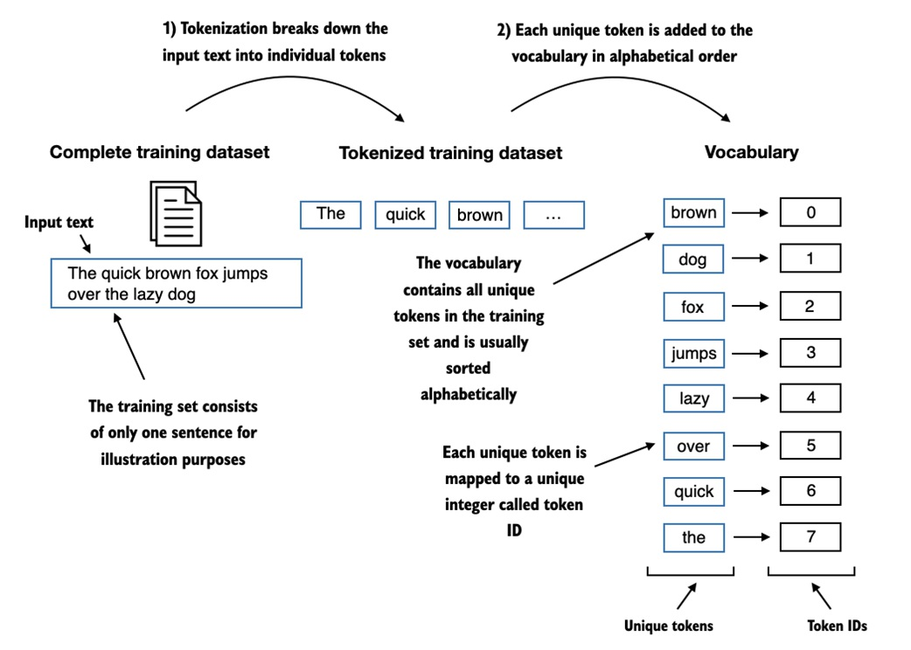
在后续章节中，当我们希望将 LLM 输出从数字转换回文本时，还需要一种方法将词元 ID 转换回对应的文本词元。为此，我们可以创建词汇表的反向版本，将词元 ID 映射回相应的文本词元。

让我们在 Python 中实现一个完整的词元化类，包括 `encode` 方法（将文本拆分为词元并通过词汇表进行字符串到整数的映射，以生成词元 ID）和 `decode` 方法（执行反向整数到字符串的映射，将词元 ID 转换回文本）。

#### 代码示例 2.3：实现简单的文本词元化器

```python
class SimpleTokenizerV1:
    def __init__(self, vocab):
        self.str_to_int = vocab  # A
        self.int_to_str = {i: s for s, i in vocab.items()}  # B

    def encode(self, text):  # C
        preprocessed = re.split(r'([,.?_!"()']|--|\s)', text)
        preprocessed = [item.strip() for item in preprocessed if item.strip()]
        ids = [self.str_to_int[s] for s in preprocessed]
        return ids

    def decode(self, ids):  # D
        text = " ".join([self.int_to_str[i] for i in ids])
        text = re.sub(r'\s+([,.?!"()'])', r'\1', text)  # E
        return text
```

通过上面的 `SimpleTokenizerV1` 类，我们可以使用现有的词汇表实例化新的词元化器对象，随后用于编码和解码文本，如图 2.8 所示。

图 2.8：词元化器实现通常包含两个常用方法：`encode` 方法和 `decode` 方法。`encode` 方法接收文本样本，将其拆分为独立词元并通过词汇表将词元转换为词元 ID；`decode` 方法接收词元 ID，将其转换回文本词元并将这些词元拼接为自然文本。
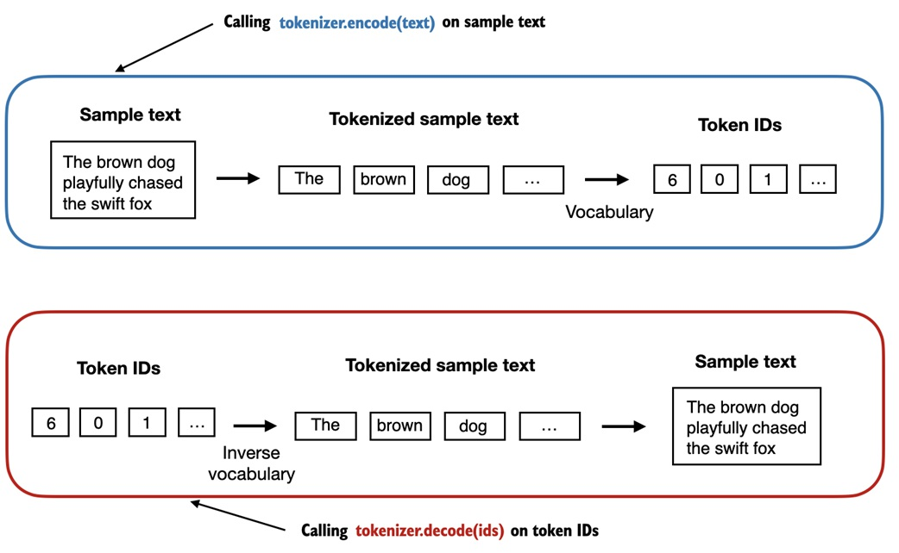

#### 实例化并使用词元化器

让我们从 `SimpleTokenizerV1` 类中实例化一个新的词元化器对象，并试用它来词元化 Edith Wharton 短篇小说中的一段文字：

```python
tokenizer = SimpleTokenizerV1(vocab)
text = """"It's the last he painted, you know," Mrs. Gisburn said with pardonable pride."""
ids = tokenizer.encode(text)
print(ids)
```

输出词元 ID：

```plaintext
[1, 58, 2, 872, 1013, 615, 541, 763, 5, 1155, 608, 5, 1, 69, 7, 39, 873, 1136, 773, 812, 7]
```

接下来，让我们使用 `decode` 方法将这些词元 ID 转换回文本：

```python
print(tokenizer.decode(ids))
```

输出文本：

```plaintext
'" It's the last he painted, you know," Mrs. Gisburn said with pardonable pride.'
```

输出显示 `decode` 方法成功将词元 ID 转换回原始文本。

#### 处理训练集中未包含的词

我们编写的词元化器可以基于训练集中的词元进行词元化和去词元化。让我们将其应用于训练集中未包含的新文本：

```python
text = "Hello, do you like tea?"
tokenizer.encode(text)
```

执行上述代码会产生以下错误：

```plaintext
KeyError: 'Hello'
```

这是因为单词“Hello”在《The Verdict》短篇小说中未出现，因此不在词汇表中。这提醒我们，在构建 LLM 时需要使用大型且多样化的训练集以扩展词汇表。

在下一节中，我们将进一步测试包含未知词汇的文本，并讨论用于在训练中为 LLM 提供额外上下文的特殊词元。

## 2.4 添加特殊上下文词元

在上一节中，我们实现了一个简单的词元化器并将其应用于训练集中的一段文字。在本节中，我们将修改该词元化器，以便它能够处理未知单词。我们还将讨论如何使用和添加特殊的上下文词元，以帮助模型理解文本中的上下文或其他相关信息。这些特殊词元可以包括未知单词的标记和文档边界等。

我们将修改 `SimpleTokenizerV2` 词汇表和词元化器，以支持两个新词元：`<|unk|>` 和 `<|endoftext|>`，如图 2.9 所示。

图 2.9：我们在词汇表中添加特殊词元以应对某些上下文。例如，添加 `<|unk|>` 用于表示训练数据中未出现的未知单词，添加 `<|endoftext|>` 用于分隔两个不相关的文本源。
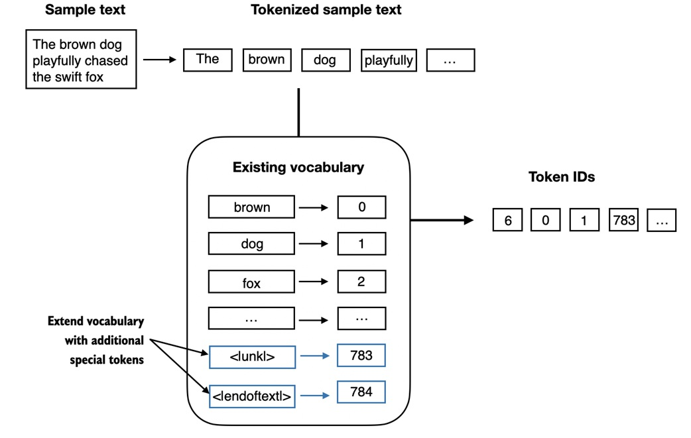
正如图 2.9 所示，当遇到词汇表中没有的词时，我们可以修改词元化器使用 `<|unk|>`。此外，当在多个独立的文档或书籍上训练 GPT 类 LLM 时，通常会在每个后续文本源前插入一个特殊词元，以帮助 LLM 识别文本源彼此独立，如图 2.10 所示。

图 2.10：当处理多个独立文本源时，我们在这些文本之间添加 `<|endoftext|>` 词元。这些 `<|endoftext|>` 词元充当标记，标识某个片段的开始或结束，便于 LLM 更有效地处理和理解。
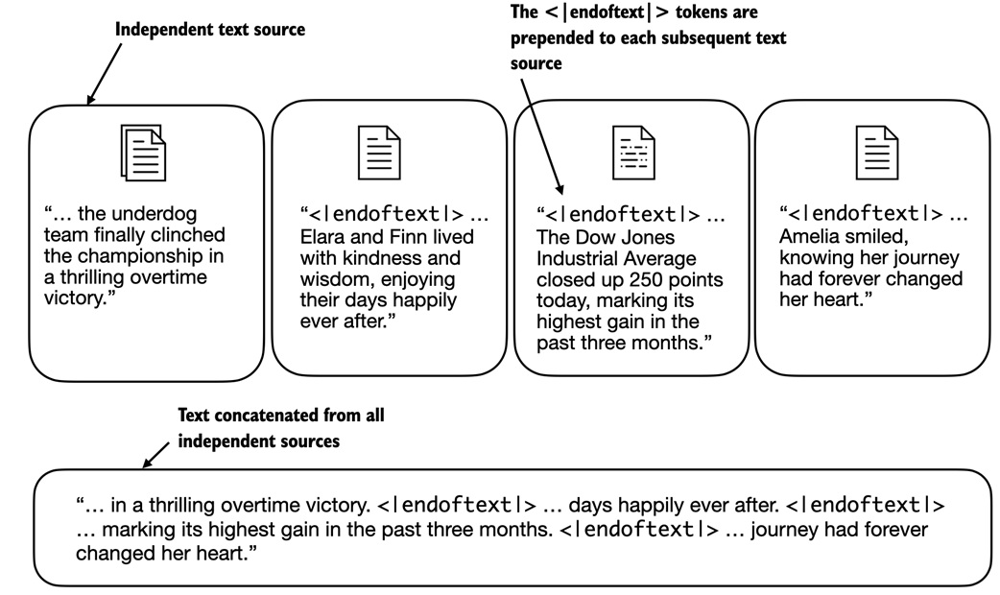

#### 修改词汇表以包含特殊词元

让我们将这两个特殊词元 `<|unk|>` 和 `<|endoftext|>` 添加到所有唯一词元的列表中：

```python
all_tokens = sorted(list(set(preprocessed)))
all_tokens.extend(["<|endoftext|>", "<|unk|>"])
vocab = {token: integer for integer, token in enumerate(all_tokens)}
print(len(vocab.items()))
```

通过上面的 `print` 输出可以看到，新词汇表大小为 1161（之前的词汇表大小为 1159）。快速检查词汇表的最后 5 个条目：

```python
for i, item in enumerate(list(vocab.items())[-5:]):
    print(item)
```

输出：

```plaintext
('younger', 1156)
('your', 1157)
('yourself', 1158)
('<|endoftext|>', 1159)
('<|unk|>', 1160)
```

代码输出确认两个新添加的特殊词元已成功加入词汇表。接下来，我们根据代码示例 2.3 调整词元化器，具体见代码示例 2.4：

#### 代码示例 2.4：处理未知单词的简单文本词元化器

```python
class SimpleTokenizerV2:
    def __init__(self, vocab):
        self.str_to_int = vocab
        self.int_to_str = {i: s for s, i in vocab.items()}

    def encode(self, text):
        preprocessed = re.split(r'([,.?_!"()']|--|\s)', text)
        preprocessed = [item.strip() for item in preprocessed if item.strip()]
        preprocessed = [item if item in self.str_to_int else "<|unk|>" for item in preprocessed]  # A
        ids = [self.str_to_int[s] for s in preprocessed]
        return ids

    def decode(self, ids):
        text = " ".join([self.int_to_str[i] for i in ids])
        text = re.sub(r'\s+([,.?!"()'])', r'\1', text)  # B
        return text
```

与上一节中实现的 `SimpleTokenizerV1` 相比，新的 `SimpleTokenizerV2` 将未知单词替换为 `<|unk|>` 词元。

#### 实践中试用新词元化器

我们将使用两个独立、不相关的句子组成一个简单文本样本来测试新词元化器：

```python
text1 = "Hello, do you like tea?"
text2 = "In the sunlit terraces of the palace."
text = " <|endoftext|> ".join((text1, text2))
print(text)
```

输出：

```plaintext
'Hello, do you like tea? <|endoftext|> In the sunlit terraces of the palace.'
```

接下来，让我们使用 `SimpleTokenizerV2` 对样本文本进行词元化：

```python
tokenizer = SimpleTokenizerV2(vocab)
print(tokenizer.encode(text))
```

输出词元 ID 列表：

```plaintext
[1160, 5, 362, 1155, 642, 1000, 10, 1159, 57, 1013, 981, 1009, 738, 1013, 1160, 7]
```

可以看到，词元 ID 列表包含用于 `<|endoftext|>` 分隔词元的 `1159`，以及用于未知单词的两个 `1160`。

#### 对词元化文本进行去词元化检查

```python
print(tokenizer.decode(tokenizer.encode(text)))
```

输出：

```plaintext
'<|unk|>, do you like tea? <|endoftext|> In the sunlit terraces of the <|unk|>.'
```

通过将去词元化文本与原始输入文本进行比较，我们可以确认训练数据集中没有出现单词“Hello”和“palace”。

#### 其他特殊词元

除了 `<|unk|>` 和 `<|endoftext|>`，某些 LLM 实现还使用其他特殊词元，如：

- `[BOS]`（序列开始）：标识文本的开头，指示 LLM 内容的起始位置。
- `[EOS]`（序列结束）：位于文本结尾，特别适用于连接多个不相关文本。
- `[PAD]`（填充）：在批量训练时确保所有文本长度相同，通过 `[PAD]` 词元填充较短的文本。

GPT 模型的词元化器通常只使用 `<|endoftext|>` 词元来实现简化。`<|endoftext|>` 相当于 `[EOS]`，并用于填充。然而，在批量输入的训练中通常会使用掩码，以避免关注填充词元，具体词元的选择便不再重要。

此外，GPT 模型的词元化器不使用 `<|unk|>` 词元处理词汇表外的词。取而代之的是使用字节对编码（BPE）词元化器，将单词分解为子词单元，下一节将详细讨论这一内容.

## 2.5 字节对编码

在前几节中，我们实现了一个简单的词元化方案以示例操作。本节介绍一种更复杂的词元化方案：字节对编码（BPE）。此方法用于训练 LLM，如 GPT-2、GPT-3 以及最初用于 ChatGPT 的模型。

由于实现 BPE 可能相对复杂，我们将使用一个名为 `tiktoken` 的开源 Python 库（[GitHub 链接](https://github.com/openai/tiktoken)）。`tiktoken` 库基于 Rust 实现了 BPE 算法，效率较高。我们可以通过 Python 的 pip 安装该库：

```bash
pip install tiktoken
```

本章代码基于 `tiktoken` 0.5.1。您可以使用以下代码检查已安装的版本：

```python
from importlib.metadata import version
import tiktoken
print("tiktoken version:", version("tiktoken"))
```

安装后，我们可以通过以下方式实例化 `tiktoken` 的 BPE 词元化器：

```python
tokenizer = tiktoken.get_encoding("gpt2")
```

这个词元化器的使用方式与我们之前实现的 `SimpleTokenizerV2` 类似，可以通过 `encode` 方法编码文本：

```python
text = "Hello, do you like tea? <|endoftext|> In the sunlit terraces of someunknownPlace."
integers = tokenizer.encode(text, allowed_special={"<|endoftext|>"})
print(integers)
```

输出词元 ID：

```plaintext
[15496, 11, 466, 345, 588, 8887, 30, 220, 50256, 554, 262, 4252, 18250, 8812, 2114, 286, 617, 34680, 27271, 13]
```

我们可以使用 `decode` 方法将这些词元 ID 转换回文本：

```python
strings = tokenizer.decode(integers)
print(strings)
```

输出文本：

```plaintext
'Hello, do you like tea? <|endoftext|> In the sunlit terraces of someunknownPlace.'
```

#### 关键观察

1. `<|endoftext|>` 词元被分配了相对较大的 ID：50256。BPE 词汇表的总大小为 50,257，且 `<|endoftext|>` 被分配了最大的词元 ID。
2. BPE 词元化器能够正确编码和解码未知单词，如 "someunknownPlace"，无需使用 `<|unk|>` 词元。这是因为 BPE 可以将不在词汇表中的单词分解为更小的子词单元或字符，使其能够处理词汇表外的单词。

#### BPE 如何处理未知单词

BPE 算法将不在预定义词汇表中的单词拆分为子词或单个字符序列，如图 2.11 所示。

图 2.11：BPE 词元化器将未知单词拆分为子词和字符，因此 BPE 词元化器可以解析任何单词而不需要特殊的 `<|unk|>` 词元。
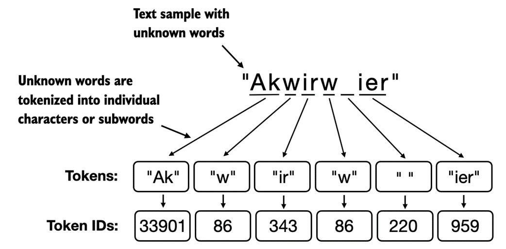
这种将未知单词拆解为子词或字符的能力确保了词元化器以及基于该词元化器训练的 LLM 可以处理任何文本，即使文本中包含训练数据中未出现的单词。

#### 练习 2.1：字节对编码未知单词

尝试使用 `tiktoken` 库的 BPE 词元化器对未知单词 "Akwirw ier" 进行编码并打印各个词元 ID。然后，对这些整数列表中的每个元素调用 `decode` 函数，重新构建图 2.11 中所示的映射。最后，对这些词元 ID 调用 `decode` 方法，检查它是否能还原原始输入 "Akwirw ier"。

### BPE 的基本原理

BPE 通过迭代地将高频字符合并为子词，再将高频子词合并为词来构建词汇表。例如，BPE 首先将所有单个字符添加到词汇表中（"a"、"b" 等）。在下一阶段，它将频繁出现的字符组合（如 "d" 和 "e"）合并为子词 "de"，该子词在 "define"、"depend"、"made" 和 "hidden" 等英语单词中很常见。

### 2.6 使用滑动窗口进行数据采样

在前一节中，我们详细介绍了词元化步骤以及将字符串词元转换为整数词元 ID 的过程。在创建 LLM 的嵌入之前的最后一步是生成用于训练的输入-目标对。

这些输入-目标对是什么样子的呢？正如我们在第一章中所了解到的，LLM 是通过预测文本中的下一个词进行预训练的，如图 2.12 所示。

图 2.12：给定一个文本样本，从中提取输入块作为 LLM 的输入子样本，LLM 在训练过程中预测该输入块之后的下一个词。在训练中，我们屏蔽了超过目标词之后的所有词。需要注意的是，图中展示的文本在 LLM 处理之前会经历词元化步骤，但为便于说明，此图省略了词元化步骤。
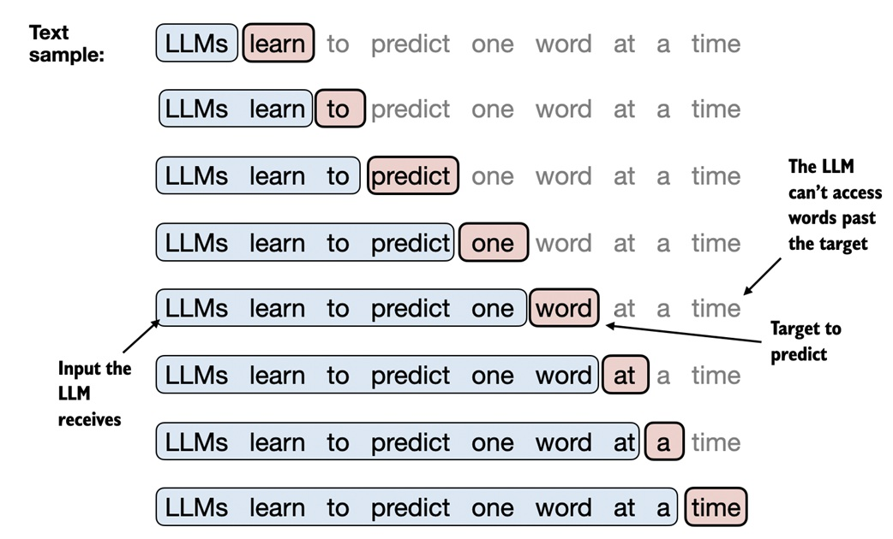
在本节中，我们将实现一个数据加载器，它使用滑动窗口方法从训练数据集中获取图 2.12 所示的输入-目标对。

首先，我们将使用上一节介绍的 BPE 词元化器对整个《The Verdict》短篇小说进行词元化：

```python
with open("the-verdict.txt", "r", encoding="utf-8") as f:
    raw_text = f.read()
enc_text = tokenizer.encode(raw_text)
print(len(enc_text))
```

执行上述代码后，词元化后的训练集总词元数为 5145。

接下来，我们出于演示目的移除数据集中的前 50 个词元，这样可以得到稍微更有趣的文本片段：

```python
enc_sample = enc_text[50:]
```

创建下一词预测任务的输入-目标对最简单直观的方法之一是创建两个变量 `x` 和 `y`，其中 `x` 包含输入词元，`y` 包含作为目标的词元，即将输入右移一位：

```python
context_size = 4  # A
x = enc_sample[:context_size]
y = enc_sample[1:context_size+1]
print(f"x: {x}")
print(f"y: {y}")
```

运行上述代码将打印以下输出：

```plaintext
x: [290, 4920, 2241, 287]
y: [4920, 2241, 287, 257]
```

通过处理输入以及作为目标的词元（输入右移一个位置），我们就可以创建图 2.12 所示的下一词预测任务，如下所示：

```python
for i in range(1, context_size+1):
    context = enc_sample[:i]
    desired = enc_sample[i]
    print(context, "---->", desired)
```

上述代码将打印以下内容：

```plaintext
[290] ----> 4920
[290, 4920] ----> 2241
[290, 4920, 2241] ----> 287
[290, 4920, 2241, 287] ----> 257
```

箭头左边的内容（---->）代表 LLM 将接收到的输入，箭头右边的词元 ID 表示 LLM 需要预测的目标词元 ID。

为了直观展示效果，让我们重复前面的代码，但将词元 ID 转换为文本：

```python
for i in range(1, context_size+1):
    context = enc_sample[:i]
    desired = enc_sample[i]
    print(tokenizer.decode(context), "---->", tokenizer.decode([desired]))
```

以下输出展示了输入和输出的文本格式：

```plaintext
and ----> established
and established ----> himself
and established himself ----> in
and established himself in ----> a
```

现在，我们已经创建了可以用于 LLM 训练的输入-目标对。

在将词元转换为嵌入之前，还有一项任务要完成：实现一个高效的数据加载器，该加载器迭代输入数据集并以 PyTorch 张量的形式返回输入和目标。PyTorch 张量可以视为多维数组。

特别是，我们需要返回两个张量：一个输入张量包含 LLM 接收到的文本，另一个目标张量包含 LLM 需要预测的目标词元，如图 2.13 所示。

图 2.13：为了实现高效的数据加载器，我们将输入收集到一个张量 `x` 中，其中每一行表示一个输入上下文。另一个张量 `y` 包含相应的预测目标（下一个词），这些目标通过将输入向右移一位来创建。
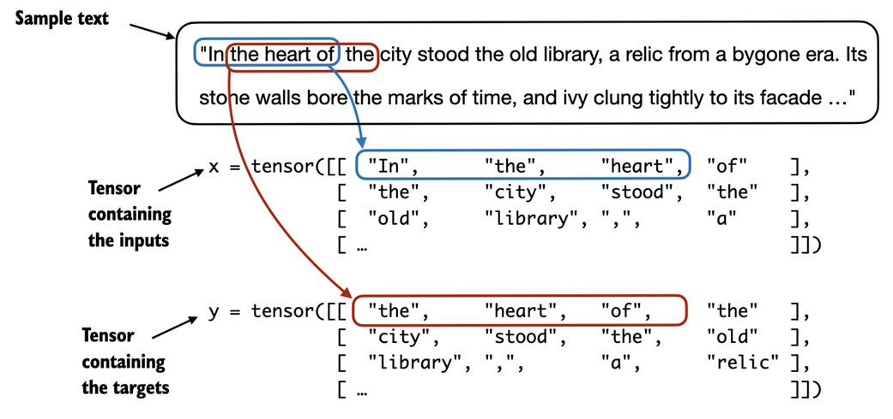
虽然图 2.13 中的词元以字符串格式显示，但代码实现将直接处理词元 ID，因为 BPE 词元化器的 `encode` 方法将词元化和转换为词元 ID 合并为一个步骤。

在高效数据加载器的实现中，我们将使用 PyTorch 的 `Dataset` 和 `DataLoader` 类。如果需要有关 PyTorch 安装的更多信息，请参阅附录 A 中的 A.1.3 节。

数据集类的代码如下所示：

#### 代码示例 2.5：用于批量输入和目标的数据集

```python
import torch
from torch.utils.data import Dataset, DataLoader

class GPTDatasetV1(Dataset):
    def __init__(self, txt, tokenizer, max_length, stride):
        self.tokenizer = tokenizer
        self.input_ids = []
        self.target_ids = []
        token_ids = tokenizer.encode(txt)  # A
        for i in range(0, len(token_ids) - max_length, stride):  # B
            input_chunk = token_ids[i:i + max_length]
            target_chunk = token_ids[i + 1: i + max_length + 1]
            self.input_ids.append(torch.tensor(input_chunk))
            self.target_ids.append(torch.tensor(target_chunk))

    def __len__(self):  # C
        return len(self.input_ids)

    def __getitem__(self, idx):  # D
        return self.input_ids[idx], self.target_ids[idx]
```

代码示例 2.5 中的 `GPTDatasetV1` 类基于 PyTorch 的 `Dataset` 类，定义了从数据集中获取单独行的方式，每行由分配给 `input_chunk` 张量的一定数量的词元 ID 组成。`target_chunk` 张量包含相应的目标。我建议继续阅读以了解如何将此数据集与 PyTorch 的 `DataLoader` 结合使用，这将提供额外的直观性和清晰度。

如果您对 PyTorch 的 `Dataset` 类结构不熟悉，请参阅附录 A 中的 A.6 节，该节解释了 PyTorch `Dataset` 和 `DataLoader` 类的一般结构和用法。

以下代码将使用 `GPTDatasetV1` 通过 PyTorch 的 `DataLoader` 按批次加载输入：

#### 代码示例 2.6：用于生成输入-目标对批次的数据加载器

```python
def create_dataloader_v1(txt, batch_size=4, max_length=256, stride=128, shuffle=True, drop_last=True):
    tokenizer = tiktoken.get_encoding("gpt2")  # A
    dataset = GPTDatasetV1(txt, tokenizer, max_length, stride)  # B
    dataloader = DataLoader(
        dataset, batch_size=batch_size, shuffle=shuffle, drop_last=drop_last)  # C
    return dataloader
```

让我们使用批量大小为 1 的 LLM 数据加载器进行测试，设置上下文大小为 4，以便更直观地理解代码示例 2.5 中的 `GPTDatasetV1` 类和代码示例 2.6 中的 `create_dataloader_v1` 函数如何配合工作：

```python
with open("the-verdict.txt", "r", encoding="utf-8") as f:
    raw_text = f.read()
dataloader = create_dataloader_v1(
    raw_text, batch_size=1, max_length=4, stride=1, shuffle=False)
data_iter = iter(dataloader)  # A
first_batch = next(data_iter)
print(first_batch)
```

执行上述代码将打印以下内容：

```plaintext
[tensor([[ 40, 367, 2885, 1464]]), tensor([[ 367, 2885, 1464, 1807]])]
```

变量 `first_batch` 包含两个张量：第一个张量存储输入词元 ID，第二个张量存储目标词元 ID。由于 `max_length` 设置为 4，每个张量包含 4 个词元 ID。请注意，输入大小 4 较小，仅用于演示目的。通常训练 LLM 时，输入大小至少为 256。

为了说明 `stride=1` 的含义，我们从此数据集中获取另一个批次：

```python
second_batch = next(data_iter)
print(second_batch)
```

第二批次的内容如下：

```plaintext
[tensor([[ 367, 2885, 1464, 1807]]), tensor([[2885, 1464, 1807, 3619]])]
```

对比第一批次与第二批次可以发现，第二批次的词元 ID 相对于第一批次右移了一位（例如，第一批次输入中的第二个 ID 为 367，而这是第二批次输入的第一个 ID）。`stride` 设置决定了跨批次输入的移动位置数，模拟了滑动窗口方法，如图 2.14 所示。

图 2.14：从输入数据集中创建多个批次时，我们在文本上滑动一个输入窗口。如果 `stride` 设置为 1，我们在创建下一个批次时将输入窗口向右移动 1 个位置。如果我们将 `stride` 设置为输入窗口大小，就可以防止批次之间的重叠。
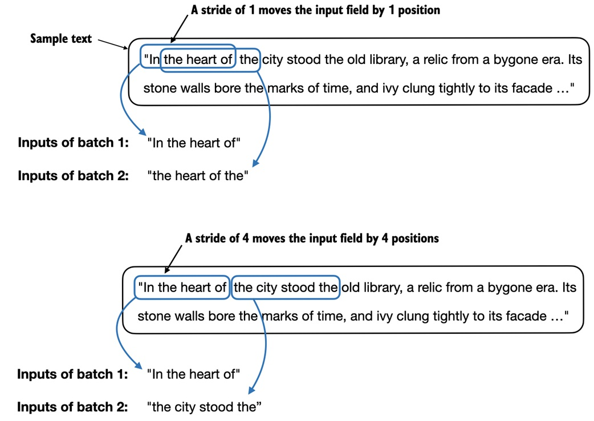

#### 练习 2.2：不同 `stride` 和 `context_size` 的数据加载器

为了加深对数据加载器工作原理的理解，尝试使用不同的设置运行它，比如 `max_length=2` 和 `stride=2`，以及 `max_length=8` 和 `stride=2`。

批量大小为 1 的示例适用于演示目的。如果您有深度学习的经验，您可能知道较小的批量大小在训练过程中需要较少的内存，但会导致模型更新更加不稳定。与常规深度学习类似，批量大小是训练 LLM 时需要实验的折中参数和超参数。

在进入本章最后两个部分之前，我们将简要介绍如何使用批量大小大于 1 的数据加载器进行采样：

```python
dataloader = create_dataloader_v1(raw_text, batch_size=8, max_length=4, stride=4)
data_iter = iter(dataloader)
inputs, targets = next(data_iter)
print("Inputs:\n", inputs)
print("\nTargets:\n", targets)
```

这将打印以下内容：

```plaintext
Inputs:
tensor([[ 40, 367, 2885, 1464],
        [ 1807, 3619, 402, 271],
        [10899, 2138, 257, 7026],
        [15632, 438, 2016, 257],
        [ 922, 5891, 1576, 438],
        [ 568, 340, 373, 645],
        [ 1049, 5975, 284, 502],
        [ 284, 3285, 326, 11]])

Targets:
tensor([[ 367, 2885, 1464, 1807],
        [ 3619, 402, 271, 10899],
        [ 2138, 257, 7026, 15632],
        [ 438, 2016, 257, 922],
        [ 5891, 1576, 438, 568],
        [ 340, 373, 645, 1049],
        [ 5975, 284, 502, 284],
        [ 3285, 326, 11, 287]])
```

请注意，这里我们将 `stride` 增加到 4，以充分利用数据集（我们不会跳过任何单词），同时避免批次之间的重叠，因为过多的重叠可能导致过拟合增加。

在本章的最后两部分中，我们将实现嵌入层，将词元 ID 转换为连续向量表示，为 LLM 提供输入数据格式。

## 2.7 创建词元嵌入

为 LLM 训练准备输入文本的最后一步是将词元 ID 转换为嵌入向量，如图 2.15 所示。本节和下一节将重点介绍这一转换步骤。

图 2.15：为 LLM 准备输入文本包括文本的词元化、将文本词元转换为词元 ID，以及将词元 ID 转换为嵌入向量。在本节中，我们将使用前几节创建的词元 ID 来生成词元嵌入向量。
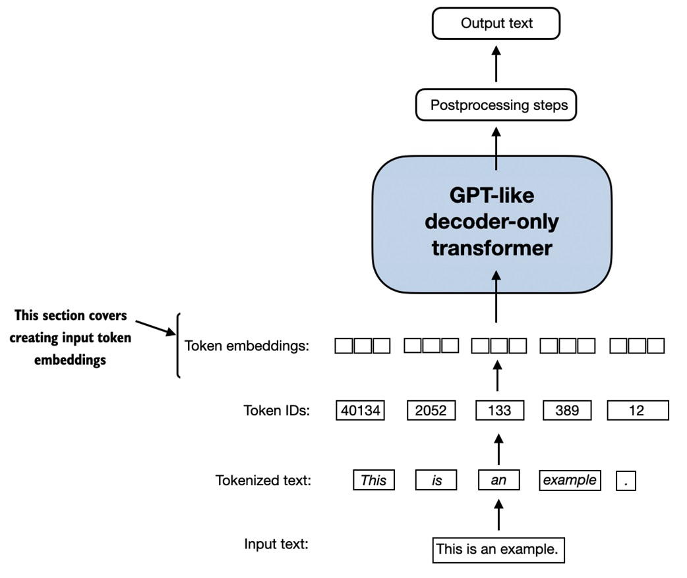
除了图 2.15 所示的流程外，重要的是要注意，我们会将这些嵌入的权重初始化为随机值作为初始步骤。这一初始化是 LLM 学习过程的起点。在第 5 章中，我们将优化这些嵌入权重。

因为 GPT 类 LLM 是使用反向传播算法训练的深度神经网络，所以需要一个连续的向量表示，或者称为嵌入。如果您不熟悉神经网络是如何通过反向传播进行训练的，可以参考附录 A 中的 A.4 节。

我们用一个实际示例来演示如何将词元 ID 转换为嵌入向量。假设我们有以下四个输入词元，其 ID 分别是 2、3、5 和 1：

```python
input_ids = torch.tensor([2, 3, 5, 1])
```

为了简化演示，假设我们有一个仅包含 6 个单词的小型词汇表（而不是 BPE 词元化器中的 50,257 个单词），并且我们希望创建大小为 3 的嵌入（GPT-3 中的嵌入大小为 12,288 维）：

```python
vocab_size = 6
output_dim = 3
```

利用 `vocab_size` 和 `output_dim`，我们可以在 PyTorch 中实例化一个嵌入层，并将随机种子设置为 123 以确保结果可重复：

```python
torch.manual_seed(123)
embedding_layer = torch.nn.Embedding(vocab_size, output_dim)
print(embedding_layer.weight)
```

上述代码中的 `print` 语句将输出嵌入层的权重矩阵：

```plaintext
Parameter containing:
tensor([[ 0.3374, -0.1778, -0.1690],
        [ 0.9178, 1.5810, 1.3010],
        [ 1.2753, -0.2010, -0.1606],
        [-0.4015, 0.9666, -1.1481],
        [-1.1589, 0.3255, -0.6315],
        [-2.8400, -0.7849, -1.4096]], requires_grad=True)
```

可以看到，嵌入层的权重矩阵包含小的随机值。这些值将在 LLM 训练过程中进行优化。我们还可以看到，这个权重矩阵有 6 行和 3 列。每一行对应词汇表中的一个词元，每一列对应嵌入的一个维度。

实例化嵌入层后，我们可以将其应用于一个词元 ID，以获得对应的嵌入向量：

```python
print(embedding_layer(torch.tensor([3])))
```

返回的嵌入向量为：

```plaintext
tensor([[-0.4015,  0.9666, -1.1481]], grad_fn=<EmbeddingBackward0>)
```

如果我们将词元 ID 为 3 的嵌入向量与前面的嵌入矩阵对比，会发现它与矩阵的第 4 行相同（Python 从零开始计数，因此对应索引 3）。换句话说，嵌入层本质上是一个通过词元 ID 从嵌入层权重矩阵中检索行的查找操作。

#### 嵌入层与矩阵乘法的关系

对于熟悉独热编码（one-hot encoding）的人来说，上述嵌入层的方法实际上只是实现独热编码后通过全连接层进行矩阵乘法的更高效方式。您可以在 GitHub 上的补充代码中查看相关实现：[链接](https://github.com/rasbt/LLMs-from-scratch/tree/main/ch02/03_bonus_embedding-vs-matmul)。因为嵌入层是一种等效于独热编码和矩阵乘法的更高效实现，因此它可以被视为一种可以通过反向传播优化的神经网络层。

之前我们演示了如何将单个词元 ID 转换为三维嵌入向量。现在，让我们对之前定义的四个输入 ID（`torch.tensor([2, 3, 5, 1])`）应用同样的操作：

```python
print(embedding_layer(input_ids))
```

输出显示结果为一个 4x3 矩阵：

```plaintext
tensor([[ 1.2753, -0.2010, -0.1606],
        [-0.4015,  0.9666, -1.1481],
        [-2.8400, -0.7849, -1.4096],
        [ 0.9178,  1.5810,  1.3010]], grad_fn=<EmbeddingBackward0>)
```

输出矩阵中的每一行是通过从嵌入权重矩阵中查找得到的，如图 2.16 所示。

图 2.16：嵌入层执行查找操作，从嵌入层的权重矩阵中检索与词元 ID 对应的嵌入向量。例如，词元 ID 为 5 的嵌入向量是嵌入层权重矩阵的第六行（由于 Python 从 0 开始计数，它是第六行而不是第五行）。出于演示目的，我们假设词元 ID 是在第 2.3 节使用的小词汇表中产生的。
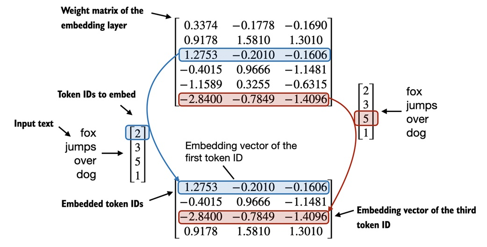
本节介绍了如何从词元 ID 创建嵌入向量。下一节也是本章的最后一节，将在这些嵌入向量上添加一个小的修改，以编码词元在文本中的位置信息。

## 2.8 编码词元位置

在前一节中，我们将词元 ID 转换为了连续向量表示，也就是所谓的词元嵌入。理论上，这已经可以作为 LLM 的输入。然而，LLM 的一个小缺陷是其自注意力机制（将在第 3 章详细介绍）没有位置或顺序的概念，无法识别序列中词元的位置信息。

前面介绍的嵌入层工作方式是，每个词元 ID 总是映射到相同的向量表示，而不考虑它在输入序列中的位置，如图 2.17 所示。

图 2.17：嵌入层将词元 ID 转换为相同的向量表示，不论它在输入序列中的位置。例如，词元 ID 为 5 的词元，无论是在输入向量的第一个位置还是第三个位置，都将映射为相同的嵌入向量。
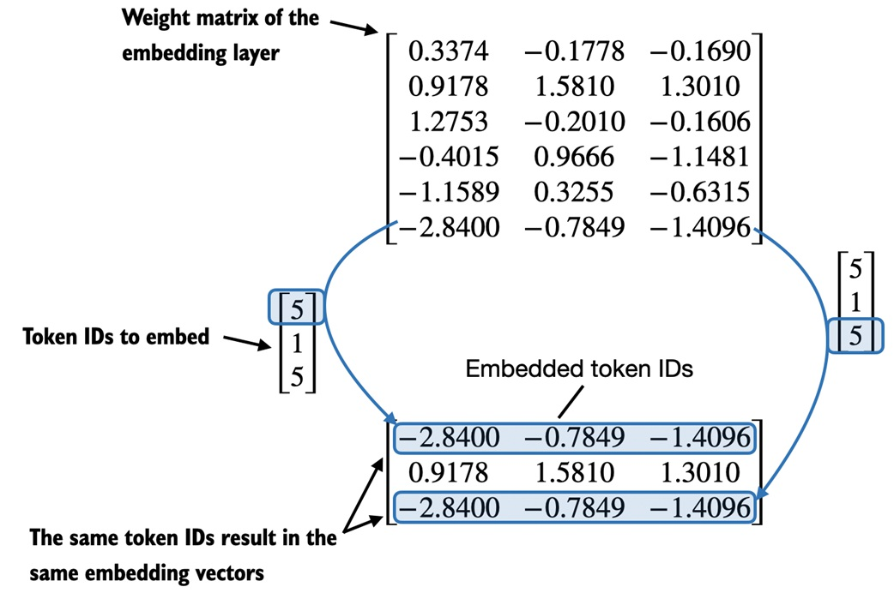
从原则上讲，词元 ID 的这种位置无关的确定性嵌入有助于可重复性。然而，由于 LLM 的自注意力机制本身对位置不敏感，向 LLM 中加入额外的位置信息是很有帮助的。

为此，存在两种主要的位置信息嵌入方法：**相对位置嵌入**和**绝对位置嵌入**。

**绝对位置嵌入**直接与序列中的特定位置关联。对于输入序列中的每个位置，会将一个唯一的嵌入添加到词元的嵌入中，以传达其确切位置。例如，第一个词元会有特定的位置嵌入，第二个词元会有另一个不同的嵌入，以此类推，如图 2.18 所示。

图 2.18：位置嵌入被添加到词元嵌入向量中，从而为 LLM 创建输入嵌入。为了简单起见，图中词元嵌入的值被设置为 1。
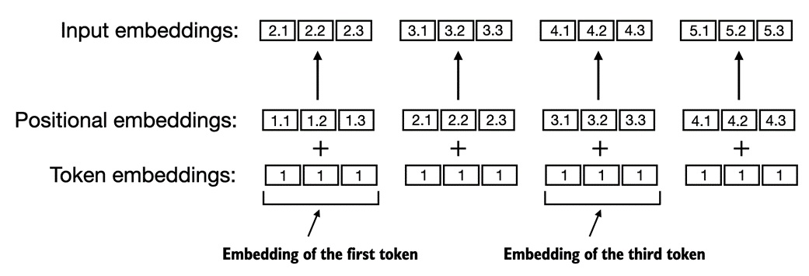
相对位置嵌入则着重于词元之间的相对位置或距离，而不是词元的绝对位置。这种方式使得模型可以更好地泛化到不同长度的序列，即使模型在训练中没有见过这样的长度。

这两种位置嵌入的目的是增强 LLM 理解词元之间的顺序和关系的能力，从而确保更准确的上下文感知预测。具体选择哪种方法通常取决于具体的应用和所处理数据的特性。

OpenAI 的 GPT 模型使用了绝对位置嵌入，这些嵌入在训练过程中被优化，而不是像原始 Transformer 模型中的位置编码那样固定或预定义。这个优化过程是模型训练的一部分，稍后在本书中我们会实现这一点。现在，我们来创建初始位置嵌入，以便为后续章节中的 LLM 输入做准备。

此前，我们为了演示简便使用了较小的嵌入尺寸。现在我们使用更实际和有用的嵌入尺寸，将输入词元编码为 256 维的向量表示。虽然这比原始 GPT-3 模型的嵌入尺寸（12,288 维）要小，但对于实验来说足够合理。此外，我们假设这些词元 ID 是由我们之前实现的 BPE 词元化器创建的，具有 50,257 的词汇表大小：

```python
output_dim = 256
vocab_size = 50257
token_embedding_layer = torch.nn.Embedding(vocab_size, output_dim)
```

使用上面的 `token_embedding_layer`，我们可以从数据加载器中采样数据，将每个批次中的每个词元嵌入到 256 维的向量中。如果我们有 8 个批次，每个批次包含 4 个词元，结果将是一个 8 x 4 x 256 的张量。

首先，我们从第 2.6 节（使用滑动窗口的数据采样）中实例化数据加载器：

```python
max_length = 4
dataloader = create_dataloader_v1(
    raw_text, batch_size=8, max_length=max_length, stride=max_length, shuffle=False)
data_iter = iter(dataloader)
inputs, targets = next(data_iter)
print("Token IDs:\n", inputs)
print("\nInputs shape:\n", inputs.shape)
```

上述代码将打印以下输出：

```plaintext
Token IDs:
tensor([[   40,   367,  2885,  1464],
        [ 1807,  3619,   402,   271],
        [10899,  2138,   257,  7026],
        [15632,   438,  2016,   257],
        [  922,  5891,  1576,   438],
        [  568,   340,   373,   645],
        [ 1049,  5975,   284,   502],
        [  284,  3285,   326,    11]])
Inputs shape:
torch.Size([8, 4])
```

可以看到，词元 ID 张量是 8x4 维的，意味着数据批次由 8 个文本样本组成，每个样本包含 4 个词元。

现在让我们使用嵌入层将这些词元 ID 嵌入到 256 维的向量中：

```python
token_embeddings = token_embedding_layer(inputs)
print(token_embeddings.shape)
```

上述 `print` 语句将返回以下内容：

```plaintext
torch.Size([8, 4, 256])
```

从 8x4x256 的张量输出可以看出，每个词元 ID 现在都被嵌入为一个 256 维的向量。

对于 GPT 模型的绝对嵌入方法，我们只需要创建另一个与 `token_embedding_layer` 具有相同维度的嵌入层：

```python
context_length = max_length
pos_embedding_layer = torch.nn.Embedding(context_length, output_dim)
pos_embeddings = pos_embedding_layer(torch.arange(context_length))
print(pos_embeddings.shape)
```

在上述代码示例中，`pos_embeddings` 的输入通常是一个占位符向量 `torch.arange(context_length)`，其中包含从 0 到最大输入长度减 1 的数字序列。`context_length` 表示 LLM 支持的输入大小。在这里，我们将其设置为输入文本的最大长度。实际应用中，输入文本的长度可能超过支持的上下文长度，在这种情况下我们需要截断文本。

`print` 语句的输出如下：

```plaintext
torch.Size([4, 256])
```

可以看到，位置嵌入张量包含四个 256 维的向量。现在，我们可以直接将这些位置嵌入添加到词元嵌入中，PyTorch 会将 4x256 维的 `pos_embeddings` 张量添加到每个 4x256 维的词元嵌入张量中（共有 8 个批次）：

```python
input_embeddings = token_embeddings + pos_embeddings
print(input_embeddings.shape)
```

输出如下：

```plaintext
torch.Size([8, 4, 256])
```

如图 2.19 所总结的那样，我们创建的 `input_embeddings` 是可以由主 LLM 模块处理的嵌入输入示例，从第 3 章开始我们将开始实现这些模块。
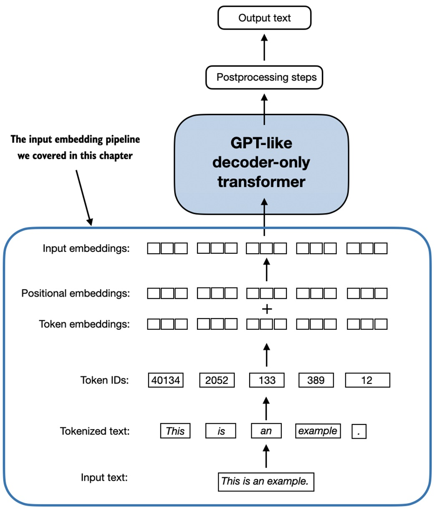
图 2.19：在输入处理管道的一部分中，输入文本首先被分割为单个词元。这些词元随后使用词汇表转换为词元 ID。然后将词元 ID 转换为嵌入向量，并添加相同大小的位置嵌入，最终得到用于 LLM 主层的输入嵌入。

## 2.9 小结

LLMs 需要将文本数据转换为数值向量（称为嵌入），因为它们无法直接处理原始文本。嵌入将离散数据（如单词或图像）转换为连续的向量空间，使其可以与神经网络操作兼容。

第一步是将原始文本分割成词元，这些词元可以是单词或字符。接着，这些词元被转换为整数表示，即词元 ID。

可以添加特殊词元，如 `<|unk|>` 和 `<|endoftext|>`，以增强模型的理解能力，并处理不同的上下文，例如未知单词或标记不相关文本之间的边界。

LLMs（如 GPT-2 和 GPT-3）使用的字节对编码（BPE）词元化器能够高效地处理未知单词，将它们分解为子词单元或单独的字符。

我们对词元化后的数据使用滑动窗口方法，生成用于 LLM 训练的输入-目标对。

PyTorch 中的嵌入层作为查找操作，检索与词元 ID 对应的向量。生成的嵌入向量为词元提供了连续表示，这是训练 LLM 等深度学习模型的关键。

虽然词元嵌入为每个词元提供了一致的向量表示，但它们缺乏词元在序列中的位置信息。为了解决这个问题，存在两种主要的位置信息嵌入：绝对位置嵌入和相对位置嵌入。OpenAI 的 GPT 模型采用了绝对位置嵌入，这些嵌入被添加到词元嵌入向量中，并在模型训练期间被优化。
