# 编码注意力机制

## 本章内容

-   探讨在神经网络中使用注意力机制的原因
-   介绍一个基本的自注意力框架，并进一步扩展为增强型自注意力机制
-   实现一个因果注意力模块，使得大型语言模型（LLMs）能够逐词生成
-   通过使用 dropout 随机屏蔽部分注意力权重以减少过拟合
-   将多个因果注意力模块堆叠成多头注意力模块

在上一章中，你学习了如何为训练 LLM 准备输入文本。这涉及将文本分割为单词或子词，并将其编码为向量表示（即嵌入）供 LLM 使用。本章将深入探讨 LLM 架构中不可或缺的部分：注意力机制，如图 3.1 所示。

图 3.1 展示了编码一个 LLM 的三个主要阶段的思维模型，即对通用文本数据集的预训练，以及对标注数据集的微调。本章聚焦于注意力机制，它是 LLM 架构中的核心组成部分。
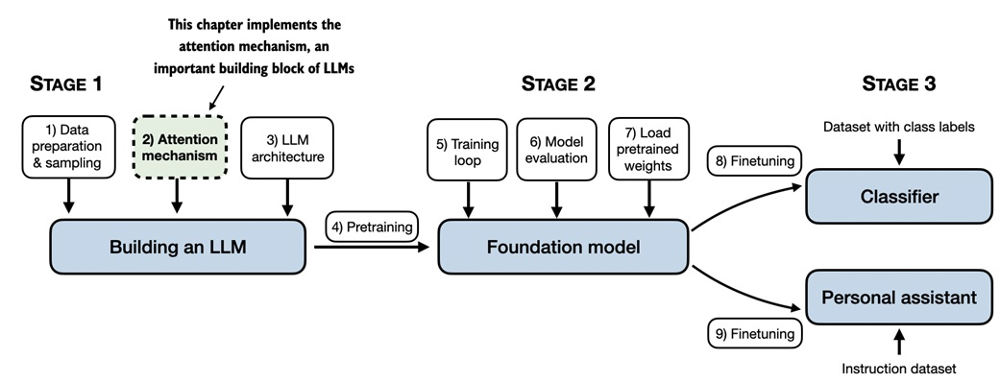
注意力机制是一个复杂的话题，因此我们将用整整一章来讨论。在本章中，我们将主要孤立地研究这些注意力机制，聚焦其在机制层面的运作。在下一章，我们将编写围绕自注意力机制的剩余 LLM 代码，以实现文本生成模型。

在本章中，我们将实现四种不同的注意力机制变体，如图 3.2 所示。

图 3.2 展示了我们在本章中将要编码的不同注意力机制，从一个简化的自注意力版本开始，再逐步添加可训练权重。因果注意力机制为自注意力添加了一个掩码，使得 LLM 可以逐词生成。最后，多头注意力将注意力机制分成多个头，使模型能够并行捕捉输入数据的不同方面。
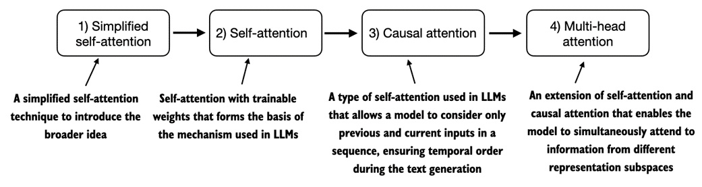
这些不同的注意力变体如图 3.2 所示，它们逐步构建，最终目标是实现一个紧凑且高效的多头注意力模块，我们可以在下一章将其插入 LLM 架构中。

## 3.1 处理长序列的问题

在深入自注意力机制之前，让我们先看看在 LLM 出现之前缺少注意力机制的架构存在的问题。假设我们要开发一个将文本从一种语言翻译成另一种语言的模型。如图 3.3 所示，我们不能逐词翻译，因为源语言和目标语言的语法结构不同。

图 3.3 展示了在从一种语言（例如德语）翻译成另一种语言（如英语）时，不可能简单地逐词翻译，而是需要考虑上下文理解和语法匹配。
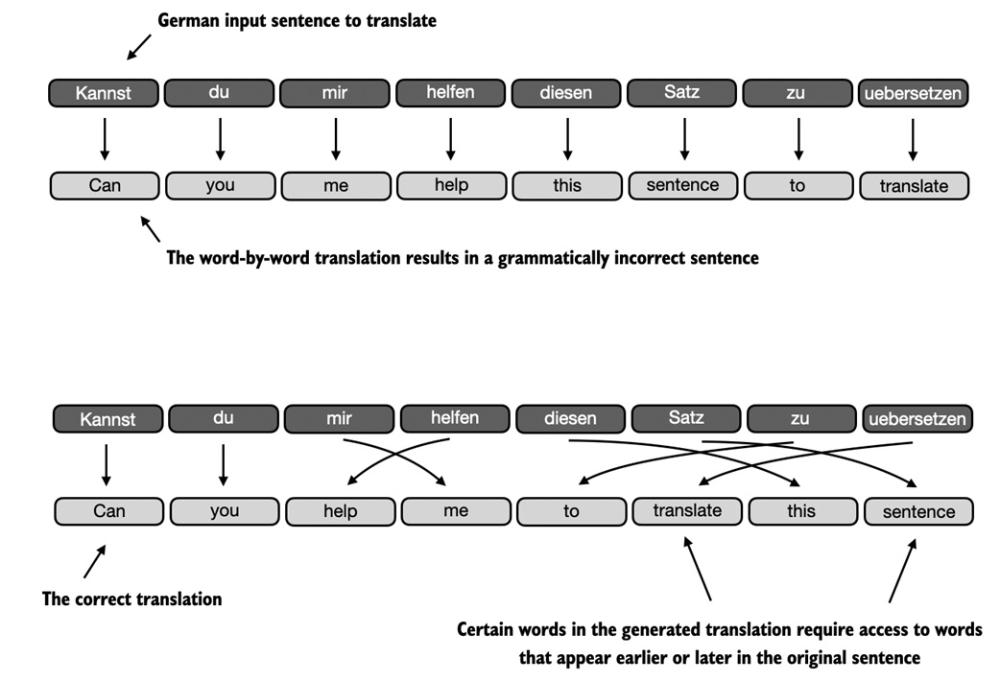
为了解决无法逐词翻译的问题，通常使用一个包含编码器和解码器两个子模块的深度神经网络。编码器的任务是读取并处理整个文本，而解码器则生成翻译后的文本。

我们在第 1 章（1.4 节 使用 LLM 进行不同任务）简要介绍过编码器-解码器网络。在 transformer 出现之前，循环神经网络（RNNs）是最受欢迎的编码器-解码器架构之一，用于语言翻译。

RNN 是一种神经网络，其前一步的输出作为当前步的输入，适合处理像文本这样的序列数据。即使你不熟悉 RNN，也不必担心，因为本讨论的重点在于编码器-解码器的总体概念。

在编码器-解码器 RNN 中，输入文本依次输入编码器，编码器在每一步更新其隐藏状态（即隐藏层的内部值），试图在最终的隐藏状态中捕捉整个句子的含义，如图 3.4 所示。解码器然后使用这个隐藏状态开始逐词生成翻译句子，并在每一步更新其隐藏状态，用于下一个词的预测。

图 3.4 在 transformer 模型出现之前，编码器-解码器 RNN 是机器翻译的流行选择。编码器将源语言的词序列作为输入，其隐藏状态（即中间层）编码了整个输入序列的压缩表示，然后解码器使用当前隐藏状态逐词生成翻译。
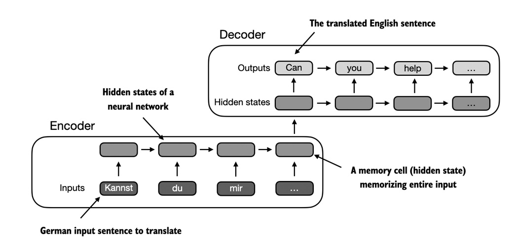
尽管我们不需要深入了解编码器-解码器 RNN 的内部运作，但其关键在于编码器部分将整个输入文本转换为隐藏状态（记忆单元），解码器使用该隐藏状态生成输出。可以将该隐藏状态视为一个嵌入向量，这是我们在第 2 章讨论过的概念。

编码器-解码器 RNN 的主要问题在于，在解码阶段 RNN 无法直接访问编码器的早期隐藏状态。它只能依赖当前的隐藏状态来包含所有相关信息，这可能导致上下文丢失，特别是当句子复杂且依赖关系跨度较长时。

对于不熟悉 RNN 的读者，无需深入了解这种架构，因为我们不会在本书中使用它。这里的关键是，编码器-解码器 RNN 的局限性促使了注意力机制的设计。

## 3.2 使用注意力机制捕获数据依赖关系

在 transformer LLM 出现之前，RNN 常被用于语言建模任务，例如语言翻译。正如前文所述，RNN 对于翻译短句效果良好，但在处理长文本时表现较差，因为它无法直接访问输入中的前面部分。

这种方法的主要缺陷在于，RNN 必须将整个编码后的输入信息保存在一个单一的隐藏状态中，然后再传递给解码器，如上一节图 3.4 所示。

因此，研究人员在 2014 年开发了所谓的 Bahdanau 注意力机制（以论文的第一作者命名），该机制对 RNN 编码器-解码器进行了修改，使得解码器可以在每个解码步骤中选择性地访问输入序列的不同部分，如图 3.5 所示。

图 3.5 展示了通过使用注意力机制，网络中的文本生成解码器部分可以选择性地访问所有输入标记。这意味着，对于生成特定的输出标记，某些输入标记比其他标记更为重要。重要性由所谓的注意力权重决定，我们将在后面计算这些权重。需要注意的是，这张图展示了注意力机制的概念，并未精确展示 Bahdanau 机制的实现方式，后者是一种超出本书范围的 RNN 方法。
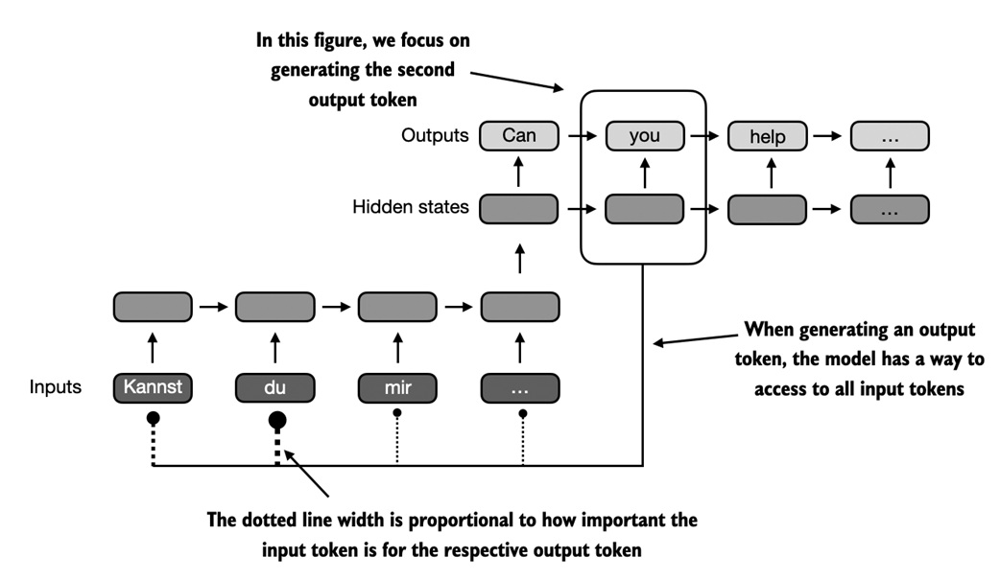
有趣的是，仅仅三年后，研究人员发现构建自然语言处理的深度神经网络并不需要 RNN 架构，并提出了最初的 transformer 架构（在第 1 章中讨论），该架构的自注意力机制受到了 Bahdanau 注意力机制的启发。

自注意力是一种机制，允许输入序列中的每个位置在计算序列表示时关注该序列中的所有位置。自注意力是基于 transformer 架构的现代 LLM（例如 GPT 系列）的关键组成部分。

本章将着重于编写并理解 GPT 类模型中使用的自注意力机制，如图 3.6 所示。在下一章中，我们将编写 LLM 的其余部分代码。

图 3.6 展示了自注意力在 transformer 中的应用，它通过允许序列中每个位置与序列中所有其他位置交互并衡量其重要性，来计算更高效的输入表示。在本章中，我们将从零开始编写这个自注意力机制代码，然后在下一章中编写 GPT 类 LLM 的剩余部分。
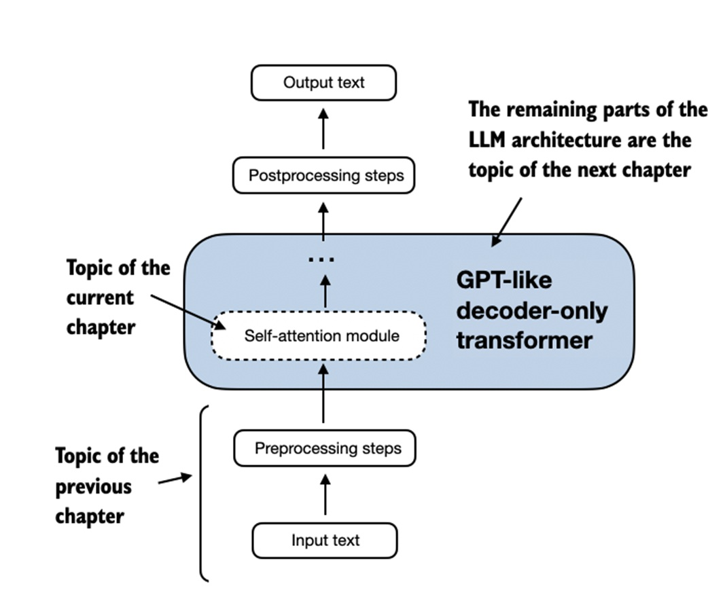

## 3.3 使用自注意力关注输入的不同部分

接下来，我们将深入探讨自注意力机制的内部工作原理，并学习如何从头开始编写它。自注意力是基于 transformer 架构的每个 LLM 的基石。值得注意的是，这一主题可能需要相当多的专注，但一旦掌握其基本原理，你将征服本书中最具挑战性的一部分，同时也是实现 LLM 的关键环节之一。

#### 自注意力中的“自我”

在自注意力中，“自我”指的是该机制通过关联单个输入序列中的不同位置来计算注意力权重的能力。它评估并学习输入内部各个部分（如句子中的单词或图像中的像素）之间的关系和依赖性。这与传统的注意力机制不同，后者关注的是两个不同序列的元素之间的关系，比如在序列到序列模型中，注意力可能集中在输入序列和输出序列之间的关系上（如图 3.5 所示的例子）。

由于自注意力可能显得较为复杂，特别是如果你是第一次接触它，我们将首先在下一小节介绍一个简化版的自注意力。然后，在 3.4 节中，我们将实现带有可训练权重的自注意力机制，即 LLM 中使用的自注意力。


### 3.3.1 一个简单的无可训练权重的自注意力机制

本节中，我们将实现一个简化的自注意力机制版本，不包含任何可训练权重，内容如图 3.7 所示。本节的目标是展示自注意力中的一些关键概念，以便为后续 3.4 节的带可训练权重的自注意力机制打下基础。

**图 3.7** 中显示了自注意力的目标，即为每个输入元素计算一个上下文向量，结合所有其他输入元素的信息。图中展示了如何计算上下文向量 z(2)z^{(2)}z(2)，即输入序列中第 2 个元素的上下文向量。对于每个输入元素，计算 z(2)z^{(2)}z(2) 的重要性或贡献由注意力权重 α21\alpha_{21}α21​ 到 α2T\alpha_{2T}α2T​ 决定。具体计算将在稍后讨论。

图 3.7 展示了一个包含 T 个元素的输入序列 xxx，元素分别表示为 x(1)x^{(1)}x(1) 到 x(T)x^{(T)}x(T)。该序列通常是文本，例如一个已经转化为词嵌入（token embeddings）的句子，如第 2 章所述。
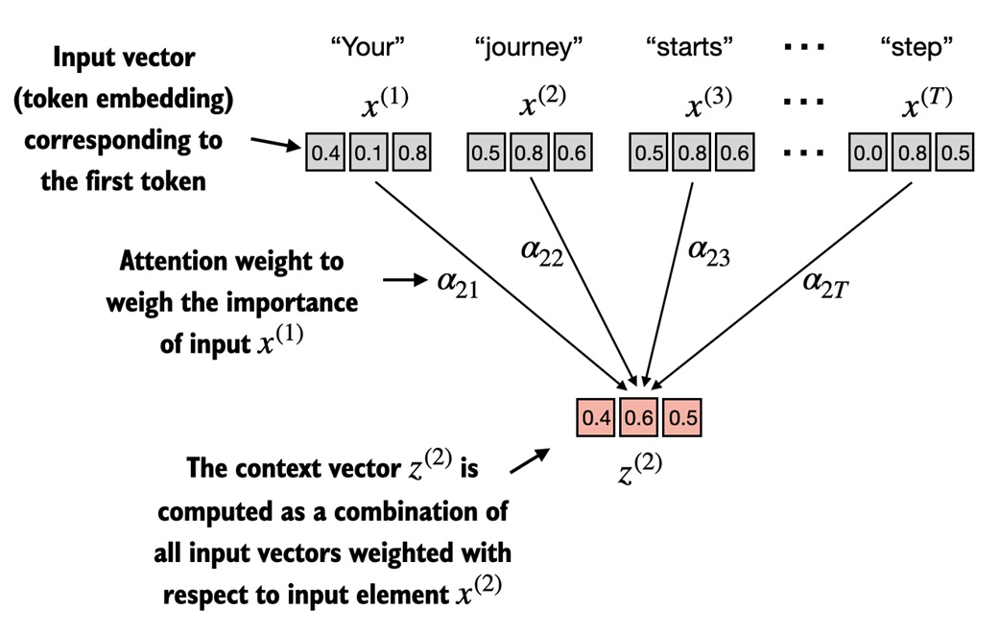
例如，输入文本为 “Your journey starts with one step.”，其中每个元素（如 x(1)x^{(1)}x(1)）对应一个 d 维的嵌入向量，表示一个特定的词（如 "Your"）。在图 3.7 中，这些输入向量被表示为 3 维嵌入。

在自注意力中，我们的目标是计算每个输入元素 x(i)x^{(i)}x(i) 的上下文向量 z(i)z^{(i)}z(i)。上下文向量可以被视为一个富含信息的嵌入向量。

为了说明这一概念，我们专注于第二个输入元素 x(2)x^{(2)}x(2) 的嵌入向量（对应词 "journey"）以及相应的上下文向量 z(2)z^{(2)}z(2)，如图 3.7 底部所示。该增强的上下文向量 z(2)z^{(2)}z(2) 是一个嵌入，包含了关于 x(2)x^{(2)}x(2) 及其他所有输入元素 x(1)x^{(1)}x(1) 到 x(T)x^{(T)}x(T) 的信息。

上下文向量在自注意力中扮演着重要角色。它们的作用是通过包含序列中其他元素的信息，创建每个元素的富信息表示（如句子中的词），正如图 3.7 所示。这对于需要理解句子中词语之间关系的 LLM 至关重要。稍后我们将添加可训练权重，帮助 LLM 学习构建这些上下文向量，使其对 LLM 生成下一个词更为重要。

本节中，我们实现一个简化的自注意力机制，逐步计算这些权重和生成的上下文向量。

假设以下输入句子已嵌入为 3 维向量（为了便于展示，选择小的嵌入维度）：

```python
import torch
inputs = torch.tensor(
    [[0.43, 0.15, 0.89], # Your (x^1)
     [0.55, 0.87, 0.66], # journey (x^2)
     [0.57, 0.85, 0.64], # starts (x^3)
     [0.22, 0.58, 0.33], # with (x^4)
     [0.77, 0.25, 0.10], # one (x^5)
     [0.05, 0.80, 0.55]] # step (x^6)
)
```

**步骤 1：计算中间值 ω\omegaω**

如图 3.8 所示，自注意力实现的第一步是计算注意力得分（attention scores），通过查询 x(2)x^{(2)}x(2) 与其他输入元素的点积来实现：
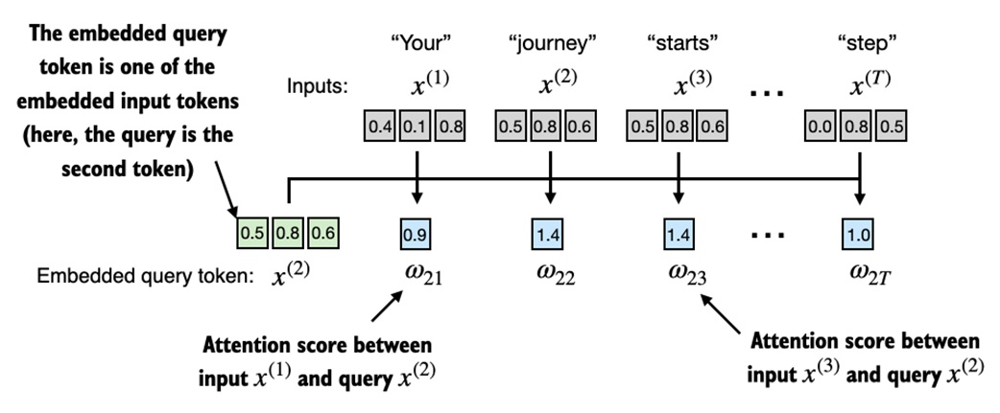
```python
query = inputs[1]  # A
attn_scores_2 = torch.empty(inputs.shape[0])
for i, x_i in enumerate(inputs):
    attn_scores_2[i] = torch.dot(x_i, query)
print(attn_scores_2)
```

输出的注意力得分为：

```scss
tensor([0.9544, 1.4950, 1.4754, 0.8434, 0.7070, 1.0865])
```

**理解点积**

点积是一种将两个向量按元素相乘并求和的简便方式。通过以下代码示例，可以展示点积的计算过程：

```python
res = 0.
for idx, element in enumerate(inputs[0]):
    res += inputs[0][idx] * query[idx]
print(res)
print(torch.dot(inputs[0], query))
```

结果确认了点积的计算方式：

```scss
tensor(0.9544)
tensor(0.9544)
```

在自注意力机制中，点积衡量了两个向量的相似性，即确定序列中元素之间相互关注的程度。

**步骤 2：归一化注意力得分**

下一步（如图 3.9 所示）是对注意力得分进行归一化，以获得注意力权重 α\alphaα，使其和为 1。代码如下：
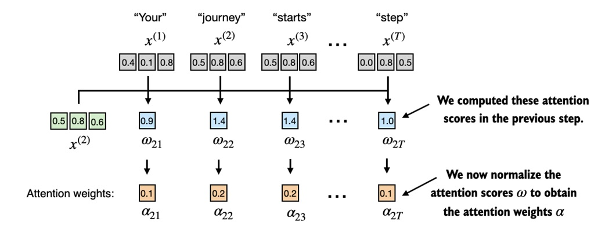
```python
attn_weights_2_tmp = attn_scores_2 / attn_scores_2.sum()
print("Attention weights:", attn_weights_2_tmp)
print("Sum:", attn_weights_2_tmp.sum())
```

输出显示注意力权重的和为 1：

```css
Attention weights: tensor([0.1455, 0.2278, 0.2249, 0.1285, 0.1077, 0.1656])
Sum: tensor(1.0000)
```

更常见的是使用 softmax 函数来归一化：

```python
def softmax_naive(x):
    return torch.exp(x) / torch.exp(x).sum(dim=0)

attn_weights_2_naive = softmax_naive(attn_scores_2)
print("Attention weights:", attn_weights_2_naive)
print("Sum:", attn_weights_2_naive.sum())
```

PyTorch 自带的 softmax 实现：

```python
attn_weights_2 = torch.softmax(attn_scores_2, dim=0)
print("Attention weights:", attn_weights_2)
print("Sum:", attn_weights_2.sum())
```

**步骤 3：计算上下文向量 z(2)z^{(2)}z(2)**

最后一步（如图 3.10 所示）是计算上下文向量 z(2)z^{(2)}z(2)，方法是将输入向量 x(i)x^{(i)}x(i) 与对应的注意力权重相乘并求和：
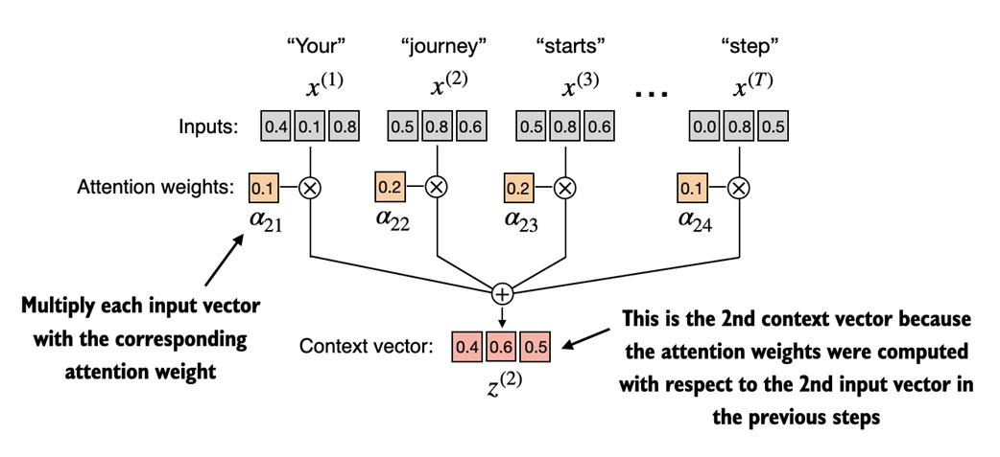
```python
query = inputs[1]  # 第 2 个输入作为查询
context_vec_2 = torch.zeros(query.shape)
for i, x_i in enumerate(inputs):
    context_vec_2 += attn_weights_2[i] * x_i
print(context_vec_2)
```

结果为：

```scss
tensor([0.4419, 0.6515, 0.5683])
```

接下来，我们将泛化此过程，以同时计算所有上下文向量。


### 3.3.2 为所有输入标记计算注意力权重

在上一节中，我们为第 2 个输入元素计算了注意力权重和上下文向量，如图 3.11 高亮显示的行所示。本节将扩展该计算，计算所有输入元素的注意力权重和上下文向量。

图 3.11 中展示了第 2 个输入元素作为查询的注意力权重。此节将通用化此计算，以获得所有其他的注意力权重。与之前一样，我们将按照图 3.12 所示的三个步骤操作，只是会对代码做一些修改，以计算所有上下文向量，而不仅仅是第 2 个上下文向量 z(2)z^{(2)}z(2)。
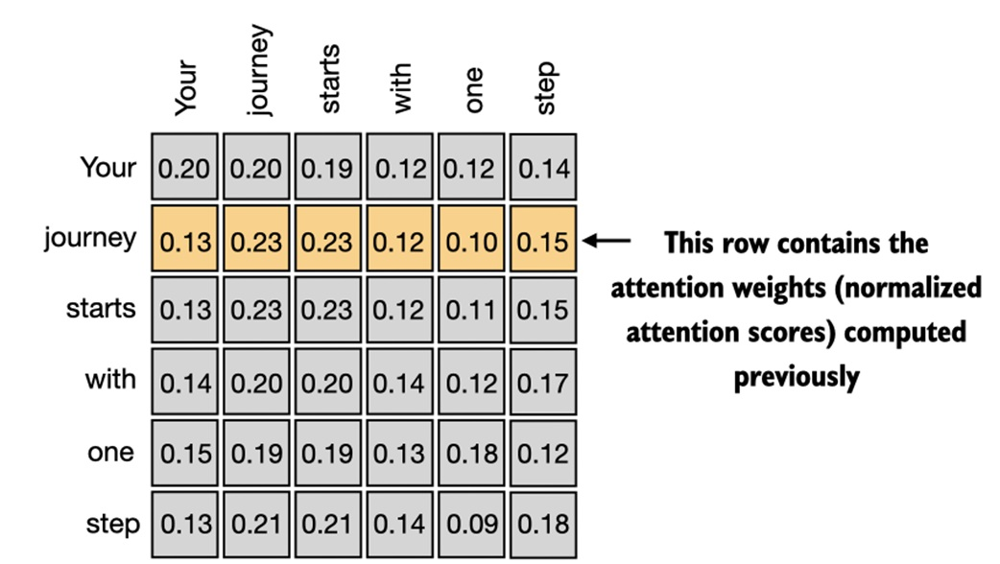
#### 步骤 1：计算所有输入对之间的点积

我们添加一个额外的 `for` 循环来计算所有输入对之间的点积：

```python
attn_scores = torch.empty(6, 6)
for i, x_i in enumerate(inputs):
    for j, x_j in enumerate(inputs):
        attn_scores[i, j] = torch.dot(x_i, x_j)
print(attn_scores)
```

生成的注意力得分如下：

```css
tensor([[0.9995, 0.9544, 0.9422, 0.4753, 0.4576, 0.6310],
        [0.9544, 1.4950, 1.4754, 0.8434, 0.7070, 1.0865],
        [0.9422, 1.4754, 1.4570, 0.8296, 0.7154, 1.0605],
        [0.4753, 0.8434, 0.8296, 0.4937, 0.3474, 0.6565],
        [0.4576, 0.7070, 0.7154, 0.3474, 0.6654, 0.2935],
        [0.6310, 1.0865, 1.0605, 0.6565, 0.2935, 0.9450]])
```
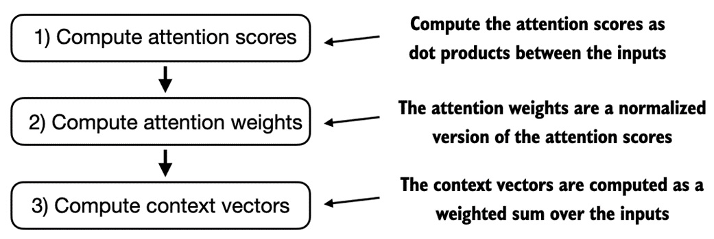
每个元素表示输入对之间的注意力得分，如图 3.11 所示。计算中使用了 `for` 循环，然而，`for` 循环的执行速度通常较慢，可以使用矩阵乘法实现相同效果：

```python
attn_scores = inputs @ inputs.T
print(attn_scores)
```

结果与之前一致：

```css
tensor([[0.9995, 0.9544, 0.9422, 0.4753, 0.4576, 0.6310],
        [0.9544, 1.4950, 1.4754, 0.8434, 0.7070, 1.0865],
        [0.9422, 1.4754, 1.4570, 0.8296, 0.7154, 1.0605],
        [0.4753, 0.8434, 0.8296, 0.4937, 0.3474, 0.6565],
        [0.4576, 0.7070, 0.7154, 0.3474, 0.6654, 0.2935],
        [0.6310, 1.0865, 1.0605, 0.6565, 0.2935, 0.9450]])
```

#### 步骤 2：归一化每行使得总和为 1

使用 softmax 归一化每行，使得各行的值总和为 1：

```python
attn_weights = torch.softmax(attn_scores, dim=1)
print(attn_weights)
```

归一化后的注意力权重如下：

```css
tensor([[0.2098, 0.2006, 0.1981, 0.1242, 0.1220, 0.1452],
        [0.1385, 0.2379, 0.2333, 0.1240, 0.1082, 0.1581],
        [0.1390, 0.2369, 0.2326, 0.1242, 0.1108, 0.1565],
        [0.1435, 0.2074, 0.2046, 0.1462, 0.1263, 0.1720],
        [0.1526, 0.1958, 0.1975, 0.1367, 0.1879, 0.1295],
        [0.1385, 0.2184, 0.2128, 0.1420, 0.0988, 0.1896]])
```

验证所有行的总和确实为 1：

```python
print("All row sums:", attn_weights.sum(dim=1))
```

输出结果：

```css
All row sums: tensor([1.0000, 1.0000, 1.0000, 1.0000, 1.0000, 1.0000])
```

#### 步骤 3：计算所有上下文向量

使用这些注意力权重，通过矩阵乘法计算所有上下文向量：

```python
all_context_vecs = attn_weights @ inputs
print(all_context_vecs)
```

输出的每一行包含一个 3 维上下文向量：

```css
tensor([[0.4421, 0.5931, 0.5790],
        [0.4419, 0.6515, 0.5683],
        [0.4431, 0.6496, 0.5671],
        [0.4304, 0.6298, 0.5510],
        [0.4671, 0.5910, 0.5266],
        [0.4177, 0.6503, 0.5645]])
```

验证第 2 行与之前计算的上下文向量 z(2)z^{(2)}z(2) 是否一致：

```python
print("Previous 2nd context vector:", context_vec_2)
```

结果显示与之前计算的 `context_vec_2` 完全一致：

```arduino
Previous 2nd context vector: tensor([0.4419, 0.6515, 0.5683])
```

至此，我们完成了一个简单自注意力机制的代码演练。下一节中，我们将添加可训练权重，使得 LLM 能够从数据中学习并在特定任务上提升表现。


## 3.4 实现带可训练权重的自注意力机制

本节将实现原始 Transformer 架构、GPT 模型和大多数流行大型语言模型（LLM）中使用的自注意力机制。这种自注意力机制也被称为**缩放点积注意力**。**图 3.13** 提供了一个心智模型，展示了这种自注意力机制在实现 LLM 时的整体架构中的位置。

* * *

> **图 3.13** 描绘了本节实现的自注意力机制如何融入本书和本章的上下文。在上一节中，我们编写了一个简化的注意力机制代码，以理解注意力机制的基本原理。在本节中，我们将为该注意力机制添加**可训练的权重**。随后，在接下来的部分中，我们将通过添加**因果遮罩**和**多头机制**进一步扩展这个自注意力机制。
* * *
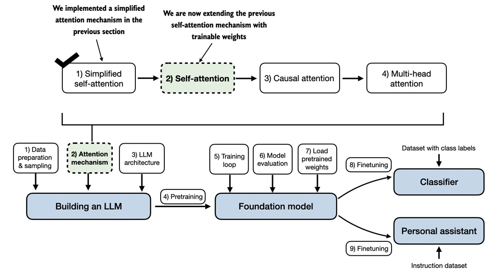

如**图 3.13** 所示，带可训练权重的自注意力机制是基于前面所介绍的概念构建的：我们的目标是**针对特定的输入元素，计算出输入向量的加权和作为上下文向量**。正如你将看到的，与我们在**3.3 节**中编写的基本自注意力机制相比，这里仅存在细微的差别。

-   最显著的差别是**引入了在模型训练过程中更新的权重矩阵**。这些可训练的权重矩阵至关重要，使模型（特别是模型中的注意力模块）能够学习生成“优质”的上下文向量。（需要注意的是，我们将在**第 5 章**对 LLM 进行训练。）

* * *

我们将通过两个小节来实现此自注意力机制。首先，我们将像之前一样逐步编写代码。接着，我们会将代码组织成一个紧凑的**Python 类**，以便可以在**第 4 章**编写的 LLM 架构中导入使用。


**3.4.1 逐步计算注意力权重**

我们将通过引入三个可训练的权重矩阵 WqW_qWq​、WkW_kWk​ 和 WvW_vWv​ 来逐步实现自注意力机制。这三个矩阵用于将嵌入的输入标记 x(i)x^{(i)}x(i) 映射到查询、键和值向量，见图 3.14。

* * *

> **图 3.14**：在具有可训练权重矩阵的自注意力机制的第一步中，我们为输入元素 xxx 计算查询（qqq）、键（k \））和值（\( v \））向量。与之前的章节类似，我们将第二个输入 \( x^{(2)} 作为查询输入。查询向量 q(2)q^{(2)}q(2) 通过输入 x(2)x^{(2)}x(2) 与权重矩阵 WqW_qWq​ 的矩阵乘法获得。类似地，通过矩阵乘法，我们利用权重矩阵 WkW_kWk​ 和 WvW_vWv​ 得到键和值向量。

* * *
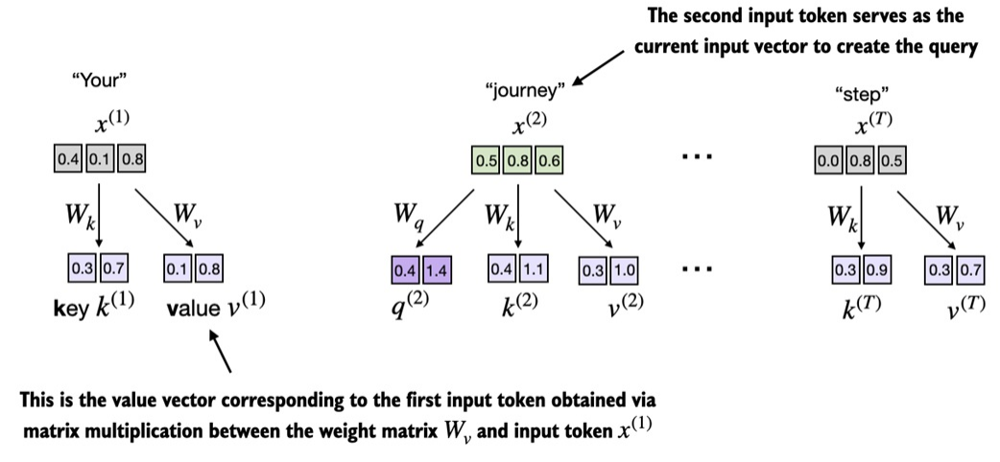

在 **3.3.1 节**中，当我们计算简化的注意力权重以获得上下文向量 z(2)z^{(2)}z(2) 时，定义了第二个输入元素 x(2)x^{(2)}x(2) 作为查询。随后在 **3.3.2 节** 中，我们将其泛化以计算六词输入句 "Your journey starts with one step." 的所有上下文向量 z(1)z^{(1)}z(1) 到 z(T)z^{(T)}z(T)。

类似地，我们将从计算一个上下文向量 z(2)z^{(2)}z(2) 开始用于演示，下一节中我们会修改代码以计算所有上下文向量。

### 变量定义

```python
x_2 = inputs[1] #A
d_in = inputs.shape[1] #B
d_out = 2 #C
```

在类似 GPT 的模型中，输入和输出的维度通常相同，但为便于理解计算，我们这里选择不同的输入（`d_in=3`）和输出（`d_out=2`）维度。

接下来，我们初始化权重矩阵 WqW_qWq​、WkW_kWk​、WvW_vWv​，如图 3.14 所示：

```python
torch.manual_seed(123)
W_query = torch.nn.Parameter(torch.rand(d_in, d_out), requires_grad=False)
W_key = torch.nn.Parameter(torch.rand(d_in, d_out), requires_grad=False)
W_value = torch.nn.Parameter(torch.rand(d_in, d_out), requires_grad=False)
```

注意，这里设置 `requires_grad=False` 以减少输出干扰，但在模型训练中应设置 `requires_grad=True`，以便更新这些矩阵。

* * *

### 计算查询、键和值向量

```python
query_2 = x_2 @ W_query
key_2 = x_2 @ W_key
value_2 = x_2 @ W_value
print(query_2)
```

输出查询结果为 2 维向量，因为我们将权重矩阵的列数 `d_out` 设置为 2：

```scss
tensor([0.4306, 1.4551])
```

* * *

**权重参数与注意力权重的区别**

权重矩阵 WWW 中的“权重”是指模型训练中优化的神经网络参数，不要与注意力权重混淆。注意力权重决定了上下文向量在多大程度上依赖输入的不同部分。

简而言之，权重参数是定义网络连接的学习系数，而注意力权重是动态的、特定于上下文的值。

尽管当前目标是计算一个上下文向量 z(2)z^{(2)}z(2)，我们仍需所有输入元素的键和值向量以便与查询 q(2)q^{(2)}q(2) 计算注意力权重。

通过矩阵乘法，我们可以获得所有的键和值：

```python
keys = inputs @ W_key
values = inputs @ W_value
print("keys.shape:", keys.shape)
print("values.shape:", values.shape)
```

输出显示，我们成功地将 6 个输入标记从 3D 投影到 2D 嵌入空间：

```css
keys.shape: torch.Size([6, 2])
values.shape: torch.Size([6, 2])
```

* * *

### 第二步：计算注意力得分

> **图 3.15**：注意力得分计算是类似于简化自注意力机制中的点积计算，不同之处在于现在我们使用了通过权重矩阵变换后的查询和键。
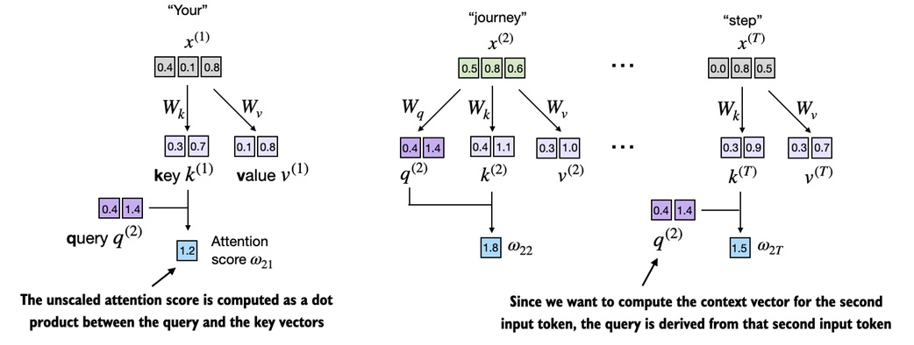
首先，计算注意力得分 ω22\omega_{22}ω22​：

```python
keys_2 = keys[1] #A
attn_score_22 = query_2.dot(keys_2)
print(attn_score_22)
```

输出如下：

```scss
tensor(1.8524)
```

接下来，通过矩阵乘法计算所有的注意力得分：

```python
attn_scores_2 = query_2 @ keys.T
print(attn_scores_2)
```

快速检查结果，输出的第二个元素与我们之前计算的 `attn_score_22` 一致：

```scss
tensor([1.2705, 1.8524, 1.8111, 1.0795, 0.5577, 1.5440])
```

* * *

### 第三步：从注意力得分到注意力权重

> **图 3.16**：在计算注意力得分 ω\omegaω 后，下一步是通过 softmax 函数来归一化这些得分，以获得注意力权重 α\alphaα。
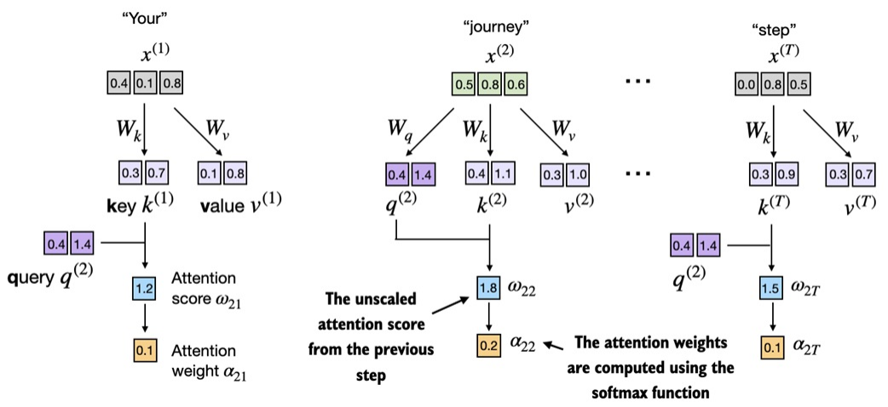
如图 3.16 所示，我们通过缩放注意力得分并使用 softmax 函数计算注意力权重。不同之处在于，现在我们通过将注意力得分除以键嵌入维度的平方根进行缩放：

```python
d_k = keys.shape[-1]
attn_weights_2 = torch.softmax(attn_scores_2 / d_k**0.5, dim=-1)
print(attn_weights_2)
```

结果的注意力权重如下：

```scss
tensor([0.1500, 0.2264, 0.2199, 0.1311, 0.0906, 0.1820])
```

**缩放点积注意力的原理**

通过嵌入维度大小进行归一化，可以避免小梯度，从而改善训练效果。嵌入维度增加时，较大的点积会使 softmax 函数表现为阶跃函数，导致梯度接近零。通过嵌入维度平方根的缩放可以缓解这种情况，因此这种机制称为**缩放点积注意力**。

* * *

### 最后一步：计算上下文向量

> **图 3.17**：在自注意力计算的最后一步，通过注意力权重组合所有的值向量来计算上下文向量。
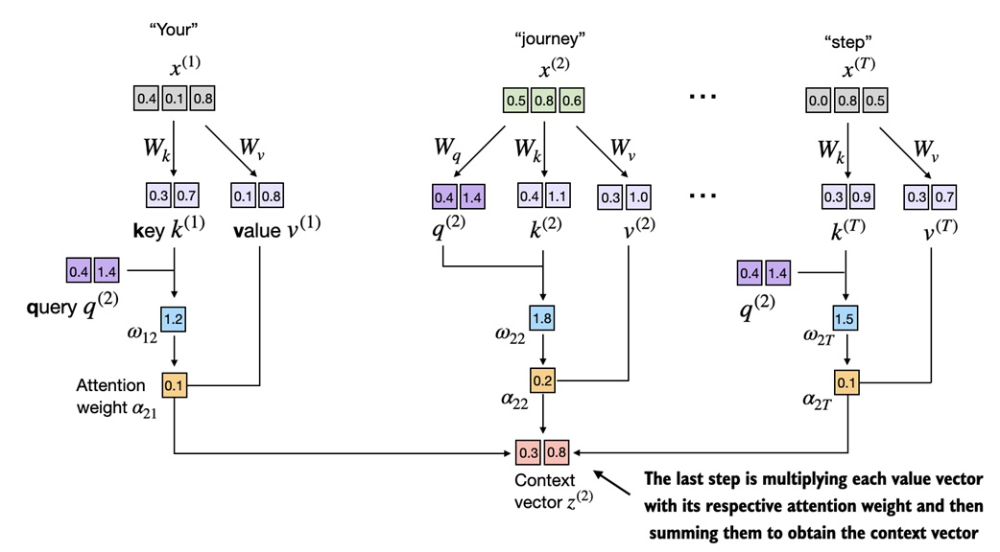
如同 **3.3 节** 中我们通过输入向量的加权和计算上下文向量一样，现在通过值向量的加权和计算上下文向量。注意力权重作为加权因子来衡量每个值向量的重要性。可以通过矩阵乘法一步获得输出：

```python
context_vec_2 = attn_weights_2 @ values
print(context_vec_2)
```

结果向量内容如下：

```scss
tensor([0.3061, 0.8210])
```

到目前为止，我们仅计算了单个上下文向量 z(2)z^{(2)}z(2)。下一节将泛化代码以计算输入序列中的所有上下文向量 z(1)z^{(1)}z(1) 到 z(T)z^{(T)}z(T)。

* * *

**为何使用查询、键和值？**

在注意力机制中，“键”、“查询”和“值”概念源于信息检索和数据库领域，其中使用相似的概念来存储、搜索和检索信息。

-   **查询（Query）** ：类似于数据库中的搜索查询，代表当前关注的项目（如句子中的词或标记），用于探测输入序列的其他部分。
-   **键（Key）** ：类似于数据库中的键，用于索引和搜索。每个输入元素（如句中的每个词）都有一个键用于与查询匹配。
-   **值（Value）** ：类似于键值对中的值，表示输入项的实际内容或表示。模型确定哪些键与查询最匹配后，检索对应的值。


**3.4.2 实现紧凑的自注意力 Python 类**

在前面的章节中，我们逐步计算了自注意力的输出，主要是为了便于逐步讲解。在实际操作中，考虑到下一章的 LLM 实现，我们可以将这些代码组织到一个 Python 类中，如下所示：

* * *

### 代码清单 3.1：一个紧凑的自注意力类

```python
import torch.nn as nn

class SelfAttention_v1(nn.Module):
    def __init__(self, d_in, d_out):
        super().__init__()
        self.d_out = d_out
        self.W_query = nn.Parameter(torch.rand(d_in, d_out))
        self.W_key = nn.Parameter(torch.rand(d_in, d_out))
        self.W_value = nn.Parameter(torch.rand(d_in, d_out))

    def forward(self, x):
        keys = x @ self.W_key
        queries = x @ self.W_query
        values = x @ self.W_value
        attn_scores = queries @ keys.T  # omega
        attn_weights = torch.softmax(
            attn_scores / keys.shape[-1]**0.5, dim=-1
        )
        context_vec = attn_weights @ values
        return context_vec
```

在这段 PyTorch 代码中，`SelfAttention_v1` 是一个继承自 `nn.Module` 的类，这是 PyTorch 模型的基本构建块，提供了创建和管理模型层的必要功能。

-   `__init__` 方法初始化了可训练的权重矩阵（`W_query`、`W_key` 和 `W_value`），用于将查询、键和值的输入维度 dind_{in}din​ 映射到输出维度 doutd_{out}dout​。
-   在前向传播中，`forward` 方法通过查询和键相乘计算注意力得分（`attn_scores`），并使用 softmax 归一化这些得分。最后，通过用这些归一化后的注意力得分对值进行加权生成上下文向量。

可以像这样使用该类：

```python
torch.manual_seed(123)
sa_v1 = SelfAttention_v1(d_in, d_out)
print(sa_v1(inputs))
```

由于 `inputs` 包含六个嵌入向量，这会生成一个存储六个上下文向量的矩阵：

```css
tensor([[0.2996, 0.8053],
        [0.3061, 0.8210],
        [0.3058, 0.8203],
        [0.2948, 0.7939],
        [0.2927, 0.7891],
        [0.2990, 0.8040]], grad_fn=<MmBackward0>)
```

作为快速检查，可以看到第二行 `[0.3061, 0.8210]` 与上一节的 `context_vec_2` 内容一致。

* * *

> **图 3.18**：在自注意力中，我们用三个权重矩阵 WqW_qWq​、WkW_kWk​ 和 WvW_vWv​ 变换输入矩阵 XXX 中的输入向量，然后根据生成的查询（QQQ）和键（KKK）计算注意力权重矩阵。使用注意力权重和值（VVV），我们随后计算上下文向量（ZZZ）。为简洁起见，我们在图中只展示了单个输入文本的 nnn 个标记，而不是多个输入的批量，以便更清晰地展示和理解流程。
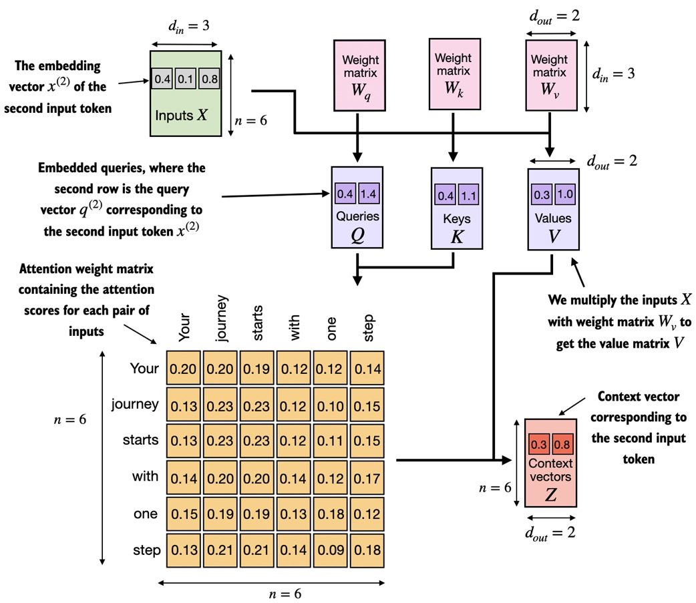
如图 3.18 所示，自注意力涉及可训练的权重矩阵 WqW_qWq​、WkW_kWk​ 和 WvW_vWv​。这些矩阵将输入数据转换为查询、键和值，构成注意力机制的核心部分。随着模型接触更多数据，这些可训练权重会得到调整。

* * *

### 使用 PyTorch 的 Linear 层改进 SelfAttention_v1 实现

利用 PyTorch 的 `nn.Linear` 层可以进一步优化 `SelfAttention_v1` 的实现，该层在禁用偏置项时可以高效执行矩阵乘法。此外，使用 `nn.Linear` 而不是手动实现 `nn.Parameter(torch.rand(...))` 的优势在于 `nn.Linear` 拥有优化的权重初始化方案，有助于更稳定和有效的模型训练。

* * *

### 代码清单 3.2：使用 PyTorch Linear 层的自注意力类

```python
class SelfAttention_v2(nn.Module):
    def __init__(self, d_in, d_out, qkv_bias=False):
        super().__init__()
        self.d_out = d_out
        self.W_query = nn.Linear(d_in, d_out, bias=qkv_bias)
        self.W_key = nn.Linear(d_in, d_out, bias=qkv_bias)
        self.W_value = nn.Linear(d_in, d_out, bias=qkv_bias)

    def forward(self, x):
        keys = self.W_key(x)
        queries = self.W_query(x)
        values = self.W_value(x)
        attn_scores = queries @ keys.T
        attn_weights = torch.softmax(attn_scores / keys.shape[-1]**0.5, dim=1)
        context_vec = attn_weights @ values
        return context_vec
```

可以像 `SelfAttention_v1` 一样使用 `SelfAttention_v2`：

```python
torch.manual_seed(789)
sa_v2 = SelfAttention_v2(d_in, d_out)
print(sa_v2(inputs))
```

输出如下：

```css
tensor([[-0.0739, 0.0713],
        [-0.0748, 0.0703],
        [-0.0749, 0.0702],
        [-0.0760, 0.0685],
        [-0.0763, 0.0679],
        [-0.0754, 0.0693]], grad_fn=<MmBackward0>)
```

注意，由于 `nn.Linear` 使用了更复杂的权重初始化方案，`SelfAttention_v1` 和 `SelfAttention_v2` 产生了不同的输出。

* * *

### 练习 3.1 比较 SelfAttention_v1 和 SelfAttention_v2

注意 `nn.Linear` 在 `SelfAttention_v2` 中使用的权重初始化方案与 `SelfAttention_v1` 中的 `nn.Parameter(torch.rand(d_in, d_out))` 不同，这会导致两种机制生成不同的结果。为检查 `SelfAttention_v1` 和 `SelfAttention_v2` 结构上的相似性，我们可以将 `SelfAttention_v2` 的权重矩阵转移到 `SelfAttention_v1` 上，使得它们生成相同的结果。

你的任务是将 `SelfAttention_v2` 实例的权重正确赋值给 `SelfAttention_v1` 实例。请理解两者的权重关系（提示：`nn.Linear` 存储的权重矩阵是转置形式）。完成赋值后，应该可以观察到两个实例生成相同的输出。

* * *

### 下一节预告

在下一节中，我们将进一步增强自注意力机制，重点是引入**因果性**和**多头**元素。

-   **因果性**：为了防止模型在序列中访问未来信息，因果性修正注意力机制，使得语言建模任务中，每个词的预测仅依赖于前面的词。
-   **多头**：多头注意力将注意力机制分成多个“头”，每个头学习数据的不同方面，使模型能够同时关注不同位置的信息。这在复杂任务中显著提升了模型性能。


## 3.5 使用因果注意力隐藏未来词

本节中，我们将对标准自注意力机制进行修改，创建因果注意力机制，这是在后续章节中开发大型语言模型（LLM）时的关键步骤。

因果注意力，也称为**遮罩注意力**，是一种特殊的自注意力形式。它限制模型在处理任何给定的标记时，仅考虑序列中之前和当前的输入。这与标准自注意力机制不同，后者允许同时访问整个输入序列。

因此，在计算注意力得分时，因果注意力机制确保模型仅考虑当前标记及之前出现的标记，而不会关注当前标记之后的未来标记。

在类似 GPT 的 LLM 中，为实现这一点，我们在处理每个标记时会对未来标记进行遮罩，忽略当前标记之后的标记，如**图 3.19** 所示。

* * *

> **图 3.19**：在因果注意力中，我们遮罩了对角线以上的注意力权重，以便在计算上下文向量时，LLM 不能访问未来标记。例如，对于第二行的“journey”一词，仅保留该词之前（“Your”）和当前词（“journey”）的位置的注意力权重。
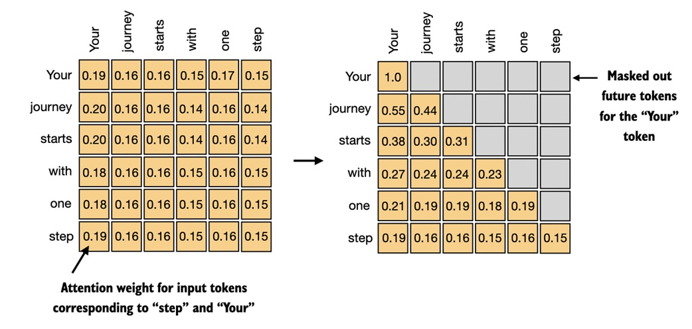
* * *

如**图 3.19** 所示，我们遮罩了对角线以上的注意力权重，并对未遮罩的注意力权重进行归一化，使每行的注意力权重之和为 1。在接下来的章节中，我们将用代码实现该遮罩和归一化过程。


**3.5.1 应用因果注意力遮罩**

本节将实现因果注意力遮罩的代码。我们将按照**图 3.20**中总结的步骤进行。

* * *

> **图 3.20**：获得因果注意力中的遮罩注意力权重矩阵的一种方法是，将 softmax 应用于注意力得分，零化对角线以上的元素，并对结果矩阵进行归一化。

* * *
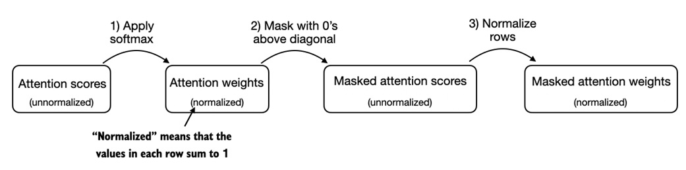

为了实现因果注意力遮罩的步骤，首先我们对上节的注意力得分和权重进行操作，编码因果注意力机制。

### 第一步：计算注意力权重

我们首先使用 softmax 函数来计算注意力权重：

```python
queries = sa_v2.W_query(inputs)  # A
keys = sa_v2.W_key(inputs)
attn_scores = queries @ keys.T
attn_weights = torch.softmax(attn_scores / keys.shape[-1]**0.5, dim=1)
print(attn_weights)
```

结果的注意力权重如下：

```css
tensor([[0.1921, 0.1646, 0.1652, 0.1550, 0.1721, 0.1510],
        [0.2041, 0.1659, 0.1662, 0.1496, 0.1665, 0.1477],
        [0.2036, 0.1659, 0.1662, 0.1498, 0.1664, 0.1480],
        [0.1869, 0.1667, 0.1668, 0.1571, 0.1661, 0.1564],
        [0.1830, 0.1669, 0.1670, 0.1588, 0.1658, 0.1585],
        [0.1935, 0.1663, 0.1666, 0.1542, 0.1666, 0.1529]],
       grad_fn=<SoftmaxBackward0>)
```

* * *

### 第二步：生成遮罩矩阵

利用 PyTorch 的 `tril` 函数创建一个遮罩矩阵，将对角线以上的值置零：

```python
context_length = attn_scores.shape[0]
mask_simple = torch.tril(torch.ones(context_length, context_length))
print(mask_simple)
```

得到的遮罩矩阵如下：

```css
tensor([[1., 0., 0., 0., 0., 0.],
        [1., 1., 0., 0., 0., 0.],
        [1., 1., 1., 0., 0., 0.],
        [1., 1., 1., 1., 0., 0.],
        [1., 1., 1., 1., 1., 0.],
        [1., 1., 1., 1., 1., 1.]])
```

### 第三步：应用遮罩

将生成的遮罩矩阵与注意力权重相乘，将对角线以上的元素置零：

```python
masked_simple = attn_weights * mask_simple
print(masked_simple)
```

输出结果显示，对角线上方的元素已成功置零：

```css
tensor([[0.1921, 0.0000, 0.0000, 0.0000, 0.0000, 0.0000],
        [0.2041, 0.1659, 0.0000, 0.0000, 0.0000, 0.0000],
        [0.2036, 0.1659, 0.1662, 0.0000, 0.0000, 0.0000],
        [0.1869, 0.1667, 0.1668, 0.1571, 0.0000, 0.0000],
        [0.1830, 0.1669, 0.1670, 0.1588, 0.1658, 0.0000],
        [0.1935, 0.1663, 0.1666, 0.1542, 0.1666, 0.1529]],
       grad_fn=<MulBackward0>)
```

### 第四步：重新归一化遮罩的注意力权重

接下来，将每行元素除以该行的和，使其重新归一化为 1：

```python
row_sums = masked_simple.sum(dim=1, keepdim=True)
masked_simple_norm = masked_simple / row_sums
print(masked_simple_norm)
```

得到的归一化注意力权重矩阵中，每行的和为 1，且对角线以上的值为零：

```css
tensor([[1.0000, 0.0000, 0.0000, 0.0000, 0.0000, 0.0000],
        [0.5517, 0.4483, 0.0000, 0.0000, 0.0000, 0.0000],
        [0.3800, 0.3097, 0.3103, 0.0000, 0.0000, 0.0000],
        [0.2758, 0.2460, 0.2462, 0.2319, 0.0000, 0.0000],
        [0.2175, 0.1983, 0.1984, 0.1888, 0.1971, 0.0000],
        [0.1935, 0.1663, 0.1666, 0.1542, 0.1666, 0.1529]],
       grad_fn=<DivBackward0>)
```

* * *

### 避免信息泄露的说明

在应用遮罩后重新归一化注意力权重，可能会让人觉得未来标记（我们试图遮罩的）会影响当前标记。然而，重新归一化后的注意力权重分布实际上相当于仅在未遮罩的部分上进行 softmax 计算，因此不会发生信息泄露。

* * *

### 更高效的遮罩方法

为实现更高效的遮罩，可以在应用 softmax 函数前，将遮罩位置的值设置为负无穷大（-∞），如**图 3.21** 所示。

> **图 3.21**：更高效的因果注意力遮罩方法是，在应用 softmax 函数前，将遮罩位置设置为负无穷大（-∞）。softmax 会将这些位置视为零概率。
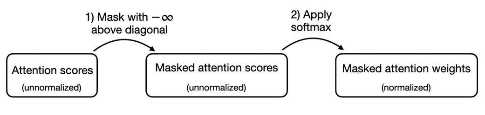
实现该方法的代码如下：

```python
mask = torch.triu(torch.ones(context_length, context_length), diagonal=1)
masked = attn_scores.masked_fill(mask.bool(), -torch.inf)
print(masked)
```

生成的遮罩结果如下：

```css
tensor([[0.2899, -inf, -inf, -inf, -inf, -inf],
        [0.4656, 0.1723, -inf, -inf, -inf, -inf],
        [0.4594, 0.1703, 0.1731, -inf, -inf, -inf],
        [0.2642, 0.1024, 0.1036, 0.0186, -inf, -inf],
        [0.2183, 0.0874, 0.0882, 0.0177, 0.0786, -inf],
        [0.3408, 0.1270, 0.1290, 0.0198, 0.1290, 0.0078]],
       grad_fn=<MaskedFillBackward0>)
```

接下来，应用 softmax 函数完成操作：

```python
attn_weights = torch.softmax(masked / keys.shape[-1]**0.5, dim=1)
print(attn_weights)
```

输出结果显示每行的和为 1，无需进一步归一化：

```css
tensor([[1.0000, 0.0000, 0.0000, 0.0000, 0.0000, 0.0000],
        [0.5517, 0.4483, 0.0000, 0.0000, 0.0000, 0.0000],
        [0.3800, 0.3097, 0.3103, 0.0000, 0.0000, 0.0000],
        [0.2758, 0.2460, 0.2462, 0.2319, 0.0000, 0.0000],
        [0.2175, 0.1983, 0.1984, 0.1888, 0.1971, 0.0000],
        [0.1935, 0.1663, 0.1666, 0.1542, 0.1666, 0.1529]],
       grad_fn=<SoftmaxBackward0>)
```

至此，我们可以使用修改后的注意力权重来计算上下文向量，通过 `context_vec = attn_weights @ values` 实现，如 **3.4 节** 中所示。不过在下一节中，我们将介绍对因果注意力机制的另一项小改动，用于在训练 LLM 时减少过拟合。


**3.5.2 使用 Dropout 进一步遮罩注意力权重**

在深度学习中，**Dropout** 是一种技术，用于在训练期间随机忽略部分隐藏层单元，有效地“丢弃”它们。这种方法可以防止模型过拟合，确保模型不会过于依赖特定的隐藏层单元。注意，Dropout 仅在训练期间使用，推理阶段则禁用。

在 Transformer 架构（包括 GPT 等模型）中，Dropout 通常应用于两个特定位置：**计算完注意力得分后**或**将注意力权重应用到值向量后**。在这里，我们将把 Dropout 遮罩应用在计算完注意力权重之后，如**图 3.22**所示，因为这种变体在实践中更为常见。

* * *

> **图 3.22**：使用因果注意力遮罩（左上）后，我们应用额外的 Dropout 遮罩（右上），以在训练期间将更多的注意力权重置零，从而减少过拟合。

* * *
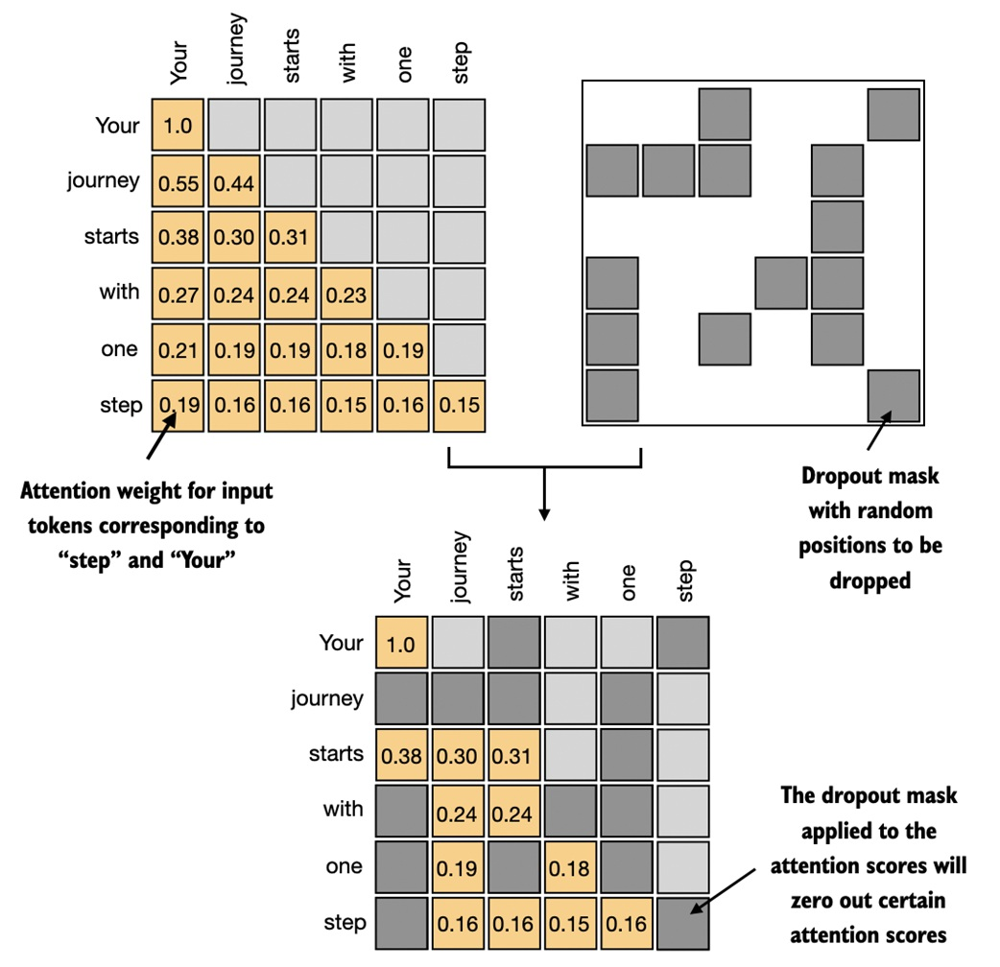

在下面的代码示例中，我们使用 50% 的 Dropout，即遮罩掉一半的注意力权重（在训练 GPT 模型时，我们会使用更低的 Dropout 比率，例如 0.1 或 0.2）。为便于演示，我们首先对一个 6×6 的全为 1 的张量应用 PyTorch 的 Dropout 实现：

```python
torch.manual_seed(123)
dropout = torch.nn.Dropout(0.5)  # A
example = torch.ones(6, 6)  # B
print(dropout(example))
```

输出显示约一半的值被置零：

```css
tensor([[2., 2., 0., 2., 2., 0.],
        [0., 0., 0., 2., 0., 2.],
        [2., 2., 2., 2., 0., 2.],
        [0., 2., 2., 0., 0., 2.],
        [0., 2., 0., 2., 0., 2.],
        [0., 2., 2., 2., 2., 0.]])
```

应用 50% Dropout 后，矩阵中的一半元素随机设为零。为补偿活跃元素的减少，剩余元素的值会按 1/0.5=21 / 0.5 = 21/0.5=2 的因子进行放大。这种放大至关重要，确保注意力机制的平均影响在训练和推理阶段保持一致。

### 将 Dropout 应用于注意力权重矩阵

我们现在将 Dropout 应用于实际的注意力权重矩阵：

```python
torch.manual_seed(123)
print(dropout(attn_weights))
```

结果中的注意力权重矩阵有额外的元素被置零，且剩余的元素进行了重新缩放：

```css
tensor([[2.0000, 0.0000, 0.0000, 0.0000, 0.0000, 0.0000],
        [0.0000, 0.0000, 0.0000, 0.0000, 0.0000, 0.0000],
        [0.7599, 0.6194, 0.6206, 0.0000, 0.0000, 0.0000],
        [0.0000, 0.4921, 0.4925, 0.0000, 0.0000, 0.0000],
        [0.0000, 0.3966, 0.0000, 0.3775, 0.0000, 0.0000],
        [0.0000, 0.3327, 0.3331, 0.3084, 0.3331, 0.0000]],
       grad_fn=<MulBackward0>)
```

* * *

**3.5.3 实现紧凑的因果注意力类**

接下来，我们将因果注意力和 Dropout 修改合并到 **SelfAttention** Python 类中。这一类将作为实现多头注意力的模板，这是我们将在下一节中实现的最终注意力模块。

为简化起见，我们确保代码能够处理由多个输入组成的批次，以便 **CausalAttention** 类支持第 2 章中数据加载器生成的批次输出。

首先，为模拟批次输入，我们将输入文本示例重复一次：

```python
batch = torch.stack((inputs, inputs), dim=0)
print(batch.shape)  # A
```

这将生成一个 3D 张量，其中包含两个输入文本，每个有 6 个标记，每个标记为 3 维嵌入向量：

```css
torch.Size([2, 6, 3])
```

* * *

### 代码清单 3.3：一个紧凑的因果注意力类

```python
class CausalAttention(nn.Module):
    def __init__(self, d_in, d_out, context_length, dropout, qkv_bias=False):
        super().__init__()
        self.d_out = d_out
        self.W_query = nn.Linear(d_in, d_out, bias=qkv_bias)
        self.W_key = nn.Linear(d_in, d_out, bias=qkv_bias)
        self.W_value = nn.Linear(d_in, d_out, bias=qkv_bias)
        self.dropout = nn.Dropout(dropout)  # A
        self.register_buffer(
            'mask',
            torch.triu(torch.ones(context_length, context_length), diagonal=1)
        )  # B

    def forward(self, x):
        b, num_tokens, d_in = x.shape  # 新增批次维度 b
        keys = self.W_key(x)
        queries = self.W_query(x)
        values = self.W_value(x)
        attn_scores = queries @ keys.transpose(1, 2)  # C
        attn_scores.masked_fill_(
            self.mask.bool()[:num_tokens, :num_tokens], -torch.inf
        )  # D
        attn_weights = torch.softmax(attn_scores / keys.shape[-1]**0.5, dim=-1)
        attn_weights = self.dropout(attn_weights)
        context_vec = attn_weights @ values
        return context_vec
```

* * *

### 代码解释

在 `__init__` 方法中，我们新增了 `self.register_buffer()`。在 PyTorch 中使用 `register_buffer` 虽非所有场景都必须，但在此处有几个优点。例如，在 LLM 中使用 **CausalAttention** 类时，缓冲区会自动随模型移动到相应的设备（CPU 或 GPU），这在训练 LLM 时尤为重要。这意味着不需要手动确保这些张量与模型参数位于同一设备，避免了设备不匹配错误。

可以像以前一样使用 **CausalAttention** 类：

```python
torch.manual_seed(123)
context_length = batch.shape[1]
ca = CausalAttention(d_in, d_out, context_length, 0.0)
context_vecs = ca(batch)
print("context_vecs.shape:", context_vecs.shape)
```

输出的上下文向量为一个 3D 张量，每个标记现由一个 2D 嵌入表示：

```css
context_vecs.shape: torch.Size([2, 6, 2])
```

* * *

> **图 3.23**：图中总结了我们到目前为止实现的四种不同的注意力模块。从简化的注意力机制开始，我们依次添加了可训练权重和因果注意力遮罩。在本章的剩余部分，我们将扩展因果注意力机制并实现多头注意力，这是下一章 LLM 实现中使用的最终模块。

* * *
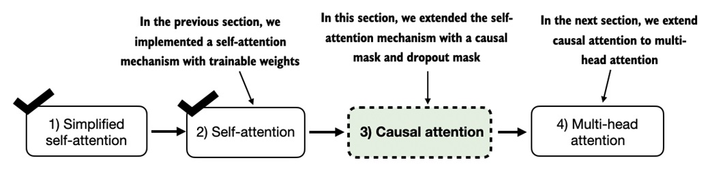

在这一节中，我们专注于神经网络中的因果注意力概念和实现。下一节中，我们将扩展此概念，实现一个**多头注意力模块**，该模块能够并行地执行多个因果注意力机制。


## 3.6 从单头注意力扩展到多头注意力

在本章的最后部分，我们将先前实现的因果注意力类扩展为多头注意力（multi-head attention）。**多头**表示将注意力机制分成多个独立的“头”，每个头独立操作。单个因果注意力模块可以看作是单头注意力，它只有一组注意力权重顺序处理输入。

在接下来的小节中，我们将从因果注意力扩展到多头注意力。第一个小节将通过堆叠多个 **CausalAttention** 模块来直观地构建多头注意力模块。第二个小节将以更复杂但计算更高效的方式实现同样的多头注意力模块。

### 3.6.1 堆叠多个单头注意力层

实际实现多头注意力时，需要创建多个自注意力机制（在**3.4.1 节**中的 **图 3.18** 进行了描述），每个自注意力机制都有自己的权重，然后将它们的输出组合起来。使用多个自注意力机制虽然计算密集，但对于 transformer 架构的 LLM 等复杂模式识别非常重要。

> **图 3.24** 展示了多头注意力模块的结构，由多个单头注意力模块堆叠而成。

在代码中，我们可以通过实现一个简单的 **MultiHeadAttentionWrapper** 类来堆叠多个先前实现的 **CausalAttention** 模块：

* * *
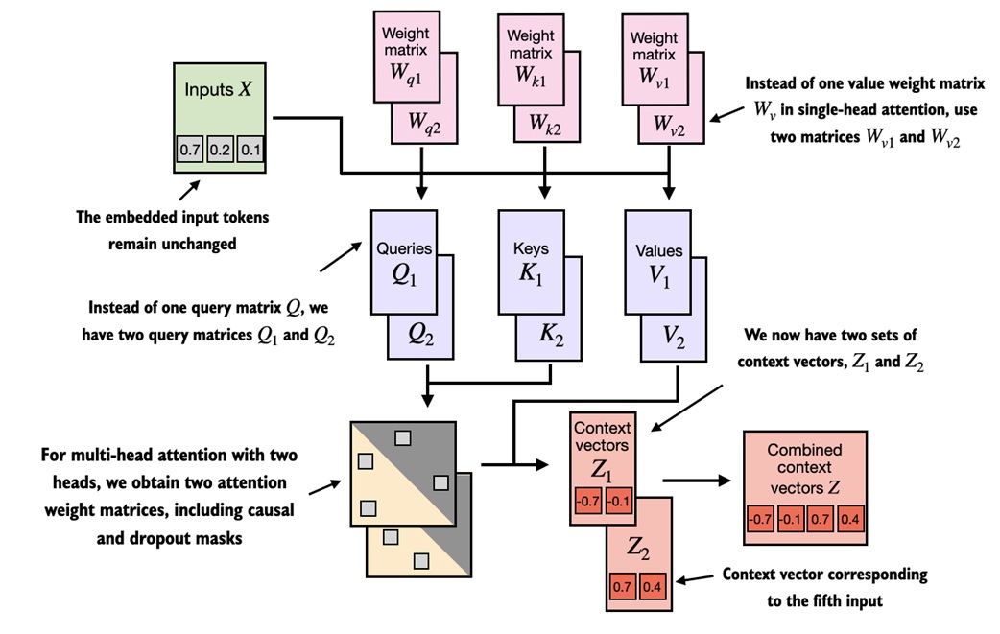

### 代码清单 3.4：实现多头注意力的包装类

```python
class MultiHeadAttentionWrapper(nn.Module):
    def __init__(self, d_in, d_out, context_length, dropout, num_heads, qkv_bias=False):
        super().__init__()
        self.heads = nn.ModuleList(
            [CausalAttention(d_in, d_out, context_length, dropout, qkv_bias)
             for _ in range(num_heads)]
        )

    def forward(self, x):
        return torch.cat([head(x) for head in self.heads], dim=-1)
```

例如，若我们使用 **MultiHeadAttentionWrapper** 类，指定两个注意力头（`num_heads=2`）和 **CausalAttention** 输出维度 `d_out=2`，则结果是 4 维的上下文向量（`d_out*num_heads=4`），如**图 3.25** 所示。

> **图 3.25**：在 **MultiHeadAttentionWrapper** 中，我们指定了注意力头的数量（`num_heads`）。若设置 `num_heads=2`，得到包含两组上下文向量矩阵的张量，每个上下文向量矩阵的行表示标记的上下文向量，列表示嵌入维度（由 `d_out=4` 指定）。沿列维度拼接这些上下文向量矩阵。由于有 2 个注意力头和 2 维嵌入维度，最终嵌入维度为 2×2=42 \times 2 = 42×2=4。

* * *
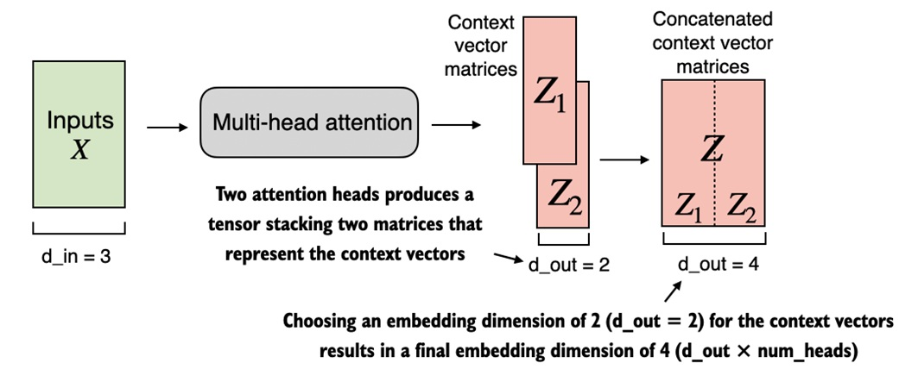
### 具体代码示例

可以像以前一样使用 **MultiHeadAttentionWrapper** 类：

```python
torch.manual_seed(123)
context_length = batch.shape[1]  # 标记数
d_in, d_out = 3, 2
mha = MultiHeadAttentionWrapper(d_in, d_out, context_length, 0.0, num_heads=2)
context_vecs = mha(batch)
print(context_vecs)
print("context_vecs.shape:", context_vecs.shape)
```

输出的张量表示上下文向量：

```css
tensor([[[-0.4519, 0.2216, 0.4772, 0.1063],
         [-0.5874, 0.0058, 0.5891, 0.3257],
         [-0.6300, -0.0632, 0.6202, 0.3860],
         [-0.5675, -0.0843, 0.5478, 0.3589],
         [-0.5526, -0.0981, 0.5321, 0.3428],
         [-0.5299, -0.1081, 0.5077, 0.3493]],

        [[-0.4519, 0.2216, 0.4772, 0.1063],
         [-0.5874, 0.0058, 0.5891, 0.3257],
         [-0.6300, -0.0632, 0.6202, 0.3860],
         [-0.5675, -0.0843, 0.5478, 0.3589],
         [-0.5526, -0.0981, 0.5321, 0.3428],
         [-0.5299, -0.1081, 0.5077, 0.3493]]], grad_fn=<CatBackward0>)
```

输出张量 `context_vecs.shape` 为：

```css
context_vecs.shape: torch.Size([2, 6, 4])
```

结果中 `context_vecs` 张量的第一个维度为 2，因为有两个输入文本（输入文本重复，因此这两个上下文向量完全相同）。第二维度对应每个输入的 6 个标记。第三维度则是每个标记的 4 维嵌入。

* * *

**练习 3.2**：返回 2 维的嵌入向量

更改 **MultiHeadAttentionWrapper(..., num_heads=2)** 的输入参数，使输出上下文向量为 2 维而不是 4 维，同时保持 `num_heads=2`。提示：无需修改类实现，只需更改其他输入参数。

* * *

在本节中，我们实现了一个 **MultiHeadAttentionWrapper** 类，用于组合多个单头注意力模块。然而请注意，在 `forward` 方法中，多个头是通过 `[head(x) for head in self.heads]` 顺序处理的。可以通过并行处理所有头来改进这一实现。例如，通过矩阵乘法同时计算所有注意力头的输出，这将在下一节中探索。

### 3.6.2 实现带有权重分割的多头注意力机制

在上一节中，我们通过堆叠多个单头注意力模块创建了一个 `MultiHeadAttentionWrapper` 来实现多头注意力机制。这是通过实例化并组合多个 `CausalAttention` 对象实现的。

与其维护两个单独的类 `MultiHeadAttentionWrapper` 和 `CausalAttention`，我们可以将这两个概念结合到一个 `MultiHeadAttention` 类中。此外，除了将 `MultiHeadAttentionWrapper` 与 `CausalAttention` 代码合并，我们还将做一些其他修改，以更高效地实现多头注意力机制。

在 `MultiHeadAttentionWrapper` 中，多个头是通过创建一个 `CausalAttention` 对象列表 (`self.heads`) 实现的，每个对象表示一个独立的注意力头。`CausalAttention` 类独立执行注意力机制，然后将每个头的结果拼接起来。而新的 `MultiHeadAttention` 类在一个类中集成了多头功能，通过对查询、键和值张量进行投影并重塑（`reshaping`），将输入分成多个头，在计算注意力后再组合这些头的结果。

下面是 `MultiHeadAttention` 类的代码：

```python
class MultiHeadAttention(nn.Module):
    def __init__(self, d_in, d_out, context_length, dropout, num_heads, qkv_bias=False):
        super().__init__()
        assert d_out % num_heads == 0, "d_out must be divisible by num_heads"
        self.d_out = d_out
        self.num_heads = num_heads
        self.head_dim = d_out // num_heads  # A
        self.W_query = nn.Linear(d_in, d_out, bias=qkv_bias)
        self.W_key = nn.Linear(d_in, d_out, bias=qkv_bias)
        self.W_value = nn.Linear(d_in, d_out, bias=qkv_bias)
        self.out_proj = nn.Linear(d_out, d_out)  # B
        self.dropout = nn.Dropout(dropout)
        self.register_buffer(
            'mask',
            torch.triu(torch.ones(context_length, context_length), diagonal=1)
        )

    def forward(self, x):
        b, num_tokens, d_in = x.shape
        keys = self.W_key(x)  # C
        queries = self.W_query(x)  # C
        values = self.W_value(x)  # C
        keys = keys.view(b, num_tokens, self.num_heads, self.head_dim)  # D
        values = values.view(b, num_tokens, self.num_heads, self.head_dim)  # D
        queries = queries.view(b, num_tokens, self.num_heads, self.head_dim)  # D
        keys = keys.transpose(1, 2)  # E
        queries = queries.transpose(1, 2)  # E
        values = values.transpose(1, 2)  # E
        attn_scores = queries @ keys.transpose(2, 3)  # F
        mask_bool = self.mask.bool()[:num_tokens, :num_tokens]  # G
        attn_scores.masked_fill_(mask_bool, -torch.inf)  # H
        attn_weights = torch.softmax(
            attn_scores / keys.shape[-1] ** 0.5, dim=-1
        )
        attn_weights = self.dropout(attn_weights)
        context_vec = (attn_weights @ values).transpose(1, 2)  # I
        context_vec = context_vec.contiguous().view(b, num_tokens, self.d_out)  # J
        context_vec = self.out_proj(context_vec)  # K
        return context_vec
```

虽然 `MultiHeadAttention` 类中的重塑（`.view`）和转置（`.transpose`）操作看起来复杂，但它在数学上实现的原理与之前的 `MultiHeadAttentionWrapper` 相同。

在 `MultiHeadAttentionWrapper` 中，我们堆叠多个单头注意力层，将它们组合成多头注意力层。而 `MultiHeadAttention` 类采取了整合的方法，它开始于一个多头层，然后在内部将该层分割成单独的注意力头，如图 3.26 所示。
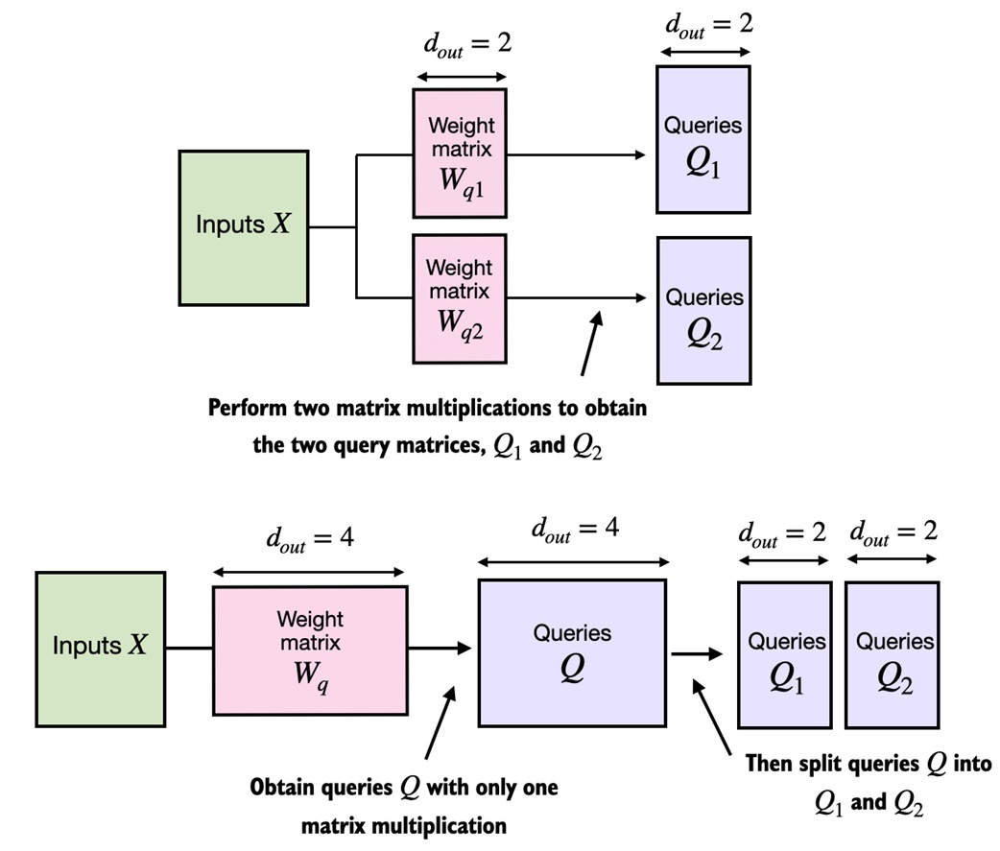
#### 示例：多头矩阵乘法的实现

假设我们有如下张量：

```python
a = torch.tensor([[[[0.2745, 0.6584, 0.2775, 0.8573], [0.8993, 0.0390, 0.9268, 0.7388], [0.7179, 0.7058, 0.9156, 0.4340]],
                  [[0.0772, 0.3565, 0.1479, 0.5331], [0.4066, 0.2318, 0.4545, 0.9737], [0.4606, 0.5159, 0.4220, 0.5786]]]])
```

现在我们可以执行矩阵乘法：

```python
print(a @ a.transpose(2, 3))
```

结果如下：

```python
tensor([[[[1.3208, 1.1631, 1.2879],
          [1.1631, 2.2150, 1.8424],
          [1.2879, 1.8424, 2.0402]],
         [[0.4391, 0.7003, 0.5903],
          [0.7003, 1.3737, 1.0620],
          [0.5903, 1.0620, 0.9912]]]])
```

在 `MultiHeadAttention` 中，计算注意力权重和上下文向量后，来自所有头的上下文向量会被转置回形状 `(b, num_tokens, num_heads, head_dim)`。这些向量会被重塑（展平）成形状 `(b, num_tokens, d_out)`，从而有效地将所有头的输出组合起来。

此外，我们在 `MultiHeadAttention` 中添加了一个输出投影层 (`self.out_proj`)，这在 `CausalAttention` 类中没有。这个输出投影层不是严格必须的，但它在许多大模型架构中常见，因此我们在此添加它以便更全面。

#### 使用 `MultiHeadAttention` 类

```python
torch.manual_seed(123)
batch_size, context_length, d_in = batch.shape
d_out = 2
mha = MultiHeadAttention(d_in, d_out, context_length, 0.0, num_heads=2)
context_vecs = mha(batch)
print(context_vecs)
print("context_vecs.shape:", context_vecs.shape)
```

输出的维度由 `d_out` 参数控制：

```lua
tensor([[[0.3190, 0.4858], [0.2943, 0.3897], ...]])
context_vecs.shape: torch.Size([2, 6, 2])
```

#### 练习 3.3 初始化与 GPT-2 相同大小的注意力模块

使用 `MultiHeadAttention` 类，初始化一个具有 12 个注意力头的多头注意力模块，并确保输入和输出的嵌入维度与 GPT-2 相同（768 维）。


## 3.7 总结

-   注意力机制将输入元素转换为包含所有输入信息的增强上下文向量表示。
-   自注意力机制将上下文向量表示计算为输入的加权和。
-   在简化的注意力机制中，注意力权重是通过点积计算的。
-   点积是一种简洁的方式，将两个向量逐元素相乘并求和。
-   虽然矩阵乘法并非绝对必要，但它使我们可以通过替代嵌套的 `for` 循环来更高效和紧凑地实现计算。
-   用于大型语言模型（LLM）的自注意力机制称为缩放点积注意力，其中包含可训练的权重矩阵，用于计算输入的中间变换：查询（queries）、值（values）和键（keys）。
-   在从左到右读取和生成文本的 LLM 中，我们添加了因果注意力掩码，以防止 LLM 访问未来的标记（tokens）。
-   除了因果注意力掩码用于将未来标记的权重归零外，我们还可以添加一个 dropout 掩码，以减少 LLM 的过拟合。
-   基于 Transformer 的 LLM 中的注意力模块包含多个因果注意力实例，这称为多头注意力。
-   可以通过堆叠多个因果注意力模块实例来创建多头注意力模块。
-   一种更高效的创建多头注意力模块的方法是使用批量矩阵乘法。