# 从零开始实现一个 GPT 模型来生成文本

## 本章内容

-   编写一个类似 GPT 的大型语言模型（LLM），可以训练生成类似人类的文本
-   归一化层激活值以稳定神经网络的训练
-   在深度神经网络中添加捷径连接（shortcut connections），以便更高效地训练模型
-   实现 transformer 块来创建不同规模的 GPT 模型
-   计算 GPT 模型的参数数量和存储需求

在上一章中，我们学习并编写了多头注意力机制，这是 LLM 的核心组件之一。本章中，我们将编写 LLM 的其他构建模块，并将它们组装成一个类似 GPT 的模型。在下一章中，我们将训练它来生成类似人类的文本，如图 4.1 所示。

**图 4.1** 展示了编写一个 LLM 的三个主要阶段：在一个通用文本数据集上预训练 LLM，然后在标记数据集上进行微调。本章的重点是实现 LLM 的结构，下一章中我们将进行训练。

* * *
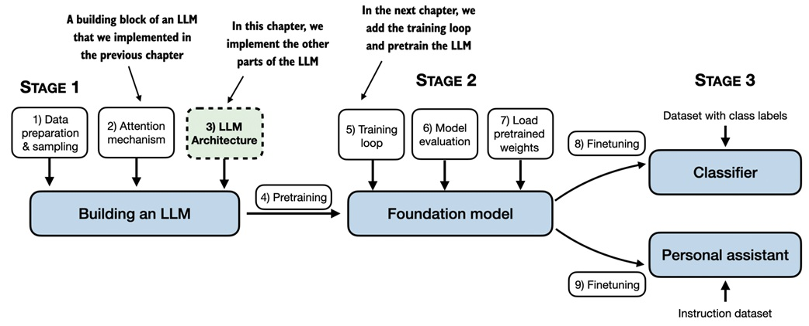

## 4.1 编写 LLM 架构

LLM，例如 GPT（Generative Pretrained Transformer 的缩写），是一种大型深度神经网络架构，设计用于一次生成一个词（或标记）。尽管其规模庞大，GPT 的架构并不复杂，因为它的许多组件是重复的，如图 4.2 所示。

**图 4.2** 展示了 GPT 模型的结构。除了嵌入层之外，它包含一个或多个 transformer 块，这些块内部包含上一章实现的掩码多头注意力模块。
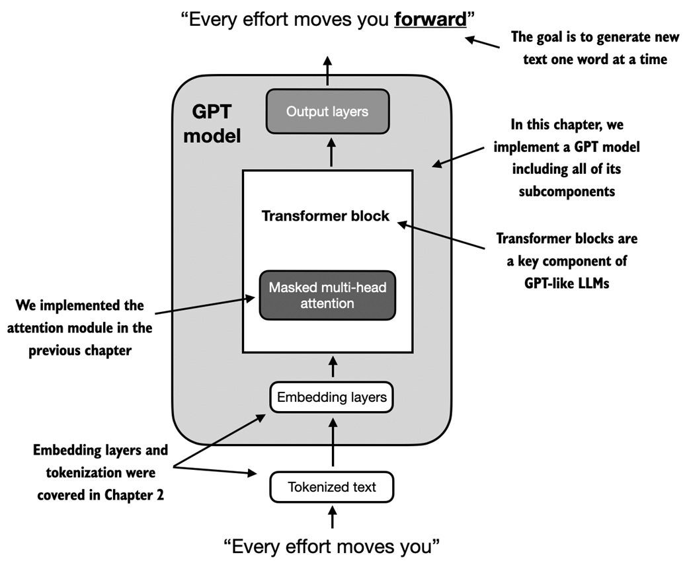
我们已经覆盖了几个关键方面，比如输入的分词和嵌入层，以及掩码多头注意力模块。本章将专注于实现 GPT 模型的核心结构，包括 transformer 块。我们将在下一章训练这个模型来生成类似人类的文本。

在前几章中，我们使用较小的嵌入维度来简化示例，使概念和代码示例更容易展示。但在这一章，我们将扩展到一个小型 GPT-2 模型的规模，即包含 1.24 亿个参数的小型版本，正如 Radford 等人在论文“Language Models are Unsupervised Multitask Learners”中描述的那样。请注意，原论文提到的参数数量是 1.17 亿，后续进行了更正。

在第 6 章中，我们将加载预训练权重并适配更大的 GPT-2 模型（345、762 和 1542 百万参数）。在深度学习和 LLM（如 GPT）中，"参数"指的是模型的可训练权重，这些权重在训练过程中进行调整，以最小化特定损失函数，最终使模型从训练数据中学习。

举例来说，如果一个神经网络层的权重矩阵为 2048 x 2048 的维度，则其参数总数为 2048 x 2048 = 4,194,304。

#### GPT-2 与 GPT-3 的对比

我们聚焦于 GPT-2，因为 OpenAI 已公开了 GPT-2 的预训练权重，我们将在第 6 章中加载这些权重。GPT-3 在模型架构上与 GPT-2 基本相同，只是参数量从 GPT-2 的 15 亿扩展到 GPT-3 的 175 亿，并且在更多数据上进行训练。截至本文撰写时，GPT-3 的权重尚未公开。对于学习实现 LLM 而言，GPT-2 是更好的选择，因为它可以在单台笔记本电脑上运行，而 GPT-3 则需要 GPU 集群来进行训练和推理。根据 Lambda Labs 的数据，在单个 V100 数据中心 GPU 上训练 GPT-3 需要 355 年，在 RTX 8000 消费级 GPU 上则需要 665 年。

我们可以通过以下 Python 字典来配置小型 GPT-2 模型，在后续代码示例中将用到此配置：

```python
GPT_CONFIG_124M = {
    "vocab_size": 50257,         # 词汇量大小
    "context_length": 1024,       # 上下文长度
    "emb_dim": 768,               # 嵌入维度
    "n_heads": 12,                # 注意力头数量
    "n_layers": 12,               # 层数
    "drop_rate": 0.1,             # dropout 比率
    "qkv_bias": False             # Query-Key-Value 的 bias
}
```

在 `GPT_CONFIG_124M` 字典中，变量名简明扼要，以保持代码简洁：

-   `"vocab_size"`：词汇量大小为 50257，与第 2 章中的 BPE 分词器相同。
-   `"context_length"`：表示模型能够处理的最大输入标记数量，通过位置嵌入实现。
-   `"emb_dim"`：表示嵌入维度，将每个标记转换为 768 维的向量。
-   `"n_heads"`：多头注意力机制中的注意力头数量，已在第 3 章实现。
-   `"n_layers"`：transformer 块的数量，后续章节将详细说明。
-   `"drop_rate"`：dropout 机制的比率（0.1 表示有 10% 的隐藏单元被丢弃），第 3 章中已介绍。
-   `"qkv_bias"`：用于决定是否在多头注意力的 Query、Key 和 Value 计算中添加偏置向量。我们初始设置为 False，以符合现代 LLM 的惯例，但在第 6 章加载 GPT-2 的预训练权重时将重新探讨该设置。

基于以上配置，我们将在本章开始实现一个 GPT 的占位符架构（DummyGPTModel），提供大致框架以展示各组件如何组合成完整的 GPT 架构。如图 4.3 所示，这将为我们提供一个总体视图，帮助我们在接下来的章节中编写必要的代码来构建完整的 GPT 模型架构。

* * *

**图 4.3** 展示了编码 GPT 架构的步骤顺序。在本章中，我们将从 GPT 主干的占位符架构开始，最终将各个组件集成到 transformer 块中，构建最终的 GPT 架构。
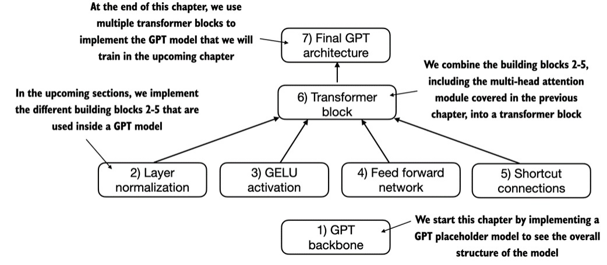
图中的编号标示了实现 GPT 架构的步骤顺序。首先从第 1 步开始，即占位符 GPT 主干 DummyGPTModel：

```python
# Listing 4.1: 占位符 GPT 模型架构类
import torch
import torch.nn as nn

class DummyGPTModel(nn.Module):
    def __init__(self, cfg):
        super().__init__()
        self.tok_emb = nn.Embedding(cfg["vocab_size"], cfg["emb_dim"])
        self.pos_emb = nn.Embedding(cfg["context_length"], cfg["emb_dim"])
        self.drop_emb = nn.Dropout(cfg["drop_rate"])
        self.trf_blocks = nn.Sequential(
            *[DummyTransformerBlock(cfg) for _ in range(cfg["n_layers"])]
        )  # A
        self.final_norm = DummyLayerNorm(cfg["emb_dim"])  # B
        self.out_head = nn.Linear(cfg["emb_dim"], cfg["vocab_size"], bias=False)

    def forward(self, in_idx):
        batch_size, seq_len = in_idx.shape
        tok_embeds = self.tok_emb(in_idx)
        pos_embeds = self.pos_emb(torch.arange(seq_len, device=in_idx.device))
        x = tok_embeds + pos_embeds
        x = self.drop_emb(x)
        x = self.trf_blocks(x)
        x = self.final_norm(x)
        logits = self.out_head(x)
        return logits

class DummyTransformerBlock(nn.Module):  # C
    def __init__(self, cfg):
        super().__init__()

    def forward(self, x):  # D
        return x

class DummyLayerNorm(nn.Module):  # E
    def __init__(self, normalized_shape, eps=1e-5):  # F
        super().__init__()

    def forward(self, x):
        return x
```

在这段代码中，`DummyGPTModel` 定义了一个简化的 GPT 模型结构。模型架构由以下部分组成：

-   标记嵌入和位置嵌入层
-   dropout 层
-   一系列 transformer 块（`DummyTransformerBlock`）
-   最后的层归一化层（`DummyLayerNorm`）
-   输出的线性层（`out_head`）

配置通过一个 Python 字典传入，例如我们创建的 `GPT_CONFIG_124M` 字典。

`forward` 方法描述了数据流动的过程：计算输入索引的标记和位置嵌入，应用 dropout，将数据通过 transformer 块进行处理，归一化并最终通过线性输出层生成 logits。

尽管代码已具备基本功能，但我们在 transformer 块和层归一化部分使用了占位符（`DummyLayerNorm` 和 `DummyTransformerBlock`），这些组件将在后续章节中详细实现。

接下来，我们将准备输入数据并初始化一个新的 GPT 模型来展示其用法。基于第 2 章中编码的分词器，**图 4.4** 提供了数据在 GPT 模型中进出流程的高级概览。
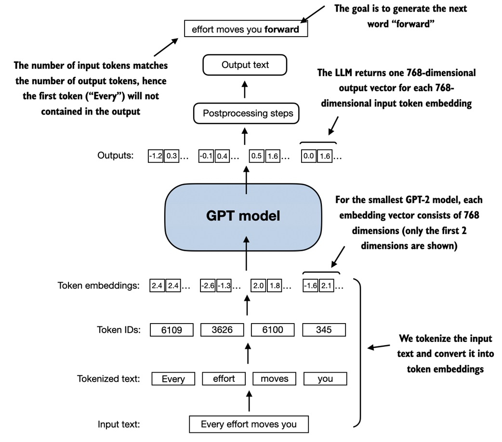
为了实现图 4.4 所示的步骤，我们对两条文本输入进行分词，并使用第 2 章介绍的 tiktoken 分词器：

```python
import tiktoken
tokenizer = tiktoken.get_encoding("gpt2")

batch = []
txt1 = "Every effort moves you"
txt2 = "Every day holds a"
batch.append(torch.tensor(tokenizer.encode(txt1)))
batch.append(torch.tensor(tokenizer.encode(txt2)))
batch = torch.stack(batch, dim=0)
print(batch)
```

生成的两条文本的 token ID 如下：

```plaintext
tensor([[ 6109, 3626, 6100, 345],  # A
        [ 6109, 1110, 6622, 257]])
```

接下来，我们初始化一个拥有 1.24 亿参数的 `DummyGPTModel` 实例并传入分词后的数据：

```python
torch.manual_seed(123)
model = DummyGPTModel(GPT_CONFIG_124M)
logits = model(batch)
print("Output shape:", logits.shape)
print(logits)
```

模型的输出（通常称为 logits）如下所示：

```plaintext
Output shape: torch.Size([2, 4, 50257])
tensor([[[-1.2034, 0.3201, -0.7130, ..., -1.5548, -0.2390, -0.4667],
         [-0.1192, 0.4539, -0.4432, ..., 0.2392, 1.3469, 1.2430],
         [0.5307, 1.6720, -0.4695, ..., 1.1966, 0.0111, 0.5835],
         [0.0139, 1.6755, -0.3388, ..., 1.1586, -0.0435, -1.0400]],
        [[-1.0908, 0.1798, -0.9484, ..., -1.6047, 0.2439, -0.4530],
         [-0.7860, 0.5581, -0.0610, ..., 0.4835, -0.0077, 1.6621],
         [0.3567, 1.2698, -0.6398, ..., -0.0162, -0.1296, 0.3717],
         [-0.2407, -0.7349, -0.5102, ..., 2.0057, -0.3694, 0.1814]]],
       grad_fn=<UnsafeViewBackward0>)
```

输出张量包含两行，对应两条文本样本。每条样本由 4 个 token 组成，每个 token 是一个 50257 维的向量，与分词器的词汇大小一致。

嵌入的 50257 维度对应每个词汇表中的独特 token。在本章的结尾，当我们实现后处理代码时，会将这些 50257 维的向量转换回 token ID，然后可以解码为文字。

现在，我们已经从上到下概览了 GPT 架构及其输入输出，接下来将从具体的 placeholder 开始实现各个模块。第一步是实现真正的层归一化类，以取代上面的 `DummyLayerNorm`。


## 4.2 使用层归一化来调整激活值

训练拥有多层的深度神经网络有时会非常具有挑战性，因为会出现梯度消失或梯度爆炸等问题。这些问题会导致训练动态不稳定，并且使得网络难以有效地调整其权重，这意味着学习过程难以找到一组参数（权重）使得神经网络的损失函数最小化。换句话说，网络难以学习到数据中的潜在模式，从而难以做出准确的预测或决策。（如果你对神经网络训练和梯度的概念还不熟悉，可以在附录 A 中的 A.4 节“轻松实现自动微分”中找到这些概念的简要介绍。不过，要理解本书内容并不需要对梯度有深奥的数学理解。）

在本节中，我们将实现层归一化，以提高神经网络训练的稳定性和效率。

层归一化的主要思想是将神经网络层的激活值（输出）调整到均值为 0、方差为 1，也就是单位方差。这种调整加快了有效权重的收敛速度，并确保训练过程的一致性和可靠性。正如我们在上一节基于 `DummyLayerNorm` 占位符所看到的那样，在 GPT-2 和现代 Transformer 架构中，层归一化通常在多头注意力模块的前后以及最终输出层之前应用。

在我们实现层归一化的代码之前，图 4.5 提供了一个层归一化如何工作的直观概览。

**图 4.5** 展示了层归一化的示意图，其中 5 个层输出（也称为激活值）被归一化，使得它们的均值为 0，方差为 1。
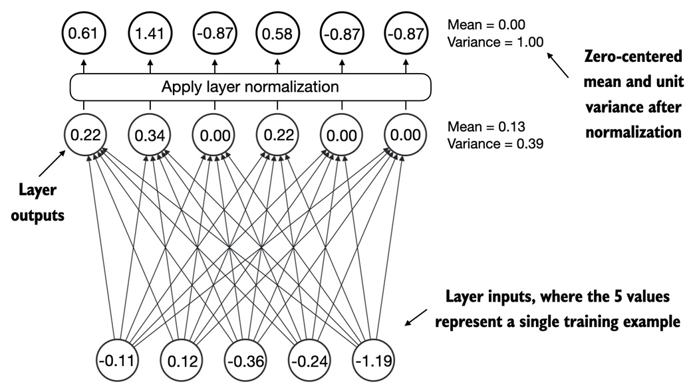
我们可以通过以下代码重现图 4.5 中的示例，其中实现了一个神经网络层，具有 5 个输入和 6 个输出，并将其应用于两个输入示例：

```python
torch.manual_seed(123)
batch_example = torch.randn(2, 5)  # A
layer = nn.Sequential(nn.Linear(5, 6), nn.ReLU())
out = layer(batch_example)
print(out)
```

这段代码会输出以下张量，其中第一行列出第一个输入的层输出，而第二行列出第二行的层输出：

```plaintext
tensor([[0.2260, 0.3470, 0.0000, 0.2216, 0.0000, 0.0000],
        [0.2133, 0.2394, 0.0000, 0.5198, 0.3297, 0.0000]],
       grad_fn=<ReluBackward0>)
```

我们编写的这个神经网络层由一个线性层和一个非线性激活函数 ReLU（修正线性单元）组成，这是神经网络中的标准激活函数。如果你不熟悉 ReLU，它只是将负输入截断为 0，确保层输出只有正值，这也解释了为什么输出结果中不包含任何负值。（注意，在 GPT 中我们将使用另一种更复杂的激活函数，它将在下一节中介绍。）

在对这些输出应用层归一化之前，让我们先检查均值和方差：

```python
mean = out.mean(dim=-1, keepdim=True)
var = out.var(dim=-1, keepdim=True)
print("Mean:\n", mean)
print("Variance:\n", var)
```

输出结果如下：

```plaintext
Mean:
tensor([[0.1324],
        [0.2170]], grad_fn=<MeanBackward1>)
Variance:
tensor([[0.0231],
        [0.0398]], grad_fn=<VarBackward0>)
```

上面均值张量中的第一行包含了第一个输入行的均值，第二行包含第二个输入行的均值。

在诸如均值或方差计算的操作中使用 `keepdim=True` 可以确保输出张量保留与输入张量相同的形状，即便该操作沿指定的维度（通过 `dim` 参数指定）减少了张量的维度。例如，没有 `keepdim=True` 时，返回的均值张量将是一个二维向量 `[0.1324, 0.2170]`，而不是 2×1 维的矩阵 `[[0.1324], [0.2170]]`。

参数 `dim` 指定了计算统计量（此处为均值或方差）时应在张量的哪个维度上执行操作，如图 4.6 所示。

**图 4.6** 是计算张量均值时 `dim` 参数的示意图。例如，如果我们有一个维度为 `[行数，列数]` 的 2D 张量（矩阵），使用 `dim=0` 会在行间执行操作（垂直方向，如底部所示），生成一个聚合每列数据的输出。使用 `dim=1` 或 `dim=-1` 则会在列间执行操作（水平方向，如顶部所示），生成一个聚合每行数据的输出。
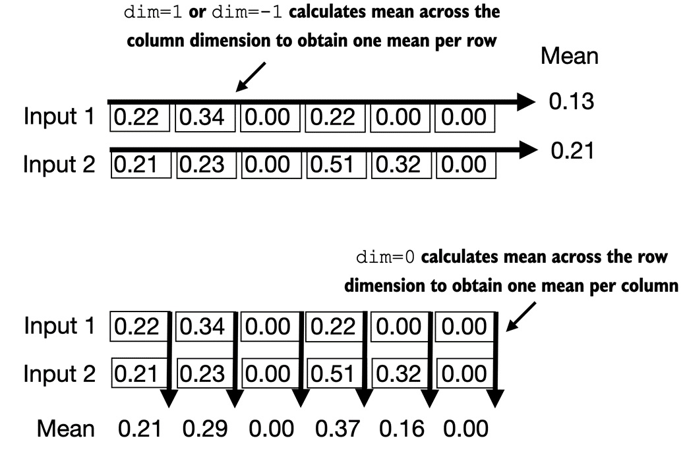
如图 4.6 所示，对于二维张量（如矩阵），在执行均值或方差计算时，使用 `dim=-1` 与使用 `dim=1` 是相同的。这是因为 -1 表示张量的最后一个维度，对于二维张量而言，这对应于列的维度。稍后在 GPT 模型中添加层归一化时，该模型会生成形状为 `[batch_size, num_tokens, embedding_size]` 的 3D 张量，我们仍然可以使用 `dim=-1` 来跨最后一个维度进行归一化，从而避免从 `dim=1` 更改为 `dim=2`。

接下来让我们对先前得到的层输出应用层归一化。该操作包括减去均值并除以方差的平方根（即标准差）：

```python
out_norm = (out - mean) / torch.sqrt(var)
mean = out_norm.mean(dim=-1, keepdim=True)
var = out_norm.var(dim=-1, keepdim=True)
print("Normalized layer outputs:\n", out_norm)
print("Mean:\n", mean)
print("Variance:\n", var)
```

我们可以根据结果看到，归一化后的层输出现在包含了负值，并且均值为 0，方差为 1：

```plaintext
Normalized layer outputs:
tensor([[ 0.6159, 1.4126, -0.8719, 0.5872, -0.8719, -0.8719],
        [-0.0189, 0.1121, -1.0876, 1.5173, 0.5647, -1.0876]],
       grad_fn=<DivBackward0>)
Mean:
tensor([[2.9802e-08],
        [3.9736e-08]], grad_fn=<MeanBackward1>)
Variance:
tensor([[1.],
        [1.]], grad_fn=<VarBackward0>)
```

注意，输出张量中的值 `2.9802e-08` 是科学计数法表示的 2.9802 × 10⁻⁸，即十进制形式的 0.0000000298。这个值非常接近 0，但不是精确的 0，这是因为计算机表示数值时的精度有限，可能会出现一些小的数值误差。

为了提高可读性，我们也可以关闭张量值的科学计数法显示，将 `sci_mode` 设置为 `False`：

```python
torch.set_printoptions(sci_mode=False)
print("Mean:\n", mean)
print("Variance:\n", var)
```

输出如下：

```plaintext
Mean:
tensor([[0.0000],
        [0.0000]], grad_fn=<MeanBackward1>)
Variance:
tensor([[1.],
        [1.]], grad_fn=<VarBackward0>)
```

在本节中，我们已经逐步编写了层归一化代码并应用到数据上。接下来将把这一过程封装到一个 PyTorch 模块中，便于在 GPT 模型中使用：

```python
# 列表 4.2：层归一化类
class LayerNorm(nn.Module):
    def __init__(self, emb_dim):
        super().__init__()
        self.eps = 1e-5
        self.scale = nn.Parameter(torch.ones(emb_dim))
        self.shift = nn.Parameter(torch.zeros(emb_dim))

    def forward(self, x):
        mean = x.mean(dim=-1, keepdim=True)
        var = x.var(dim=-1, keepdim=True, unbiased=False)
        norm_x = (x - mean) / torch.sqrt(var + self.eps)
        return self.scale * norm_x + self.shift
```

这种层归一化实现针对输入张量 `x` 的最后一个维度操作，表示嵌入维度（`emb_dim`）。变量 `eps` 是一个小常数，用于防止归一化过程中出现除零错误。`scale` 和 `shift` 是两个可训练参数（与输入维度相同），当模型判断它们有助于提高任务的性能时，会在训练过程中自动调整。这使得模型能够学习适合数据处理的适当缩放和偏移值。

##### 有偏方差

在我们的方差计算方法中，我们选择设置 `unbiased=False`。如果好奇的话，这意味着在计算方差时，分母为输入数量 `n`，而不是常见的贝塞尔校正的 `n-1`。这种方式被称为有偏方差估计。对于嵌入维度 `n` 较大的大型语言模型（LLM）而言，使用 `n` 和 `n-1` 的差异几乎可以忽略不计。我们选择这种方法以确保与 GPT-2 模型的归一化层兼容，并且它反映了实现原始 GPT-2 模型所使用的 TensorFlow 默认行为。使用类似设置可以确保我们的方法兼容将在第 6 章加载的预训练权重。

接下来，在实践中试用 `LayerNorm` 模块，并将其应用于示例输入：

```python
ln = LayerNorm(emb_dim=5)
out_ln = ln(batch_example)
mean = out_ln.mean(dim=-1, keepdim=True)
var = out_ln.var(dim=-1, unbiased=False, keepdim=True)
print("Mean:\n", mean)
print("Variance:\n", var)
```

我们可以根据结果看到，层归一化代码正常工作，将两个输入的值归一化，使得它们的均值为 0，方差为 1：

```plaintext
Mean:
tensor([[0.0000],
        [0.0000]], grad_fn=<MeanBackward1>)
Variance:
tensor([[1.0000],
        [1.0000]], grad_fn=<VarBackward0>)
```

在本节中，我们覆盖了实现 GPT 架构所需的一个构建模块，图 4.7 展示了我们在本章中组装 GPT 架构时实现的不同构建模块的心智模型。

**图 4.7** 是显示本章实现的不同构建模块的心智模型，用于组装 GPT 架构。
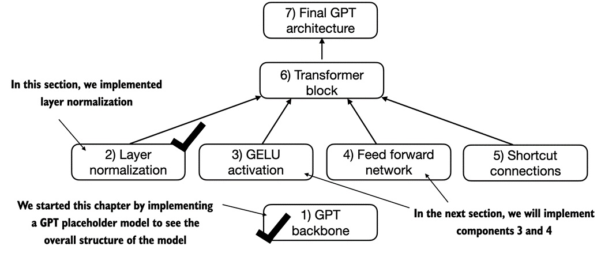
在下一节中，我们将研究 GELU 激活函数，这是 LLM 使用的一种激活函数，替代了本节中使用的传统 ReLU 函数。

##### 层归一化与批量归一化的比较

如果你熟悉批量归一化，一种常见的神经网络归一化方法，你可能会好奇它与层归一化的区别。与批量归一化不同，批量归一化在批次维度上进行归一化，而层归一化在特征维度上进行归一化。LLM 通常需要大量计算资源，训练或推理过程中的批量大小可能会受到硬件或具体用例的限制。层归一化每个输入独立于批次大小进行归一化，在这些情况下提供了更大的灵活性和稳定性。这对分布式训练或在资源受限的环境中部署模型尤其有利。


## 4.3 使用 GELU 激活函数实现前馈神经网络

在本节中，我们将实现一个小型神经网络子模块，用作 LLM 中 Transformer 块的一部分。首先，我们实现 GELU 激活函数，它在该神经网络子模块中起着至关重要的作用。（有关在 PyTorch 中实现神经网络的更多信息，请参见附录 A 的 A.5 节“实现多层神经网络”）

历史上，由于其简单性和在各种神经网络架构中的有效性，ReLU 激活函数在深度学习中被广泛使用。然而在 LLM 中，除了传统的 ReLU，还使用了其他几种激活函数。其中两个典型的例子是 GELU（Gaussian Error Linear Unit，高斯误差线性单元）和 SwiGLU（Sigmoid-Weighted Linear Unit，Sigmoid 加权线性单元）。GELU 和 SwiGLU 都是更复杂和平滑的激活函数，分别结合了高斯分布和 sigmoid 门控线性单元。与较为简单的 ReLU 不同，它们为深度学习模型提供了更好的性能。

GELU 激活函数可以通过多种方式实现；其精确形式定义为 GELU(x)=x⋅Φ(x)\text{GELU}(x) = x \cdot \Phi(x)GELU(x)=x⋅Φ(x)，其中 Φ(x)\Phi(x)Φ(x) 是标准高斯分布的累积分布函数。然而在实际应用中，通常实现一种计算上更便宜的近似形式（GPT-2 原始模型也是用这种近似进行训练的）：

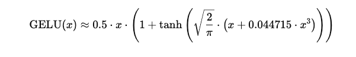
在代码中，我们可以将此函数实现为一个 PyTorch 模块，如下所示：

```python
# 列表 4.3 GELU 激活函数的实现
class GELU(nn.Module):
    def __init__(self):
        super().__init__()

    def forward(self, x):
        return 0.5 * x * (1 + torch.tanh(
            torch.sqrt(torch.tensor(2.0 / torch.pi)) *
            (x + 0.044715 * torch.pow(x, 3))
        ))
```

接下来，为了更好地了解此 GELU 函数的特性，并与 ReLU 函数进行比较，我们将这些函数并排绘制出来：

```python
import matplotlib.pyplot as plt

gelu, relu = GELU(), nn.ReLU()
x = torch.linspace(-3, 3, 100)  # A
y_gelu, y_relu = gelu(x), relu(x)

plt.figure(figsize=(8, 3))
for i, (y, label) in enumerate(zip([y_gelu, y_relu], ["GELU", "ReLU"]), 1):
    plt.subplot(1, 2, i)
    plt.plot(x, y)
    plt.title(f"{label} activation function")
    plt.xlabel("x")
    plt.ylabel(f"{label}(x)")
    plt.grid(True)
    plt.tight_layout()
plt.show()
```

从图 4.8 的结果中可以看到，ReLU 是一个分段线性函数，对于正值直接输出输入值；否则输出为零。GELU 则是一个平滑的非线性函数，近似 ReLU，但对于负值有一个非零的梯度。

**图 4.8** 显示了使用 matplotlib 绘制的 GELU 和 ReLU 函数的输出。x 轴表示函数输入，y 轴表示函数输出。
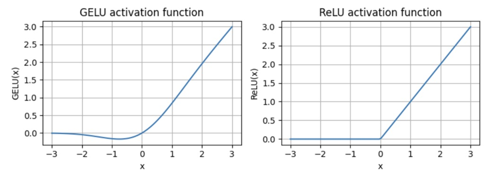
如图 4.8 所示，GELU 的平滑特性可以在训练过程中带来更好的优化特性，因为它允许对模型参数进行更细微的调整。相比之下，ReLU 在零点有一个陡峭的拐角，这有时会使优化变得更难，尤其是在网络非常深或结构复杂的情况下。此外，与 ReLU 不同的是，ReLU 对负值的输入直接输出零，而 GELU 对负值允许一个小的非零输出。这一特性意味着在训练过程中，即使神经元接收到负输入，也仍然可以参与学习过程，尽管贡献小于正输入。

接下来，我们将使用 GELU 函数实现 LLM Transformer 块中使用的小型神经网络模块 `FeedForward`：

```python
# 列表 4.4 前馈神经网络模块
class FeedForward(nn.Module):
    def __init__(self, cfg):
        super().__init__()
        self.layers = nn.Sequential(
            nn.Linear(cfg["emb_dim"], 4 * cfg["emb_dim"]),
            GELU(),
            nn.Linear(4 * cfg["emb_dim"], cfg["emb_dim"]),
        )

    def forward(self, x):
        return self.layers(x)
```

如上代码所示，`FeedForward` 模块是一个包含两个线性层和一个 GELU 激活函数的小型神经网络。在 1.24 亿参数的 GPT 模型中，它接受输入批次中的 token，这些 token 的嵌入大小为 768（通过 `GPT_CONFIG_124M` 字典配置，其中 `GPT_CONFIG_124M["emb_dim"] = 768`）。**图 4.9** 展示了当我们传入一些输入时，此小型前馈神经网络内部的嵌入大小如何变化。

**图 4.9** 提供了前馈神经网络层之间连接的视觉概览。重要的是，这个神经网络可以适应输入中不同的批次大小和 token 数量。然而，每个 token 的嵌入大小在初始化权重时是固定的。
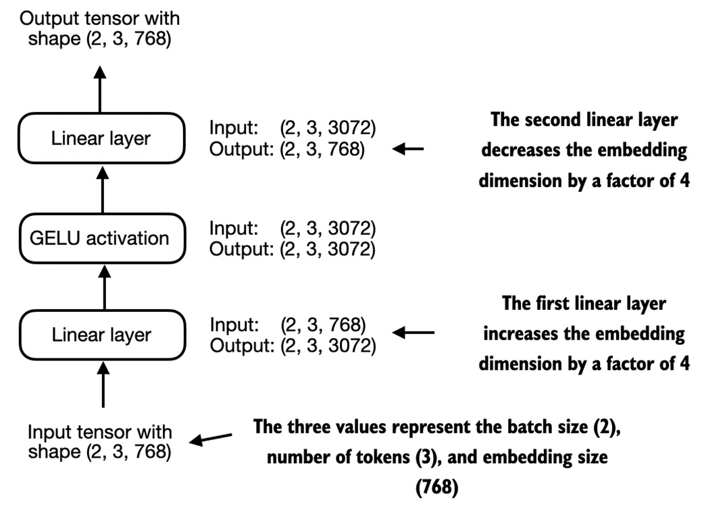
按照图 4.9 中的示例，我们初始化一个新的 `FeedForward` 模块，token 的嵌入大小为 768，并传入一个包含 2 个样本、每个样本包含 3 个 token 的输入批次：

```python
ffn = FeedForward(GPT_CONFIG_124M)
x = torch.rand(2, 3, 768)  # A
out = ffn(x)
print(out.shape)
```

如我们所见，输出张量的形状与输入张量相同：

```plaintext
torch.Size([2, 3, 768])
```

我们在本节实现的 `FeedForward` 模块在增强模型从数据中学习和泛化的能力方面起到了关键作用。虽然此模块的输入和输出维度相同，但它通过第一个线性层将嵌入维度扩展到一个更高维度的空间，如图 4.10 所示。这种扩展后接一个非线性的 GELU 激活，然后再通过第二个线性变换压缩回原始维度。这种设计允许模型探索更丰富的表示空间。

**图 4.10** 展示了前馈神经网络中层输出的扩展和收缩过程。首先，输入通过第一个线性层由 768 扩展到 3072 的值。然后，通过第二层将 3072 个值压缩回 768 维的表示。
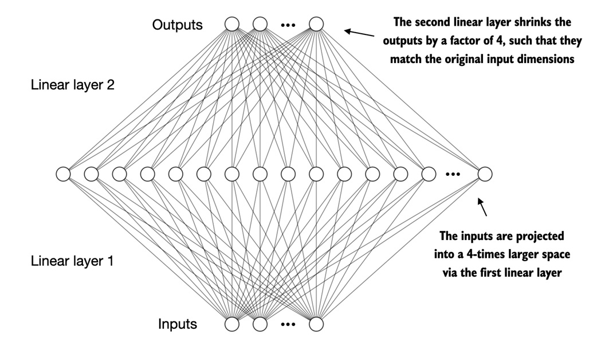
此外，输入和输出维度的一致性简化了架构的设计，使得可以堆叠多个层（我们稍后会这样做），而不需要在它们之间调整维度，从而使模型更具可扩展性。

正如图 4.11 所示，我们现在已经实现了 LLM 的大部分构建模块。

**图 4.11** 是显示本章中我们涵盖主题的心智模型，黑色的对勾表示已经涵盖的部分。
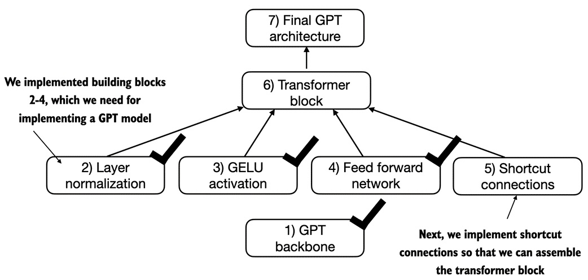
在下一节中，我们将探讨在神经网络的不同层之间插入捷径连接的概念，这在改进深度神经网络架构的训练性能方面非常重要。


## 4.4 添加捷径连接

接下来，我们来讨论捷径连接（shortcut connections）的概念，它也被称为跳跃连接（skip connections）或残差连接（residual connections）。最初，捷径连接是为计算机视觉中的深层网络（特别是残差网络）提出的，以缓解梯度消失的问题。梯度消失问题指的是在训练过程中，梯度（用于指导权重更新）在向后传播过程中逐渐减小，从而难以有效地训练较早的层，如图 4.12 所示。

**图 4.12** 展示了一个深度神经网络的比较，左侧是不带捷径连接的 5 层网络，右侧是带有捷径连接的网络。捷径连接通过将一层的输入添加到它的输出上，创造了一条绕过某些层的替代路径。图中的梯度表示每层的平均绝对梯度，接下来我们将通过代码示例计算它。
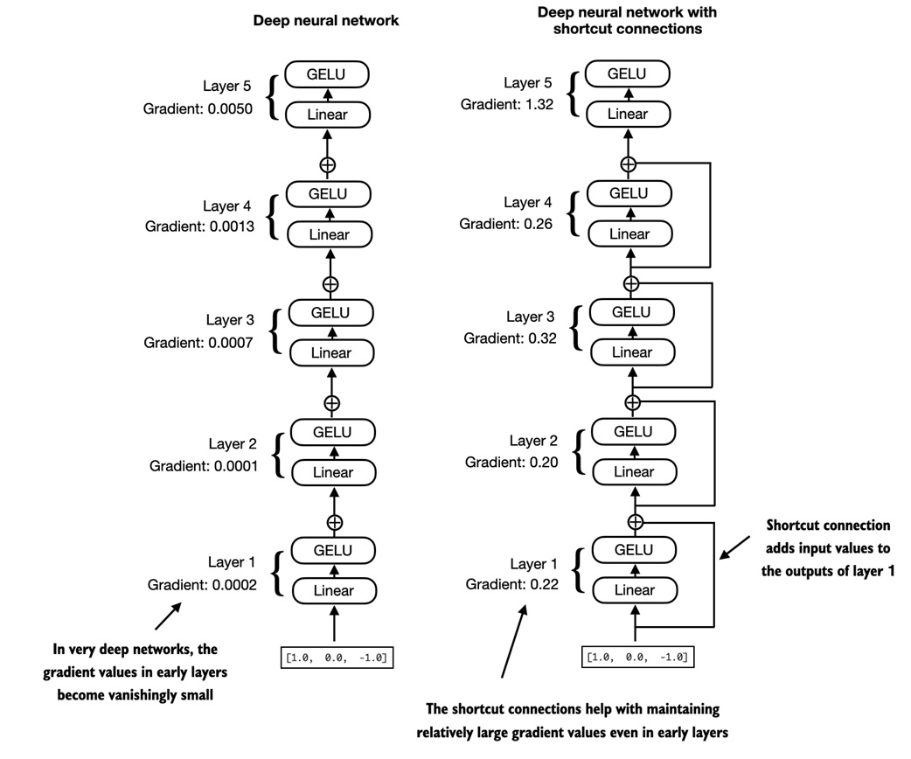
如图 4.12 所示，捷径连接通过跳过一个或多个层来为梯度流通提供了一条替代的、更短的路径，这实现方式是将某一层的输出与后面某一层的输出相加。这就是为什么这些连接也称为跳跃连接（skip connections）。它们在训练过程中对保持梯度流动起到了关键作用，特别是在向后传播中。

在下面的代码示例中，我们实现了图 4.12 中所示的神经网络，以便了解如何在 `forward` 方法中添加捷径连接：

```python
# 列表 4.5 用于演示捷径连接的神经网络
class ExampleDeepNeuralNetwork(nn.Module):
    def __init__(self, layer_sizes, use_shortcut):
        super().__init__()
        self.use_shortcut = use_shortcut
        self.layers = nn.ModuleList([
            # 实现 5 层
            nn.Sequential(nn.Linear(layer_sizes[0], layer_sizes[1]), GELU()),
            nn.Sequential(nn.Linear(layer_sizes[1], layer_sizes[2]), GELU()),
            nn.Sequential(nn.Linear(layer_sizes[2], layer_sizes[3]), GELU()),
            nn.Sequential(nn.Linear(layer_sizes[3], layer_sizes[4]), GELU()),
            nn.Sequential(nn.Linear(layer_sizes[4], layer_sizes[5]), GELU())
        ])

    def forward(self, x):
        for layer in self.layers:
            # 计算当前层的输出
            layer_output = layer(x)
            # 检查是否可以应用捷径连接
            if self.use_shortcut and x.shape == layer_output.shape:
                x = x + layer_output
            else:
                x = layer_output
        return x
```

该代码实现了一个由 5 层组成的深度神经网络，每层包含一个线性层和一个 GELU 激活函数。在前向传播过程中，我们将输入逐层传递，并且如果 `self.use_shortcut` 属性设为 `True`，则选择性地添加图 4.12 所示的捷径连接。

让我们使用此代码初始化一个不带捷径连接的神经网络。这里每一层的初始化保证它接受一个包含 3 个输入值的示例，并返回 3 个输出值。最后一层返回一个单一输出值：

```python
layer_sizes = [3, 3, 3, 3, 3, 1]
sample_input = torch.tensor([[1., 0., -1.]])
torch.manual_seed(123)  # 指定随机种子，以便复现初始权重
model_without_shortcut = ExampleDeepNeuralNetwork(
    layer_sizes, use_shortcut=False
)
```

接下来，我们实现一个函数，用于在模型的反向传播中计算梯度：

```python
def print_gradients(model, x):
    # 前向传播
    output = model(x)
    target = torch.tensor([[0.]])
    # 基于目标值和输出值的接近程度计算损失
    loss = nn.MSELoss()
    loss = loss(output, target)
    # 反向传播计算梯度
    loss.backward()
    for name, param in model.named_parameters():
        if 'weight' in name:
            # 打印权重梯度的平均绝对值
            print(f"{name} has gradient mean of {param.grad.abs().mean().item()}")
```

在上面的代码中，我们指定了一个损失函数，用于计算模型输出与指定目标（这里简化为值 0）之间的接近程度。当调用 `loss.backward()` 时，PyTorch 会计算模型中每层的损失梯度。我们可以通过 `model.named_parameters()` 遍历权重参数。假设给定层的权重参数矩阵为 3×3，则此层将有 3×3 个梯度值，我们打印这些 3×3 梯度值的平均绝对值，以便更容易地比较层间的梯度。

简而言之，`.backward()` 方法是 PyTorch 中的便捷方法，它计算损失梯度，而无需手动实现梯度计算的数学运算，从而使得深度神经网络的操作更加便捷。如果你不熟悉梯度和神经网络训练的概念，建议阅读附录 A 的 A.4 节“轻松实现自动微分”和 A.7 节“典型的训练循环”。

现在让我们使用 `print_gradients` 函数并将其应用于不带捷径连接的模型：

```python
print_gradients(model_without_shortcut, sample_input)
```

输出如下：

```plaintext
layers.0.0.weight has gradient mean of 0.00020173587836325169
layers.1.0.weight has gradient mean of 0.0001201116101583466
layers.2.0.weight has gradient mean of 0.0007152041653171182
layers.3.0.weight has gradient mean of 0.001398873864673078
layers.4.0.weight has gradient mean of 0.005049646366387606
```

从 `print_gradients` 函数的输出可以看到，随着我们从最后一层（`layers.4`）到第一层（`layers.0`）的推进，梯度变得越来越小，这种现象称为梯度消失问题。

现在让我们实例化一个带有跳跃连接的模型，并看看它的表现如何：

```python
torch.manual_seed(123)
model_with_shortcut = ExampleDeepNeuralNetwork(
    layer_sizes, use_shortcut=True
)
print_gradients(model_with_shortcut, sample_input)
```

输出如下：

```plaintext
layers.0.0.weight has gradient mean of 0.22169792652130127
layers.1.0.weight has gradient mean of 0.20694105327129364
layers.2.0.weight has gradient mean of 0.32896995544433594
layers.3.0.weight has gradient mean of 0.2665732502937317
layers.4.0.weight has gradient mean of 1.3258541822433472
```

从输出中可以看到，尽管最后一层（`layers.4`）的梯度仍然大于其他层，但随着我们逐层向前推进，梯度值保持稳定，并没有缩小到接近零的极小值。

总的来说，捷径连接对于克服深度神经网络中的梯度消失问题所带来的限制非常重要。捷径连接是非常大规模模型（如 LLM）的核心构建模块，确保在训练 GPT 模型时梯度能够在层间保持一致流动，从而有助于更有效的训练。

在介绍了捷径连接之后，我们将在下一节中将之前所学的概念（层归一化、GELU 激活、前馈模块和捷径连接）整合到 Transformer 块中，这是我们编写 GPT 架构所需的最后一个构建模块。


## 4.5 在 Transformer 块中连接注意力和线性层

在本节中，我们将实现 Transformer 块，这是 GPT 和其他 LLM 架构的基础构建模块。该模块在 GPT-2 的 1.24 亿参数架构中重复多次，结合了我们之前介绍的多个概念：多头注意力、层归一化、dropout、前馈层和 GELU 激活，如图 4.13 所示。在下一节中，我们将把这个 Transformer 块连接到 GPT 架构的其他部分。

**图 4.13** 展示了一个 Transformer 块。图的底部显示了已嵌入到 768 维向量的输入 token，每行对应一个 token 的向量表示。Transformer 块的输出是与输入相同维度的向量，之后可以输入到 LLM 的后续层中。
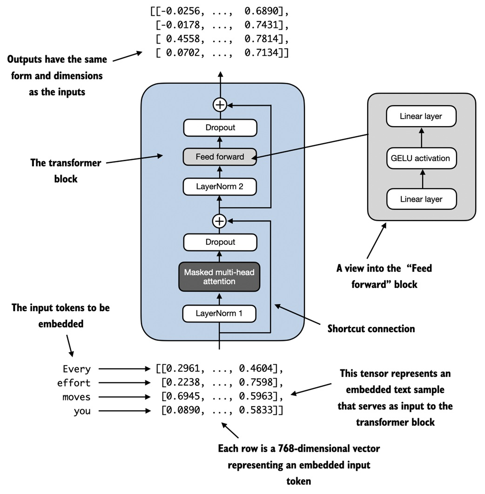
如图 4.13 所示，Transformer 块结合了多个组件，包括第 3 章中的掩码多头注意力模块和我们在第 4.3 节中实现的 `FeedForward` 模块。

当 Transformer 块处理一个输入序列时，序列中的每个元素（例如一个词或子词 token）都被表示为一个固定大小的向量（在图 4.13 中为 768 维）。Transformer 块内部的操作，包括多头注意力和前馈层，旨在转换这些向量，同时保持它们的维度不变。

自注意力机制可以识别并分析输入序列中元素之间的关系，而前馈网络则在每个位置单独地对数据进行修改。这种组合不仅可以更细致地理解和处理输入，还提高了模型处理复杂数据模式的整体能力。

在代码中，我们可以这样实现 TransformerBlock：

```python
# 列表 4.6 GPT 的 Transformer 块组件
from previous_chapters import MultiHeadAttention

class TransformerBlock(nn.Module):
    def __init__(self, cfg):
        super().__init__()
        self.att = MultiHeadAttention(
            d_in=cfg["emb_dim"],
            d_out=cfg["emb_dim"],
            block_size=cfg["context_length"],
            num_heads=cfg["n_heads"],
            dropout=cfg["drop_rate"],
            qkv_bias=cfg["qkv_bias"]
        )
        self.ff = FeedForward(cfg)
        self.norm1 = LayerNorm(cfg["emb_dim"])
        self.norm2 = LayerNorm(cfg["emb_dim"])
        self.drop_resid = nn.Dropout(cfg["drop_rate"])

    def forward(self, x):
        #A
        shortcut = x
        x = self.norm1(x)
        x = self.att(x)
        x = self.drop_resid(x)
        x = x + shortcut  # 将原始输入加回来
        shortcut = x  #B
        x = self.norm2(x)
        x = self.ff(x)
        x = self.drop_resid(x)
        x = x + shortcut  #C
        return x
```

这段代码定义了一个 `TransformerBlock` 类，包含多头注意力机制 (`MultiHeadAttention`) 和前馈网络 (`FeedForward`)，它们都根据提供的配置字典（如 `GPT_CONFIG_124M`）进行配置。

在这两个组件的前面各应用了层归一化 (`LayerNorm`)，并在它们之后应用了 dropout 来对模型进行正则化，防止过拟合。这种方式也称为 Pre-LayerNorm。较早的架构（如原始 Transformer 模型）则在自注意力和前馈网络之后应用层归一化，称为 Post-LayerNorm，这种方式通常导致训练动态变差。

该类还实现了前向传播，其中每个组件后面都接有一个捷径连接，将块的输入与输出相加。这个关键特性有助于在训练期间让梯度在网络中顺畅流动，并改进深度模型的学习能力，如第 4.4 节所述。

使用我们先前定义的 `GPT_CONFIG_124M` 字典，让我们实例化一个 Transformer 块并输入一些示例数据：

```python
torch.manual_seed(123)
x = torch.rand(2, 4, 768)  #A
block = TransformerBlock(GPT_CONFIG_124M)
output = block(x)
print("Input shape:", x.shape)
print("Output shape:", output.shape)
```

输出如下：

```plaintext
Input shape: torch.Size([2, 4, 768])
Output shape: torch.Size([2, 4, 768])
```

从输出中可以看出，Transformer 块在输出中保持了输入维度不变，这表明 Transformer 架构在整个网络中处理序列数据时不会改变它们的形状。

Transformer 块架构保持形状不变是其设计中的关键特点。这种设计使得它能够有效应用于各种序列到序列任务中，在每个输出向量与对应的输入向量之间保持一一对应的关系。然而，输出是一个上下文向量，包含了来自整个输入序列的信息，如我们在第 3 章中所学到的。这意味着虽然序列的物理维度（长度和特征大小）在穿过 Transformer 块时保持不变，但每个输出向量的内容被重新编码，以整合来自整个输入序列的上下文信息。

随着我们在本节中实现的 Transformer 块，现在我们已经具备了实现 GPT 架构所需的所有构建模块，如图 4.14 所示。

**图 4.14** 显示了本章中我们实现的不同概念的心智模型。
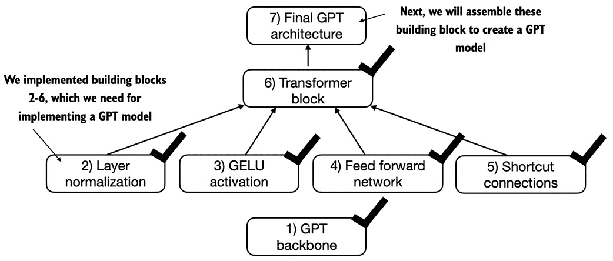
如图 4.14 所示，Transformer 块结合了层归一化、前馈网络（包含 GELU 激活）和捷径连接，这些我们已经在本章前面介绍了。在接下来的章节中，这个 Transformer 块将成为我们实现的 GPT 架构的主要组件。


## 4.6 编写 GPT 模型代码

我们在本章开始时提供了一个 GPT 架构的总体概览，称之为 `DummyGPTModel`。在 `DummyGPTModel` 实现中，我们展示了 GPT 模型的输入和输出，但其中的构建模块使用 `DummyTransformerBlock` 和 `DummyLayerNorm` 占位类，仍然是一个“黑箱”。

在本节中，我们将用我们在本章后面实现的 `TransformerBlock` 和 `LayerNorm` 类来替换这些占位符，以组装一个完整的、可工作的 GPT-2 124M（1.24 亿参数）版本模型。在第 5 章中，我们将对 GPT-2 模型进行预训练，而在第 6 章中，我们将加载 OpenAI 提供的预训练权重。

在代码中组装 GPT-2 模型之前，让我们先看一下它的整体结构，如图 4.15 所示，该图结合了我们在本章中讨论的所有概念。

**图 4.15** 展示了 GPT 模型架构的概览。图中展示了数据在 GPT 模型中的流动过程。从底部开始，分词后的文本首先被转换为 token 嵌入，并且还会添加位置嵌入。此组合信息形成的张量被传入多个 Transformer 块（每个块包含多头注意力、前馈神经网络层、dropout 和层归一化），这些块堆叠在一起，重复 12 次。
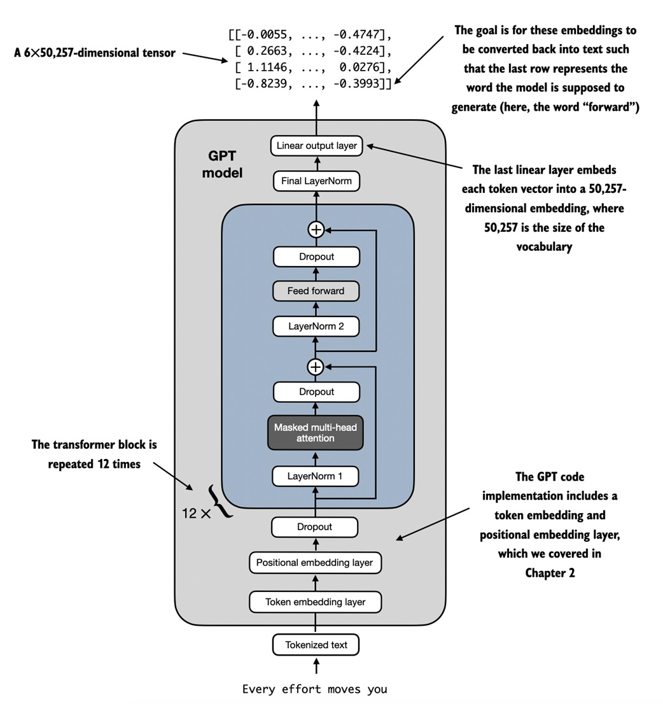
如图 4.15 所示，我们在第 4.5 节中实现的 Transformer 块在 GPT 模型架构中重复多次。对于 GPT-2 124M 模型，这个块重复了 12 次，这由 `GPT_CONFIG_124M` 字典中的 `"n_layers"` 项指定。对于参数量为 15.42 亿的最大 GPT-2 模型，这个 Transformer 块重复 36 次。

最终 Transformer 块的输出通过一个最终层归一化步骤，然后进入线性输出层。该输出层将 Transformer 的输出映射到高维空间（在这里为 50,257 维，对应模型的词汇大小），用于预测序列中的下一个 token。

让我们在代码中实现图 4.15 中的架构：

```python
# 列表 4.7 GPT 模型架构的实现
class GPTModel(nn.Module):
    def __init__(self, cfg):
        super().__init__()
        self.tok_emb = nn.Embedding(cfg["vocab_size"], cfg["emb_dim"])
        self.pos_emb = nn.Embedding(cfg["context_length"], cfg["emb_dim"])
        self.drop_emb = nn.Dropout(cfg["drop_rate"])
        self.trf_blocks = nn.Sequential(
            *[TransformerBlock(cfg) for _ in range(cfg["n_layers"])]
        )
        self.final_norm = LayerNorm(cfg["emb_dim"])
        self.out_head = nn.Linear(
            cfg["emb_dim"], cfg["vocab_size"], bias=False
        )

    def forward(self, in_idx):
        batch_size, seq_len = in_idx.shape
        tok_embeds = self.tok_emb(in_idx)
        # A
        pos_embeds = self.pos_emb(torch.arange(seq_len, device=in_idx.device))
        x = tok_embeds + pos_embeds
        x = self.drop_emb(x)
        x = self.trf_blocks(x)
        x = self.final_norm(x)
        logits = self.out_head(x)
        return logits
```

得益于我们在第 4.5 节实现的 `TransformerBlock` 类，`GPTModel` 类显得相对简洁紧凑。

`GPTModel` 类的 `__init__` 构造函数根据提供的配置字典 `cfg` 初始化了 token 和位置嵌入层。这些嵌入层负责将输入 token 索引转换为稠密向量，并添加位置信息，如第 2 章所述。

接下来，`__init__` 方法创建了与 `cfg` 中指定的层数相等的 `TransformerBlock` 模块的顺序堆栈。在 Transformer 块之后，应用一个 `LayerNorm` 层，对 Transformer 块的输出进行标准化，以稳定学习过程。最后定义了一个不带偏置的线性输出头，将 Transformer 的输出投影到词汇空间中，以生成每个词汇的 logits。

`forward` 方法接收一批输入 token 索引，计算它们的嵌入值，应用位置嵌入，将序列传递给 Transformer 块，规范化最终输出，并计算 logits，表示下一个 token 的非归一化概率。我们将在下一节中将这些 logits 转换为 tokens 和文本输出。

现在，让我们使用 `GPT_CONFIG_124M` 字典初始化一个 1.24 亿参数的 GPT 模型，并使用我们在本章开头创建的批次文本输入进行输入：

```python
torch.manual_seed(123)
model = GPTModel(GPT_CONFIG_124M)
out = model(batch)
print("Input batch:\n", batch)
print("\nOutput shape:", out.shape)
print(out)
```

前述代码打印了输入批次的内容和输出张量：

```plaintext
Input batch:
tensor([[ 6109, 3626, 6100, 345],  # 文本 1 的 token IDs
        [ 6109, 1110, 6622, 257]])  # 文本 2 的 token IDs

Output shape: torch.Size([2, 4, 50257])
tensor([[[ 0.3613, 0.4222, -0.0711, ..., 0.3483, 0.4661, -0.2838],
         [-0.1792, -0.5660, -0.9485, ..., 0.0477, 0.5181, -0.3168],
         [ 0.7120, 0.0332, 0.1085, ..., 0.1018, -0.4327, -0.2553],
         [-1.0076, 0.3418, -0.1190, ..., 0.7195, 0.4023, 0.0532]],
        [[-0.2564, 0.0900, 0.0335, ..., 0.2659, 0.4454, -0.6806],
         [ 0.1230, 0.3653, -0.2074, ..., 0.7705, 0.2710, 0.2246],
         [ 1.0558, 1.0318, -0.2800, ..., 0.6936, 0.3205, -0.3178],
         [-0.1565, 0.3926, 0.3288, ..., 1.2630, -0.1858, 0.0388]]],
       grad_fn=<UnsafeViewBackward0>)
```

可以看到，输出张量的形状为 `[2, 4, 50257]`，因为我们传入了 2 个输入文本，每个文本包含 4 个 token。最后一个维度 50,257 对应于分词器的词汇大小。在下一节中，我们将了解如何将这些 50,257 维的输出向量转换回 tokens。

在继续下一节之前，让我们先对模型架构本身进行进一步的分析。

使用 `numel()` 方法（即“number of elements”缩写），我们可以收集模型参数张量中的总参数量：

```python
total_params = sum(p.numel() for p in model.parameters())
print(f"Total number of parameters: {total_params:,}")
```

结果如下：

```plaintext
Total number of parameters: 163,009,536
```

好奇的读者可能会注意到一个不一致之处。我们之前提到要初始化一个 1.24 亿参数的 GPT 模型，那么为什么实际参数数量为 1.63 亿呢？

原因在于一个叫做权重共享（weight tying）的概念，它被用于原始 GPT-2 架构中，意味着原始 GPT-2 架构在输出层重复使用了 token 嵌入层的权重。为了理解这意味着什么，让我们来看一下我们先前在模型中初始化的 token 嵌入层和线性输出层的形状：

```python
print("Token embedding layer shape:", model.tok_emb.weight.shape)
print("Output layer shape:", model.out_head.weight.shape)
```

如输出所示，这两个层的权重张量形状相同：

```plaintext
Token embedding layer shape: torch.Size([50257, 768])
Output layer shape: torch.Size([50257, 768])
```

由于分词器的词汇量为 50,257，这两个嵌入层和输出层非常大。让我们根据权重共享从总的 GPT-2 模型参数数量中减去输出层的参数计数：

```python
total_params_gpt2 = total_params - sum(p.numel() for p in model.out_head.parameters())
print(f"Number of trainable parameters considering weight tying: {total_params_gpt2:,}")
```

输出如下：

```plaintext
Number of trainable parameters considering weight tying: 124,412,160
```

如我们所见，模型现在仅包含 1.24 亿参数，与原始 GPT-2 模型的大小一致。

权重共享减少了模型的总体内存占用和计算复杂性。然而，根据我的经验，使用独立的 token 嵌入和输出层会带来更好的训练和模型性能；因此，我们在 `GPTModel` 实现中使用了独立的层，现代 LLM 也是如此。不过，当我们在第 6 章中从 OpenAI 加载预训练权重时，会重新探讨并实现权重共享的概念。

#### 练习 4.1：前馈模块和注意力模块中的参数数量

计算并比较前馈模块和多头注意力模块中的参数数量。

最后，让我们计算 `GPTModel` 对象中的 1.63 亿参数的内存需求：

```python
total_size_bytes = total_params * 4  # A
total_size_mb = total_size_bytes / (1024 * 1024)  # B
print(f"Total size of the model: {total_size_mb:.2f} MB")
```

结果如下：

```plaintext
Total size of the model: 621.83 MB
```

总结：通过计算我们 `GPTModel` 对象中 1.63 亿参数的内存需求，并假设每个参数是 32 位浮点数（占用 4 字节），可以得出该模型的总大小为 621.83 MB，说明了即使是相对较小的 LLM 也需要相对较大的存储容量。

在本节中，我们实现了 `GPTModel` 架构，并看到它输出形状为 `[batch_size, num_tokens, vocab_size]` 的数值张量。在下一节中，我们将编写代码，将这些输出张量转换为文本。

#### 练习 4.2：初始化更大规模的 GPT 模型

在本章中，我们初始化了一个参数量为 1.24 亿的 GPT 模型，即“GPT-2 small”。在不进行代码修改的情况下，仅通过更新配置文件，使用 `GPTModel` 类来实现 GPT-2 medium（使用 1024 维嵌入，24 个 Transformer 块，16 个多头注意力头）、GPT-2 large（1280 维嵌入，36 个 Transformer 块，20 个多头注意力头）和 GPT-2 XL（1600 维嵌入，48 个 Transformer 块，25 个多头注意力头）。作为附加内容，计算每个 GPT 模型的总参数数量。


## 4.7 生成文本

在本章的最后一节中，我们将编写代码，将 GPT 模型的张量输出转换回文本。在开始之前，让我们简要回顾一下像 LLM 这样的生成模型是如何一次生成一个单词（或 token）的，如图 4.16 所示。

**图 4.16** 展示了 LLM 逐步生成文本的过程，每次生成一个 token。模型从初始输入上下文（如 "Hello, I am"）开始，在每次迭代中预测下一个 token，并将其添加到输入上下文中，作为下一轮预测的输入。第一轮添加 "a"，第二轮添加 "model"，第三轮添加 "ready"，逐步构建完整句子。
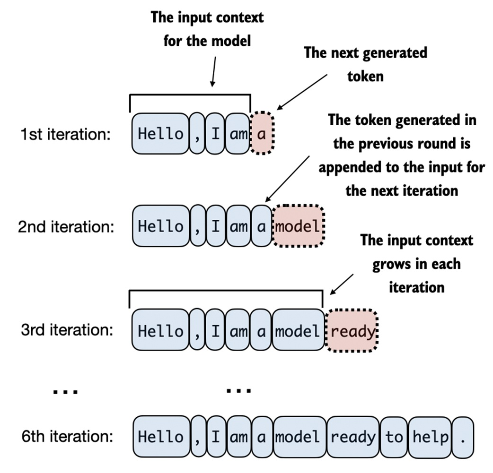
图 4.16 展示了 GPT 模型在大局上如何给定一个输入上下文（如 "Hello, I am"）生成文本。在每次迭代中，输入上下文逐步增长，使得模型可以生成连贯且符合语境的文本。到第六次迭代时，模型已经构建出一个完整的句子："Hello, I am a model ready to help."

在上一节中，我们看到我们当前的 `GPTModel` 实现输出形状为 `[batch_size, num_token, vocab_size]` 的张量。接下来我们的问题是，GPT 模型如何将这些输出张量转换为如图 4.16 中显示的生成文本？

GPT 模型从输出张量生成文本的过程涉及几个步骤，如图 4.17 所示。这些步骤包括解码输出张量、基于概率分布选择 token，并将这些 token 转换成人类可读的文本。

**图 4.17** 详细说明了 GPT 模型中文本生成的机制，通过展示生成 token 过程中的一个迭代步骤。过程从将输入文本编码为 token ID 开始，然后将其输入到 GPT 模型中。模型的输出被转换回文本，并添加到原始输入文本中。

在图 4.17 中详细描述的下一个 token 生成过程展示了 GPT 模型在给定输入的情况下生成下一个 token 的单步操作。

在每一步中，模型输出一个矩阵，包含潜在的下一个 token 的向量。我们从中提取出与下一个 token 对应的向量，并通过 softmax 函数转换为概率分布。在包含概率分数的向量中，找到最大值的索引，该索引即为 token ID。然后将这个 token ID 解码回文本，生成序列中的下一个 token。最后，将此 token 添加到前面的输入中，形成下一次迭代的新输入序列。通过这种逐步的过程，模型可以顺序生成文本，从初始输入上下文中构建连贯的短语和句子。

在实际操作中，我们重复该过程多次，如前述的图 4.16 所示，直到达到用户指定的生成 token 数量。

在代码中，我们可以这样实现 token 生成过程：

```python
# 列表 4.8 GPT 模型生成文本的函数
def generate_text_simple(model, idx, max_new_tokens, context_size): #A
    for _ in range(max_new_tokens):
        idx_cond = idx[:, -context_size:]  # B
        with torch.no_grad():
            logits = model(idx_cond)
            logits = logits[:, -1, :]  # C
            probas = torch.softmax(logits, dim=-1)  # D
            idx_next = torch.argmax(probas, dim=-1, keepdim=True)  # E
            idx = torch.cat((idx, idx_next), dim=1)  # F
    return idx
```

此代码片段演示了使用 PyTorch 实现语言模型的简单生成循环。它迭代生成指定数量的新 token，将当前上下文裁剪到模型的最大上下文大小，计算预测值，并基于最高概率的预测值选择下一个 token。

在上述 `generate_text_simple` 函数中，我们使用 softmax 函数将 logits 转换为概率分布，然后通过 `torch.argmax` 确定概率分布中最大值的位置。由于 softmax 是单调的，这意味着在输入转换为输出时保留顺序，因此实际上 softmax 步骤是多余的，因为 softmax 输出张量中最高分数的位置与 logits 张量中相同。换句话说，我们可以直接对 logits 张量应用 `torch.argmax`，得到相同的结果。不过，我们编写了转换步骤以展示从 logits 到概率的完整过程，从而更好地理解模型生成下一个最有可能 token 的过程，称为贪婪解码。

在下一章中，当我们实现 GPT 的训练代码时，还将介绍其他采样技术，在这些技术中，我们会调整 softmax 的输出，以便模型并不总是选择最有可能的 token，从而引入生成文本的多样性和创造性。

使用 `generate_text_simple` 函数逐次生成一个 token ID，并将其附加到上下文中的过程如图 4.18 所示。（每次迭代中的 token ID 生成过程在图 4.17 中详述。）

**图 4.18** 展示了 token 预测循环的六次迭代过程，在每次迭代中，模型接收一系列初始 token ID 作为输入，预测下一个 token，并将该 token 添加到下次迭代的输入序列中。（为了更易理解，这些 token ID 也被翻译成相应的文本。）
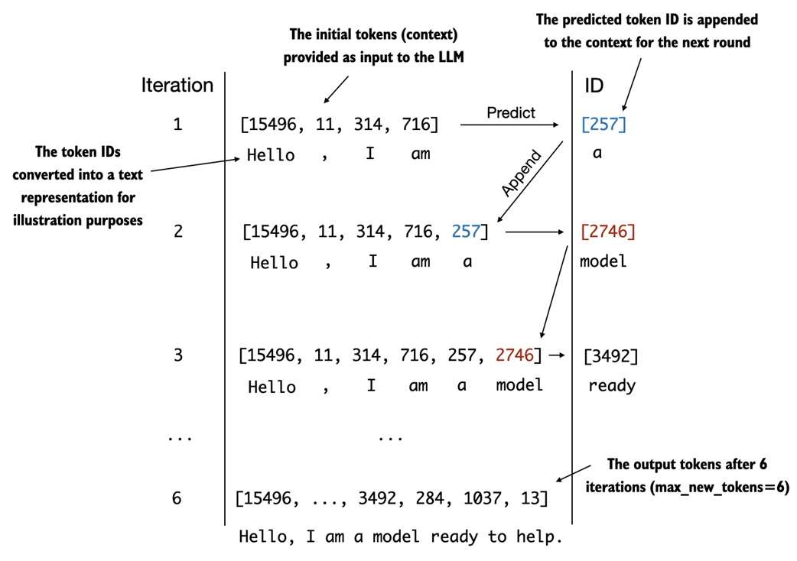
如图 4.18 所示，我们以迭代的方式生成 token ID。例如，在第 1 次迭代中，模型接收到 "Hello , I am" 对应的 token，预测下一个 token（ID 为 257，即 "a"），并将其附加到输入中。该过程重复进行，直到模型在六次迭代后生成了完整句子 "Hello, I am a model ready to help."

现在，让我们在实践中尝试使用 `generate_text_simple` 函数，并以 "Hello, I am" 作为输入上下文，如图 4.18 所示。

首先，我们将输入上下文编码为 token ID：

```python
start_context = "Hello, I am"
encoded = tokenizer.encode(start_context)
print("encoded:", encoded)
encoded_tensor = torch.tensor(encoded).unsqueeze(0)  # A
print("encoded_tensor.shape:", encoded_tensor.shape)
```

编码后的 ID 如下：

```plaintext
encoded: [15496, 11, 314, 716]
encoded_tensor.shape: torch.Size([1, 4])
```

接下来，我们将模型设置为 `.eval()` 模式，以禁用训练期间使用的随机组件（如 dropout），并使用 `generate_text_simple` 函数对编码后的输入张量进行生成：

```python
model.eval()  # A
out = generate_text_simple(
    model=model,
    idx=encoded_tensor,
    max_new_tokens=6,
    context_size=GPT_CONFIG_124M["context_length"]
)
print("Output:", out)
print("Output length:", len(out[0]))
```

生成的输出 token ID 如下：

```plaintext
Output: tensor([[15496, 11, 314, 716, 27018, 24086, 47843, 30961, 42348, 7267]])
Output length: 10
```

使用分词器的 `.decode` 方法，我们可以将 ID 转换回文本：

```python
decoded_text = tokenizer.decode(out.squeeze(0).tolist())
print(decoded_text)
```

文本格式的模型输出如下：

```plaintext
Hello, I am Featureiman Byeswickattribute argue logger Normandy Compton analogous
```

从上述输出可以看到，模型生成了无意义的文字，与图 4.18 中显示的连贯文本完全不同。这是为什么？模型无法生成连贯文本的原因是因为我们尚未对其进行训练。目前，我们仅仅实现了 GPT 架构，并初始化了一个具有随机权重的 GPT 模型实例。

模型训练是一个庞大的主题，我们将在下一章中深入探讨。

#### 练习 4.3 使用单独的 dropout 参数

在本章开始时，我们在 `GPT_CONFIG_124M` 字典中定义了一个全局的 "drop_rate" 设置，用于在 `GPTModel` 架构的各个位置设置 dropout 率。更改代码，以便在模型架构的各个 dropout 层使用单独的 dropout 值。（提示：我们在模型中三个不同位置使用了 dropout 层：嵌入层、捷径连接层和多头注意力模块。）


## 4.8 总结

-   **层归一化**：通过确保每一层的输出具有一致的均值和方差来稳定训练过程。
-   **捷径连接**：通过将一层的输出直接传递到更深的层，捷径连接帮助缓解深度神经网络（例如 LLM）在训练中的梯度消失问题。
-   **Transformer 块**：GPT 模型的核心结构组件，结合了带掩码的多头注意力模块和使用 GELU 激活函数的全连接前馈网络。
-   **GPT 模型**：一种包含大量重复 Transformer 块的 LLM，参数量可从数百万到数十亿不等。
-   **GPT 模型的规模**：GPT 模型有不同的大小，例如 1.24 亿、3.45 亿、7.62 亿和 15.42 亿参数，可以使用相同的 `GPTModel` Python 类实现。
-   **文本生成能力**：GPT 类 LLM 的文本生成功能通过顺序预测下一个 token 并将输出张量解码为人类可读文本来实现。
-   **重要性训练**：未经训练的 GPT 模型生成的文本无意义，这说明了模型训练在生成连贯文本中的重要性，训练将是后续章节的重点。