# 在无标签数据上进行预训练

## 本章内容

-   计算训练和验证集损失，以评估 LLM 在训练过程中的文本生成质量
-   实现训练函数并对 LLM 进行预训练
-   保存和加载模型权重，以继续训练 LLM
-   从 OpenAI 加载预训练的权重

在前几章中，我们实现了数据采样、注意力机制，并编写了 LLM 架构。本章的核心是实现一个训练函数，并对模型进行预训练，如图 5.1 所示。

**图 5.1** 展示了构建 LLM 的三个主要阶段的心智模型：编码 LLM、在通用文本数据集上预训练 LLM，以及在带标签的数据集上微调 LLM。本章重点在于 LLM 的预训练，包括实现训练代码、评估模型性能以及保存和加载模型权重。
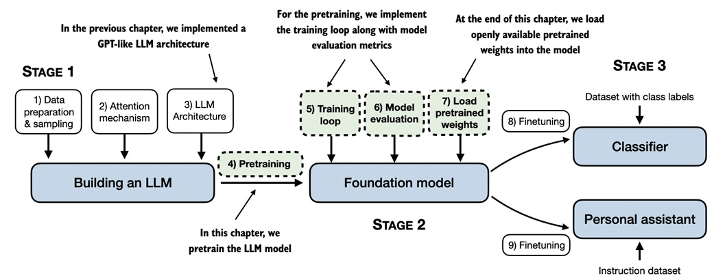
如图 5.1 所示，我们还将了解基本的模型评估技术，用于在训练过程中衡量生成文本的质量，这是优化 LLM 所需的。此外，我们将讨论如何加载预训练权重，为后续章节中的微调提供一个良好的起点。

#### 权重参数

在 LLM 和其他深度学习模型的上下文中，**权重**指的是学习过程中会调整的可训练参数。这些权重也称为权重参数，或简而言之为参数。在 PyTorch 等框架中，这些权重通常存储在线性层中，例如我们在第 3 章中用于实现多头注意力模块和第 4 章中用于实现 `GPTModel` 的线性层。在初始化一个层之后（例如 `new_layer = torch.nn.Linear(...)`），可以通过 `.weight` 属性访问其权重，即 `new_layer.weight`。此外，为了方便起见，PyTorch 允许通过 `model.parameters()` 方法直接访问模型中所有的可训练参数，包括权重和偏置项。我们将在后续实现模型训练时使用这个方法。


## 5.1 评估生成文本模型

我们从设置 LLM 开始，以基于上一章的代码生成文本，并在本节中讨论评估生成文本质量的基本方法。本节以及本章剩余内容的结构如图 5.2 所示。

**图 5.2** 提供了本章涵盖主题的概览。我们首先回顾了上一章的文本生成过程，并实现一些基本的模型评估技术，便于在预训练阶段使用。
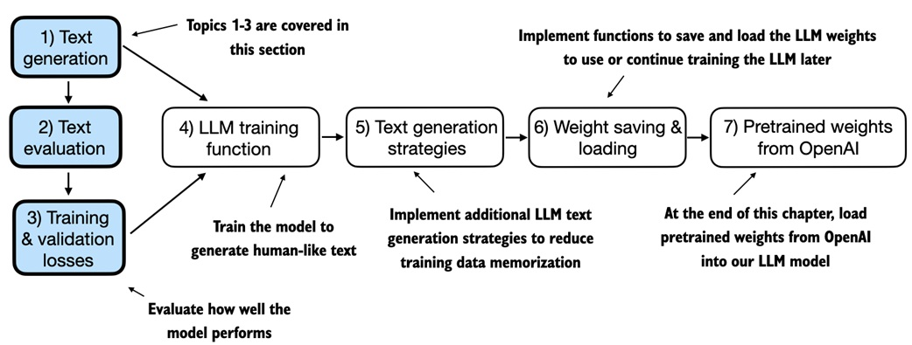
正如图 5.2 所示，下一小节将回顾我们在上一章末尾设置的文本生成，然后再深入文本评估，并在接下来的小节中计算训练和验证集的损失。

### 5.1.1 使用 GPT 生成文本

在本节中，我们设置 LLM 并简要回顾第 4 章实现的文本生成过程。我们从初始化将要在本章中评估和训练的 GPT 模型开始，使用 `GPTModel` 类和 `GPT_CONFIG_124M` 字典：

```python
import torch
from chapter04 import GPTModel

GPT_CONFIG_124M = {
    "vocab_size": 50257,
    "context_length": 256,  # A
    "emb_dim": 768,
    "n_heads": 12,
    "n_layers": 12,
    "drop_rate": 0.1,  # B
    "qkv_bias": False
}

torch.manual_seed(123)
model = GPTModel(GPT_CONFIG_124M)
model.eval()
```

在 `GPT_CONFIG_124M` 字典中，相比上一章唯一的调整是将上下文长度 (`context_length`) 减小为 256 个 token。此修改减少了训练模型的计算需求，使得在普通笔记本电脑上进行训练成为可能。

原始的 GPT-2 模型配置为处理最多 1024 个 token。经过训练后，在本章末尾我们将更新上下文大小设置，并加载预训练权重，使其能够处理 1024-token 上下文长度。

使用 `GPTModel` 实例，我们采用上一章介绍的 `generate_text_simple` 函数，并引入两个便捷函数，`text_to_token_ids` 和 `token_ids_to_text`。这两个函数便于在文本和 token 表示之间转换，这也是本章将反复使用的技术。图 5.3 进一步说明了该过程的原理。

**图 5.3** 展示了使用 GPT 模型生成文本的三步过程。首先，分词器将输入文本转换为一系列 token ID（参见第 2 章）。接着，模型接收这些 token ID 并生成相应的 logits（即表示词汇表中每个 token 的概率分布的向量，参见第 4 章）。最后，这些 logits 被转换回 token ID，并由分词器解码为人类可读的文本，完成从文本输入到文本输出的循环。
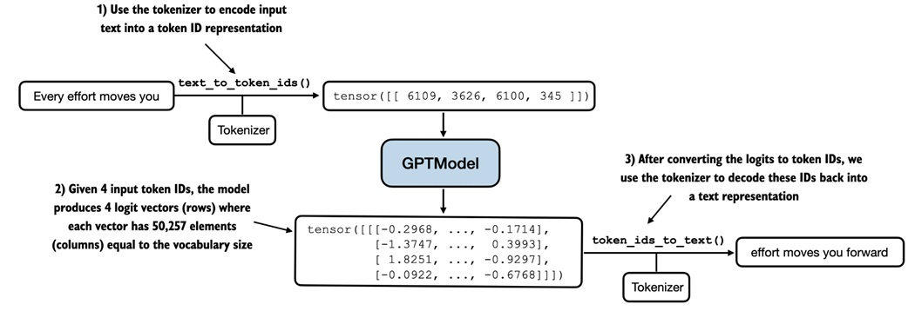
代码实现如下：

```python
# 列表 5.1 文本到 token ID 转换的实用函数
import tiktoken
from chapter04 import generate_text_simple

def text_to_token_ids(text, tokenizer):
    encoded = tokenizer.encode(text, allowed_special={'<|endoftext|>'})
    encoded_tensor = torch.tensor(encoded).unsqueeze(0)  # 添加批次维度
    return encoded_tensor

def token_ids_to_text(token_ids, tokenizer):
    flat = token_ids.squeeze(0)  # 移除批次维度
    return tokenizer.decode(flat.tolist())

start_context = "Every effort moves you"
tokenizer = tiktoken.get_encoding("gpt2")
token_ids = generate_text_simple(
    model=model,
    idx=text_to_token_ids(start_context, tokenizer),
    max_new_tokens=10,
    context_size=GPT_CONFIG_124M["context_length"]
)
print("Output text:\n", token_ids_to_text(token_ids, tokenizer))
```

使用以上代码，模型生成以下文本：

```plaintext
Output text:
Every effort moves you rentingetic wasnم refres RexMeCHicular stren
```

从输出可以看出，模型尚未生成连贯的文本，因为它还没有经过训练。要定义文本的“连贯性”或“高质量”，我们需要实现一种数值方法来评估生成内容。这种方法将使我们能够在整个训练过程中监控并提升模型的性能。

接下来的小节将介绍如何计算生成输出的损失指标。此损失作为训练进展和成功的指示器。此外，在后续的微调 LLM 章节中，我们还将探讨其他评估模型质量的方法。


### 5.1.2 计算文本生成损失

本节探讨通过计算**文本生成损失**来量化评估生成文本质量的技术。我们将通过实际示例逐步讲解，以便清晰且易于应用，从如何加载数据（第 2 章）和通过 `generate_text_simple` 函数生成文本（第 4 章）开始复习。

**图 5.4** 展示了从输入文本到 LLM 生成的文本的整体流程，包括五个步骤。
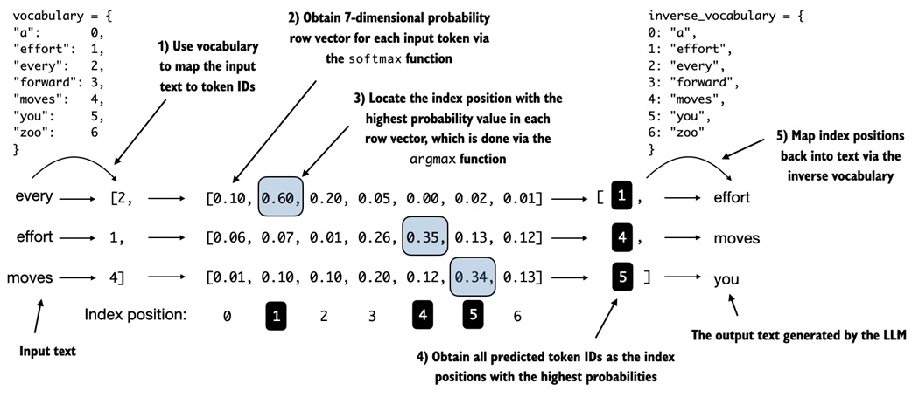
**图 5.4** 展示了 `generate_text_simple` 函数的内部生成过程。我们需要执行这些初始步骤，以便在本节后续部分计算生成文本质量的损失。

图中展示了一个简化的 7-token 词汇表流程以适应页面展示，但我们的 `GPTModel` 实际使用了 50257 个词汇表单词，因此代码中的 token ID 范围为 0 到 50256，而不是 0 到 6。为简单起见，**图 5.4** 中仅显示了一个文本示例 "every effort moves"。在以下代码示例中，我们将使用两个输入示例作为 GPT 模型的输入："every effort moves" 和 "I really like"。

考虑两个已经映射为 token ID 的输入示例，对应图 5.4 中的第 1 步：

```python
inputs = torch.tensor([[16833, 3626, 6100],   # ["every effort moves"]
                       [40, 1107, 588]])      # ["I really like"]
```

与这些输入相对应，`targets` 包含了我们希望模型生成的目标 token ID：

```python
targets = torch.tensor([[3626, 6100, 345],   # ["effort moves you"]
                        [588, 428, 11311]])  # ["really like chocolate"]
```

注意，目标是输入序列向后移动一个位置，这一策略在第 2 章的数据加载实现中讨论过。该偏移策略对于教模型预测序列中的下一个 token 至关重要。

当我们将 `inputs` 输入到模型中以计算两个输入示例的 logit 向量（每个示例包含三个 token），并应用 softmax 函数将这些 logit 值转换为概率分数时，就完成了图 5.4 中的第 2 步：

```python
with torch.no_grad():  # A
    logits = model(inputs)
    probas = torch.softmax(logits, dim=-1)  # 词汇表中每个 token 的概率
    print(probas.shape)
```

生成的概率分数张量的维度为：

```plaintext
torch.Size([2, 3, 50257])
```

第一个数字 2 对应于输入示例的数量（即批次大小），第二个数字 3 对应每个输入的 token 数量。最后一个数字 50257 对应词汇表的大小。

在从 logit 到概率的转换之后（通过 softmax 函数），`generate_text_simple` 函数将这些概率分数转换回文本，如图 5.4 中的第 3 至第 5 步所示。

我们可以通过对概率分数应用 `argmax` 函数来实现第 3 步和第 4 步，从而获得对应的 token ID：

```python
token_ids = torch.argmax(probas, dim=-1, keepdim=True)
print("Token IDs:\n", token_ids)
```

由于我们有 2 个输入批次，每个批次包含 3 个 token，应用 `argmax` 函数后得到 2 组输出，每组 3 个预测的 token ID：

```plaintext
Token IDs:
tensor([[[16657],    # 第一批
         [  339],
         [42826]],
        [[49906],    # 第二批
         [29669],
         [41751]]])
```

最后，第 5 步将 token ID 转换回文本：

```python
print(f"Targets batch 1: {token_ids_to_text(targets[0], tokenizer)}")
print(f"Outputs batch 1: {token_ids_to_text(token_ids[0].flatten(), tokenizer)}")
```

解码这些 token 后，我们发现输出 token 与目标 token 相差很大，因为模型还没有经过训练：

```plaintext
Targets batch 1: effort moves you
Outputs batch 1: Armed heNetflix
```

模型生成了与目标文本不同的随机文本，因为它尚未经过训练。接下来，我们将介绍如何通过计算所谓的**损失**来数值化评估模型生成文本的表现，如图 5.4 所示。这不仅有助于衡量生成文本的质量，也是我们稍后用以更新模型权重、改进生成文本的训练函数的构建模块。

**图 5.5** 展示了文本评估函数的实现步骤。在下一节中，我们会将此评估函数应用于整个训练数据集。
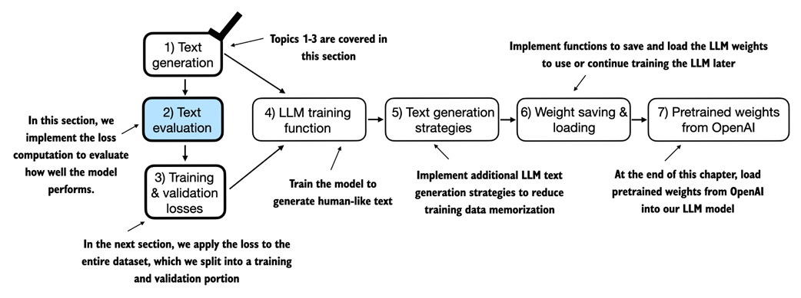
在模型训练中，目标是增加正确目标 token ID 对应位置的 softmax 概率，如图 5.6 所示。该 softmax 概率也用于我们在本节中实现的评估指标：目标位置概率越高越好。

记住，**图 5.6** 显示了一个仅包含 7 个 token 的词汇表的 softmax 概率，目的是适应图示。因此起始随机值大约为 1/7，即 0.14。而我们 GPT-2 模型的词汇量为 50257，因此大多数初始概率会在 1/50257 附近，即约 0.00002。
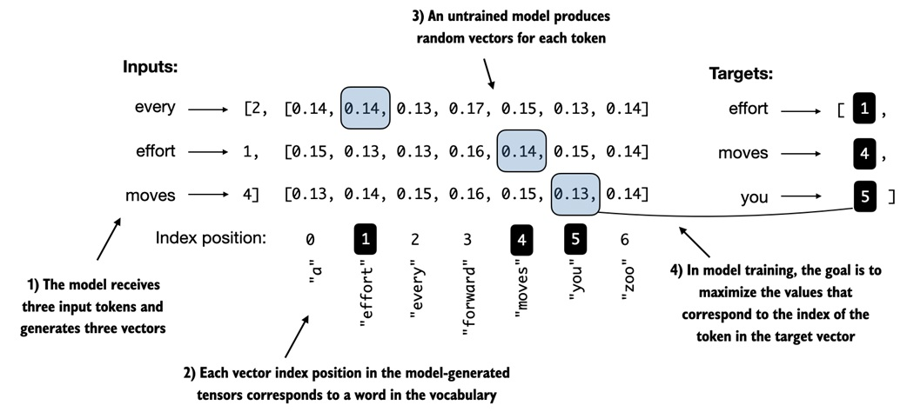
对于两个输入文本，我们可以通过以下代码打印目标 token 的初始 softmax 概率分数：

```python
text_idx = 0
target_probas_1 = probas[text_idx, [0, 1, 2], targets[text_idx]]
print("Text 1:", target_probas_1)

text_idx = 1
target_probas_2 = probas[text_idx, [0, 1, 2], targets[text_idx]]
print("Text 2:", target_probas_2)
```

每个批次的 3 个目标 token ID 概率如下：

```plaintext
Text 1: tensor([7.4541e-05, 3.1061e-05, 1.1563e-05])
Text 2: tensor([3.9836e-05, 1.6783e-05, 4.7559e-06])
```

LLM 训练的目标是将这些值尽量提高，使其接近 1，从而确保模型始终选择目标 token——即句子中的下一个单词——作为生成的下一个 token。

#### 反向传播

我们如何最大化这些目标 token 对应的 softmax 概率？方法是通过更新模型的权重，使得模型为期望的 token ID 输出更高的值。这种权重更新通过一种称为**反向传播**的过程实现，这是训练深度神经网络的标准技术（详情见附录 A 的 A.3 到 A.7 节）。

反向传播需要一个**损失函数**，该函数计算模型预测输出（即目标 token ID 对应的概率）与实际期望输出的差异。这个损失函数衡量模型预测偏离目标值的程度。

在本节的其余部分，我们将计算两个示例批次（`target_probas_1` 和 `target_probas_2`）概率分数的损失。主要步骤见图 5.7。

**图 5.7** 展示了计算损失的几个步骤。第 1 至第 3 步计算目标张量对应的 token 概率。这些概率在第 4 至第 6 步中通过对数变换并求平均值。
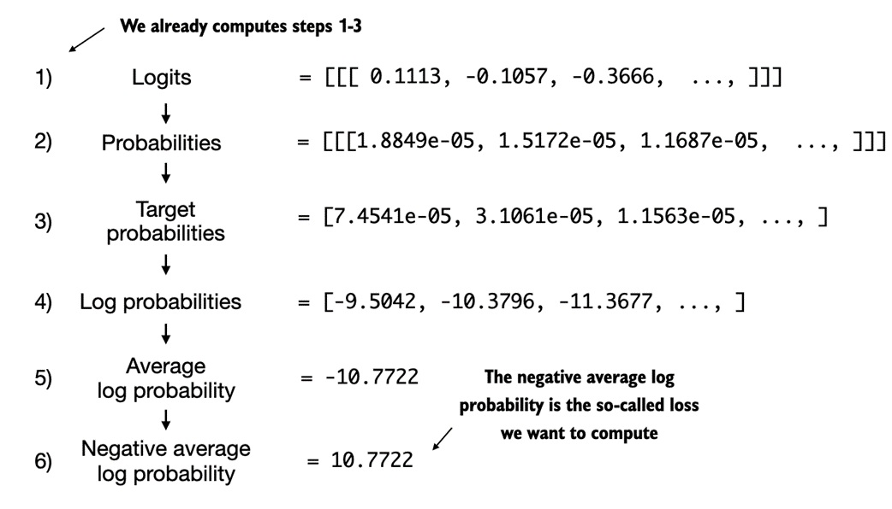
我们已经通过第 1 至第 3 步得到 `target_probas_1` 和 `target_probas_2`，接下来是第 4 步，对概率分数应用对数：

```python
log_probas = torch.log(torch.cat((target_probas_1, target_probas_2)))
print(log_probas)
```

结果如下：

```plaintext
tensor([ -9.5042, -10.3796, -11.3677, -10.1308, -10.9951, -12.2561])
```

处理概率分数的对数在数学优化中更易操作。这一主题超出本书范围，但可参考附录 B 提到的讲座以了解更多。

接下来，我们计算这些对数概率的平均值（图 5.7 中的第 5 步）：

```python
avg_log_probas = torch.mean(log_probas)
print(avg_log_probas)
```

结果如下：

```plaintext
tensor(-10.7722)
```

模型训练的目标是使平均对数概率尽量接近 0，稍后将在 5.2 节实现的训练过程中更新模型权重实现该目标。

在深度学习中，通常的做法不是将平均对数概率提升到 0，而是将负的平均对数概率降低到 0。负的平均对数概率等于平均对数概率乘以 -1，对应图 5.7 中的第 6 步：

```python
neg_avg_log_probas = avg_log_probas * -1
print(neg_avg_log_probas)
```

这将结果 `tensor(-10.7722)` 转为 `10.7722`，即**交叉熵损失**。

PyTorch 提供了便捷的 `cross_entropy` 函数，可为我们完成图 5.7 中的所有 6 步。

#### 交叉熵损失

本质上，**交叉熵损失**是机器学习和深度学习中的一种常用度量，衡量两个概率分布之间的差异——通常为标签的真实分布（这里是数据集中的 token）和模型预测分布（例如，LLM 生成的 token 概率分布）。

在 PyTorch 中，`cross_entropy` 函数计算离散结果的损失，与目标 token 给定的模型生成的 token 概率的负平均对数概率相似，因此在实践中交叉熵和负平均对数概率常常可互换使用。

在应用 `cross_entropy` 函数前，让我们回顾 logits 和 targets 张量的形状：

```python
print("Logits shape:", logits.shape)
print("Targets shape:", targets.shape)
```

输出形状如下：

```plaintext
Logits shape: torch.Size([2, 3, 50257])
Targets shape: torch.Size([2, 3])
```

logits 张量有三维：批次大小、token 数量和词汇表大小。而 targets 张量有二维：批次大小和 token 数量。

为了使 `cross_entropy` 函数在 PyTorch 中使用，我们需要在批次维度上展平这些张量：

```python
logits_flat = logits.flatten(0, 1)
targets_flat = targets.flatten()
print("Flattened logits:", logits_flat.shape)
print("Flattened targets:", targets_flat.shape)
```

生成的张量维度为：

```plaintext
Flattened logits: torch.Size([6, 50257])
Flattened targets: torch.Size([6])
```

记住，targets 是我们希望 LLM 生成的 token ID，logits 则是进入 softmax 函数前的未缩放模型输出。

之前，我们应用 softmax 函数，选择目标 ID 对应的概率分数，并计算负平均对数概率。PyTorch 的 `cross_entropy` 函数将为我们完成这些步骤：

```python
loss = torch.nn.functional.cross_entropy(logits_flat, targets_flat)
print(loss)
```

生成的损失与之前手动应用图 5.7 中各步骤的结果一致：

```plaintext
tensor(10.7722)
```

#### 困惑度

**困惑度**是一种常用于语言建模任务的度量，与交叉熵损失一起使用，可更直观地了解模型在预测序列下一个 token 时的不确定性。

困惑度衡量模型预测的概率分布与数据集实际分布的匹配程度。与损失类似，较低的困惑度表示模型预测更接近实际分布。

困惑度可通过 `torch.exp(loss)` 计算。应用到先前计算的损失时，返回 `tensor(47678.8633)`。

困惑度比原始损失值更具解释性，因为它表示模型在每一步中不确定的有效词汇大小。在给定示例中，这相当于模型在 47678 个词或 token 中不确定生成哪个作为下一个 token。

本节中，我们计算了两个小文本输入的损失用于说明。在下一节中，我们将把损失计算应用于整个训练和验证集。


### 5.1.3 计算训练集和验证集的损失

本节首先准备训练和验证数据集，随后将计算训练和验证集的交叉熵损失，这在模型训练过程中是非常重要的一步。**图 5.8** 展示了在前一节计算交叉熵损失之后，将该损失计算应用于整个文本数据集的过程。
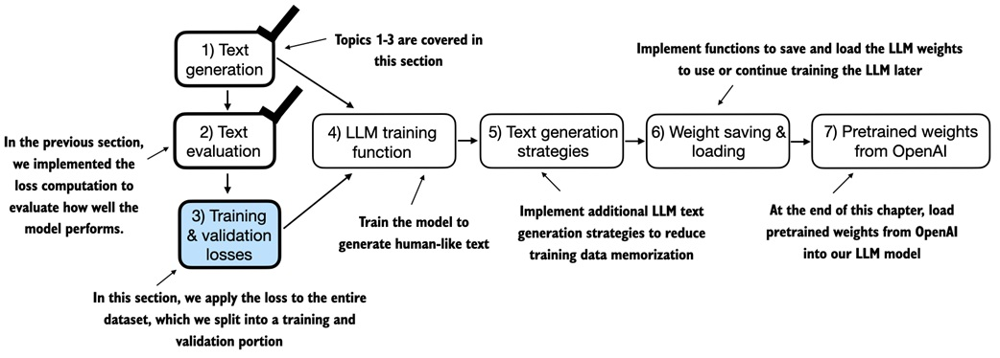
为了计算训练集和验证集上的损失，我们使用了一个非常小的文本数据集，即第 2 章中使用的 Edith Wharton 的短篇小说《The Verdict》。选择公共领域的文本可以避免使用权相关问题。此外，我们选择较小的数据集是为了便于在普通笔记本电脑上快速运行代码示例，即使没有高端 GPU 也可以轻松执行，非常适合学习用途。

对于感兴趣的读者，书中的附加代码还提供了更大规模的数据集准备方法，可以使用来自 Project Gutenberg 的超过 60,000 本公共领域书籍训练 LLM（见附录 D 了解详情）。

#### 预训练 LLM 的成本

将项目规模放在实际背景中，可以参考训练一个相对流行的开源 LLM（例如 70 亿参数的 Llama 2 模型）所需的资源。该模型训练了 2 万亿 tokens，使用了昂贵的 A100 GPU 共计 184,320 小时。目前，AWS 上的 8xA100 云服务器每小时大约 $30，训练此类 LLM 的粗略成本约为 $690,000。

以下代码加载了第 2 章中使用的短篇小说《The Verdict》：

```python
file_path = "the-verdict.txt"
with open(file_path, "r", encoding="utf-8") as file:
    text_data = file.read()
```

加载数据集后，我们可以检查字符和 token 数量：

```python
total_characters = len(text_data)
total_tokens = len(tokenizer.encode(text_data))
print("Characters:", total_characters)
print("Tokens:", total_tokens)
```

输出如下：

```plaintext
Characters: 20479
Tokens: 5145
```

虽然只有 5145 个 tokens，可能看起来过小而无法训练一个 LLM，但正如前述，这主要用于教育目的，因此我们可以在几分钟内完成代码运行，而不需数周。此外，在本章结束时，我们将从 OpenAI 加载预训练权重用于 `GPTModel`。

接下来，我们将数据集分为训练集和验证集，并使用第 2 章的 `data loader` 准备 LLM 训练的批次。如**图 5.9** 所示，数据准备过程包括将输入文本划分为训练和验证集，然后将文本 token 化并分割为指定长度的文本块（图中为 6），最后对文本块行进行随机化并组织成批次供模型训练使用。
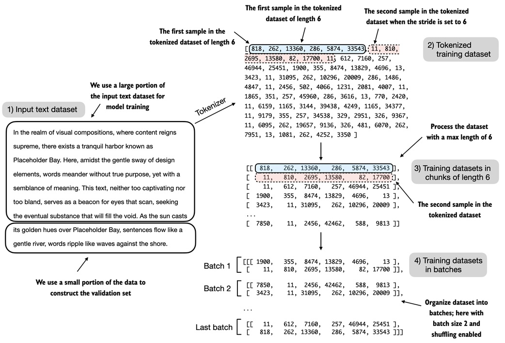
在实际的 `data loader` 实现中，`max_length` 设置为 LLM 支持的 256-token 长度，以确保模型在训练时可以看到更长的文本。

#### 使用可变长度进行训练

我们用相似大小的文本块来训练模型，这样做简单且高效。然而，在实际中，使用可变长度输入训练 LLM 有助于模型在不同类型输入上更好地泛化。

要实现图 5.9 中的分割和加载数据，我们首先定义 `train_ratio` 使用 90% 数据用于训练，剩余 10% 用于模型训练期间的验证评估：

```python
train_ratio = 0.90
split_idx = int(train_ratio * len(text_data))
train_data = text_data[:split_idx]
val_data = text_data[split_idx:]
```

使用 `train_data` 和 `val_data` 子集，我们可以重用第 2 章的 `create_dataloader_v1` 代码来创建数据加载器：

```python
from chapter02 import create_dataloader_v1
torch.manual_seed(123)
train_loader = create_dataloader_v1(
    train_data,
    batch_size=2,
    max_length=GPT_CONFIG_124M["context_length"],
    stride=GPT_CONFIG_124M["context_length"],
    drop_last=True,
    shuffle=True
)
val_loader = create_dataloader_v1(
    val_data,
    batch_size=2,
    max_length=GPT_CONFIG_124M["context_length"],
    stride=GPT_CONFIG_124M["context_length"],
    drop_last=False,
    shuffle=False
)
```

以上代码中使用了相对较小的批次大小，以减少计算资源需求，因为我们使用了非常小的数据集。实际中，训练 LLM 的批次大小达到 1024 或更大很常见。

作为可选检查，我们可以迭代数据加载器以确保它们正确创建：

```python
print("Train loader:")
for x, y in train_loader:
    print(x.shape, y.shape)
print("\nValidation loader:")
for x, y in val_loader:
    print(x.shape, y.shape)
```

输出如下：

```plaintext
Train loader:
torch.Size([2, 256]) torch.Size([2, 256])
torch.Size([2, 256]) torch.Size([2, 256])
...

Validation loader:
torch.Size([2, 256]) torch.Size([2, 256])
```

如代码输出所示，我们有 9 个训练集批次，每个批次包含 2 个样本和 256 个 token。由于仅将 10% 的数据用于验证，因此仅有 1 个验证批次。

接下来，我们实现一个实用函数，用于计算训练和验证加载器返回批次的交叉熵损失：

```python
def calc_loss_batch(input_batch, target_batch, model, device):
    input_batch, target_batch = input_batch.to(device), target_batch.to(device)  # A
    logits = model(input_batch)
    loss = torch.nn.functional.cross_entropy(
        logits.flatten(0, 1), target_batch.flatten()
    )
    return loss
```

现在我们可以使用 `calc_loss_batch` 函数（计算单个批次的损失）来实现 `calc_loss_loader` 函数，以计算给定数据加载器上所有批次的损失：

```python
def calc_loss_loader(data_loader, model, device, num_batches=None):
    total_loss = 0.
    if num_batches is None:
        num_batches = len(data_loader)  # A
    else:
        num_batches = min(num_batches, len(data_loader))  # B
    for i, (input_batch, target_batch) in enumerate(data_loader):
        if i < num_batches:
            loss = calc_loss_batch(input_batch, target_batch, model, device)
            total_loss += loss.item()  # C
        else:
            break
    return total_loss / num_batches  # D
```

默认情况下，`calc_loss_loader` 函数遍历给定数据加载器中的所有批次，累加损失在 `total_loss` 变量中，最后计算并平均损失。如果在 `num_batches` 参数中指定较小的批次数，也可以加速模型训练中的评估。

现在我们可以应用 `calc_loss_loader` 函数到训练和验证集加载器：

```python
device = torch.device("cuda" if torch.cuda.is_available() else "cpu")  # A
model.to(device)
train_loss = calc_loss_loader(train_loader, model, device)  # B
val_loss = calc_loss_loader(val_loader, model, device)
print("Training loss:", train_loss)
print("Validation loss:", val_loss)
```

结果损失值如下：

```plaintext
Training loss: 10.98758347829183
Validation loss: 10.98110580444336
```

由于模型尚未训练，损失值相对较高。作为对比，如果模型能够学习生成训练集和验证集中的下一个 token，损失将接近 0。

现在，我们已经有方法评估生成文本的质量。接下来一节，我们将训练 LLM 减少损失，使其生成更优质的文本，如**图 5.10** 所示。
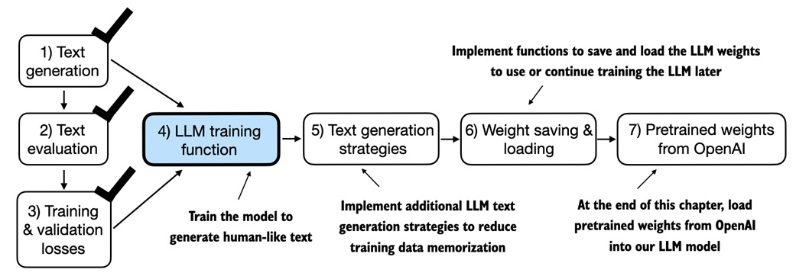
如图所示，下一节将聚焦于 LLM 的预训练。


## 5.2 训练大语言模型

在本节中，我们将实现训练大语言模型（LLM）`GPTModel`的代码。为了使代码简洁易懂，我们将采用一个简单的训练循环，如图5.11所示。不过，有兴趣的读者可以在附录D《为训练循环添加功能》中了解更高级的技术，如学习率预热、余弦退火和梯度裁剪等。

图5.11展示了一个典型的PyTorch深度神经网络训练循环，包含多个步骤，遍历训练集中的批次并进行多轮迭代。在每次循环中，我们计算每个训练集批次的损失，以确定损失的梯度，并使用这些梯度来更新模型权重，从而最小化训练集损失。
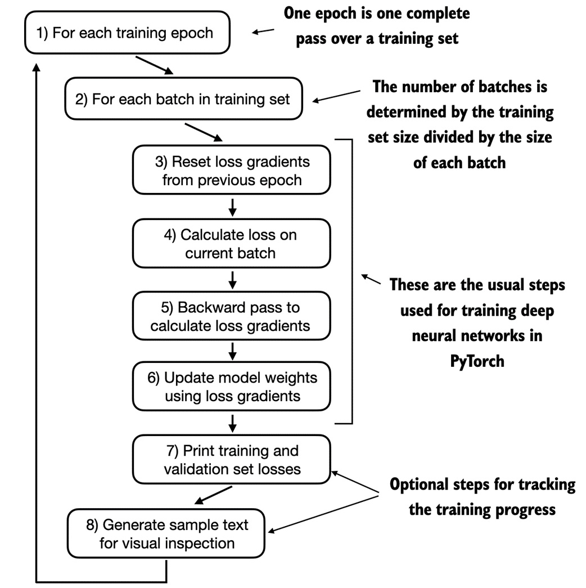
图5.11中显示的流程图描述了用于训练LLM的典型PyTorch神经网络训练流程，共八个步骤，开始于遍历每个训练轮次、处理批次、重置和计算梯度、更新权重，最后是监控步骤，如打印损失和生成文本样本。如果您对使用PyTorch训练深度神经网络不熟悉，可以参考附录A中的A.5到A.8节。

代码中，我们可以通过以下`train_model_simple`函数实现这一训练流程：

**代码清单5.3** 用于预训练LLM的主函数

```python
def train_model_simple(model, train_loader, val_loader, optimizer, device, num_epochs,
                       eval_freq, eval_iter, start_context):
    train_losses, val_losses, track_tokens_seen = [], [], []  #A
    tokens_seen, global_step = 0, -1
    for epoch in range(num_epochs):  #B
        model.train()
        for input_batch, target_batch in train_loader:
            optimizer.zero_grad()  #C
            loss = calc_loss_batch(input_batch, target_batch, model, device)
            loss.backward()  #D
            optimizer.step()  #E
            tokens_seen += input_batch.numel()
            global_step += 1
            if global_step % eval_freq == 0:  #F
                train_loss, val_loss = evaluate_model(
                    model, train_loader, val_loader, device, eval_iter)
                train_losses.append(train_loss)
                val_losses.append(val_loss)
                track_tokens_seen.append(tokens_seen)
                print(f"Ep {epoch+1} (Step {global_step:06d}): "
                      f"Train loss {train_loss:.3f}, Val loss {val_loss:.3f}")
                generate_and_print_sample(  #G
                    model, train_loader.dataset.tokenizer, device, start_context
                )
    return train_losses, val_losses, track_tokens_seen
```

请注意，我们刚刚创建的`train_model_simple`函数使用了两个尚未定义的函数：`evaluate_model`和`generate_and_print_sample`。

`evaluate_model`函数对应图5.11中的第7步。它在每次模型更新后打印训练集和验证集的损失，使我们能够评估训练是否使模型有所改进。

具体来说，`evaluate_model`函数计算训练集和验证集的损失，并确保在计算损失时模型处于评估模式（禁用梯度跟踪和dropout）：

```python
def evaluate_model(model, train_loader, val_loader, device, eval_iter):
    model.eval()  #A
    with torch.no_grad():  #B
        train_loss = calc_loss_loader(train_loader, model, device, num_batches=eval_iter)
        val_loss = calc_loss_loader(val_loader, model, device, num_batches=eval_iter)
    model.train()
    return train_loss, val_loss
```

与`evaluate_model`类似，`generate_and_print_sample`函数是一个辅助函数，用于跟踪模型在训练过程中的改进情况。特别是，`generate_and_print_sample`函数接收一个文本片段（`start_context`）作为输入，将其转换为令牌ID，并将其输入到LLM中以生成一个文本样本，使用我们之前定义的`generate_text_simple`函数：

```python
def generate_and_print_sample(model, tokenizer, device, start_context):
    model.eval()
    context_size = model.pos_emb.weight.shape[0]
    encoded = text_to_token_ids(start_context, tokenizer).to(device)
    with torch.no_grad():
        token_ids = generate_text_simple(
            model=model, idx=encoded,
            max_new_tokens=50, context_size=context_size
        )
    decoded_text = token_ids_to_text(token_ids, tokenizer)
    print(decoded_text.replace("\n", " "))  # 紧凑的打印格式
    model.train()
```

`evaluate_model`函数为我们提供了模型训练进展的数值估计，而`generate_and_print_sample`文本函数则生成了模型的具体文本示例，用于评估其训练能力。

**AdamW优化器**

Adam优化器是深度神经网络训练的常见选择。然而，在我们的训练循环中，我们选择使用AdamW优化器。AdamW是Adam的一个变体，改进了权重衰减的方法，旨在通过惩罚较大的权重来最小化模型复杂度并防止过拟合。这种调整使AdamW实现了更有效的正则化和更好的泛化，因此经常用于训练LLM。

让我们使用AdamW优化器和之前定义的`train_model_simple`函数训练一个GPT模型实例10个轮次，看看效果。

```python
torch.manual_seed(123)
model = GPTModel(GPT_CONFIG_124M)
model.to(device)
optimizer = torch.optim.AdamW(model.parameters(), lr=0.0004, weight_decay=0.1)  #A
num_epochs = 10
train_losses, val_losses, tokens_seen = train_model_simple(
    model, train_loader, val_loader, optimizer, device,
    num_epochs=num_epochs, eval_freq=5, eval_iter=1,
    start_context="Every effort moves you"
)
```

执行`train_model_simple`函数将启动训练过程，在MacBook Air或类似笔记本电脑上大约需要5分钟。训练过程中打印的输出如下：

```vbnet
Ep 1 (Step 000000): Train loss 9.781, Val loss 9.933
Ep 1 (Step 000005): Train loss 8.111, Val loss 8.339
Every effort moves you,,,,,,,,,,,,.
Ep 2 (Step 000010): Train loss 6.661, Val loss 7.048
Ep 2 (Step 000015): Train loss 5.961, Val loss 6.616
Every effort moves you, and, and, and, and, and, and, and, and, and, and, and, and, and, and, and, and, and, and, and, and, and, and,, and, and,
...
Ep 9 (Step 000080): Train loss 0.541, Val loss 6.393
Every effort moves you?" "Yes--quite insensible to the irony. She wanted him vindicated--and by me!" He laughed again, and threw back the window-curtains, I had the donkey. "There were days when I
Ep 10 (Step 000085): Train loss 0.391, Val loss 6.452
Every effort moves you know," was one of the axioms he laid down across the Sevres and silver of an exquisitely appointed luncheon-table, when, on a later day, I had again run over from Monte Carlo; and Mrs. Gis
```

从训练过程中打印的结果可以看出，训练损失大幅下降，从9.558收敛到0.762，模型的语言能力提高了很多。起初，模型只能在起始内容后添加逗号（如`"Every effort moves you,,,,,,,,,,,,"`）或重复“and”一词。到训练结束时，它已能生成语法正确的文本。

与训练集损失类似，我们可以看到验证集损失从高值（9.856）开始，并在训练过程中逐渐下降。然而，它从未接近训练集损失，并在第10轮后保持在6.372。

在更详细地讨论验证集损失之前，让我们绘制一个简单的图表，将训练集和验证集的损失并列显示：

```python
import matplotlib.pyplot as plt
def plot_losses(epochs_seen, tokens_seen, train_losses, val_losses):
    fig, ax1 = plt.subplots(figsize=(5, 3))
    ax1.plot(epochs_seen, train_losses, label="Training loss")
    ax1.plot(epochs_seen, val_losses, linestyle="-.", label="Validation loss")
    ax1.set_xlabel("Epochs")
    ax1.set_ylabel("Loss")
    ax1.legend(loc="upper right")
    ax2 = ax1.twiny()  #A
    ax2.plot(tokens_seen, train_losses, alpha=0)  #B
    ax2.set_xlabel("Tokens seen")
    fig.tight_layout()
    plt.show()

epochs_tensor = torch.linspace(0, num_epochs, len(train_losses))
plot_losses(epochs_tensor, tokens_seen, train_losses, val_losses)
```

生成的训练和验证损失图如图5.12所示。
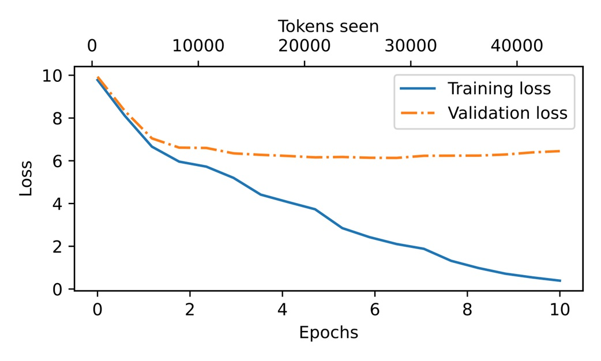
图5.12显示了在训练开始时，训练集和验证集的损失均迅速下降，这是模型学习的标志。然而，训练集损失在第二轮之后继续下降，而验证集损失则停滞不前。这表明模型仍在学习，但在第二轮之后对训练集的拟合过度。

这种记忆现象是意料之中的，因为我们使用的训练数据集非常小，并对模型进行了多轮训练。通常情况下，模型只在更大的数据集上训练一轮。如前所述，有兴趣的读者可以尝试使用Project Gutenberg的60,000本公共领域书籍训练模型，届时不会发生这种过拟合现象；详情见附录B。

在接下来的章节中（如图5.13所示），我们将探讨LLM所采用的采样方法，以减少记忆效应，从而生成更具新意的文本。
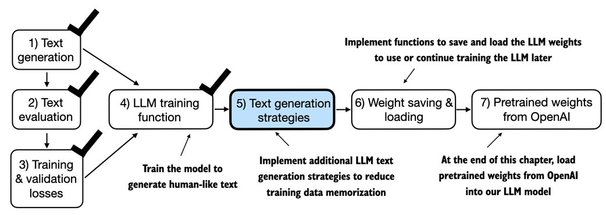
如图5.13所示，下一节将介绍生成策略，以降低LLM对训练数据的记忆效应，提高LLM生成文本的原创性。


## 5.3 解码策略以控制随机性

在本节中，我们将介绍生成文本的策略（也称为解码策略），以生成更具原创性的文本。首先，我们简要回顾上一章中使用的`generate_text_simple`函数，我们在本章中调用了它，放置在`generate_and_print_sample`函数内部。接下来，我们将介绍两种技术：温度缩放和Top-k采样，以改进该函数。

我们首先将模型从GPU传回CPU，因为对于相对较小的模型来说，推理过程并不需要GPU。同时，在训练完成后，我们将模型置于评估模式以关闭随机成分，如dropout：

```python
model.to("cpu")
model.eval()
```

接下来，我们将GPT模型实例（`model`）插入到`generate_text_simple`函数中，该函数使用LLM一次生成一个token：

```python
tokenizer = tiktoken.get_encoding("gpt2")
token_ids = generate_text_simple(
    model=model,
    idx=text_to_token_ids("Every effort moves you", tokenizer),
    max_new_tokens=25,
    context_size=GPT_CONFIG_124M["context_length"]
)
print("Output text:\n", token_ids_to_text(token_ids, tokenizer))
```

生成的文本如下：

```arduino
Output text:
Every effort moves you know," was one of the axioms he laid down across the Sevres and silver of an exquisitely appointed lun
```

如前文5.1.2节所述，每个生成步骤选择的token对应于词汇表中具有最高概率得分的token。

这意味着，即使多次运行上述`generate_text_simple`函数并使用相同的起始内容（“Every effort moves you”），LLM也将始终生成相同的输出。

以下小节将介绍两个概念，以控制生成文本的随机性和多样性：温度缩放和Top-k采样。


### 5.3.1 温度缩放

本节介绍温度缩放，这是一种为下一个token生成任务添加概率选择过程的技术。

在之前的`generate_text_simple`函数中，我们始终通过`torch.argmax`选择概率最高的token作为下一个token，这种方式称为贪婪解码。为了生成更多样化的文本，我们可以用一个从概率分布中采样的函数来替换`argmax`（在这里，概率分布是LLM在每个token生成步骤中为每个词汇生成的概率得分）。

为了通过具体示例说明概率采样过程，我们用一个非常小的词汇表来讨论下一个token生成过程：

```python
vocab = {
    "closer": 0,
    "every": 1,
    "effort": 2,
    "forward": 3,
    "inches": 4,
    "moves": 5,
    "pizza": 6,
    "toward": 7,
    "you": 8,
}
inverse_vocab = {v: k for k, v in vocab.items()}
```

接下来，假设LLM接收起始内容“every effort moves you”，并生成以下的下一个token的logits值：

```python
next_token_logits = torch.tensor(
    [4.51, 0.89, -1.90, 6.75, 1.63, -1.62, -1.89, 6.28, 1.79]
)
```

在之前的章节中讨论过，在`generate_text_simple`中，我们通过softmax函数将logits转换为概率，再通过`argmax`函数找到对应的token ID，然后可以通过逆向词汇表将其映射回文本：

```python
probas = torch.softmax(next_token_logits, dim=0)
next_token_id = torch.argmax(probas).item()
print(inverse_vocab[next_token_id])
```

由于最大logit值位于第四个位置（索引位置为3，因为Python使用0索引），生成的单词是“forward”。

为了实现概率采样过程，我们现在可以用PyTorch中的`multinomial`函数替换`argmax`：

```python
torch.manual_seed(123)
next_token_id = torch.multinomial(probas, num_samples=1).item()
print(inverse_vocab[next_token_id])
```

输出依然是“forward”。这是为什么呢？`multinomial`函数根据每个token的概率得分进行采样。换句话说，“forward”仍然是最可能的token，并且在大多数情况下会被`multinomial`选中，但不是总是如此。为了说明这一点，我们实现一个函数，重复此采样1000次：

```python
def print_sampled_tokens(probas):
    torch.manual_seed(123)
    sample = [torch.multinomial(probas, num_samples=1).item() for i in range(1_000)]
    sampled_ids = torch.bincount(torch.tensor(sample))
    for i, freq in enumerate(sampled_ids):
        print(f"{freq} x {inverse_vocab[i]}")
print_sampled_tokens(probas)
```

采样结果如下：

```sql
73 x closer
0 x every
0 x effort
582 x forward
2 x inches
0 x moves
0 x pizza
343 x toward
```

如结果所示，单词“forward”在大多数情况下被采样（1000次中有582次），但其他token如“closer”、“inches”和“toward”也有一定概率被采样。这意味着，如果在`generate_and_print_sample`函数中用`multinomial`函数替换`argmax`函数，LLM有时会生成“every effort moves you toward”、“every effort moves you inches”和“every effort moves you closer”等不同的文本，而不仅是“every effort moves you forward”。

我们可以通过一种称为温度缩放的概念进一步控制分布和选择过程，温度缩放实际上是将logits除以一个大于0的数：

```python
def softmax_with_temperature(logits, temperature):
    scaled_logits = logits / temperature
    return torch.softmax(scaled_logits, dim=0)
```

温度大于1时，token概率分布会更接近于均匀分布；温度小于1时，分布会更尖锐（分布的峰值更明显）。我们通过绘制原始概率及不同温度值缩放后的概率来说明这一点：

```python
temperatures = [1, 0.1, 5]  # 原始、较高和较低的温度
scaled_probas = [softmax_with_temperature(next_token_logits, T) for T in temperatures]
x = torch.arange(len(vocab))
bar_width = 0.15
fig, ax = plt.subplots(figsize=(5, 3))
for i, T in enumerate(temperatures):
    rects = ax.bar(x + i * bar_width, scaled_probas[i],
                   bar_width, label=f'Temperature = {T}')
ax.set_ylabel('Probability')
ax.set_xticks(x)
ax.set_xticklabels(vocab.keys(), rotation=90)
ax.legend()
plt.tight_layout()
plt.show()
```
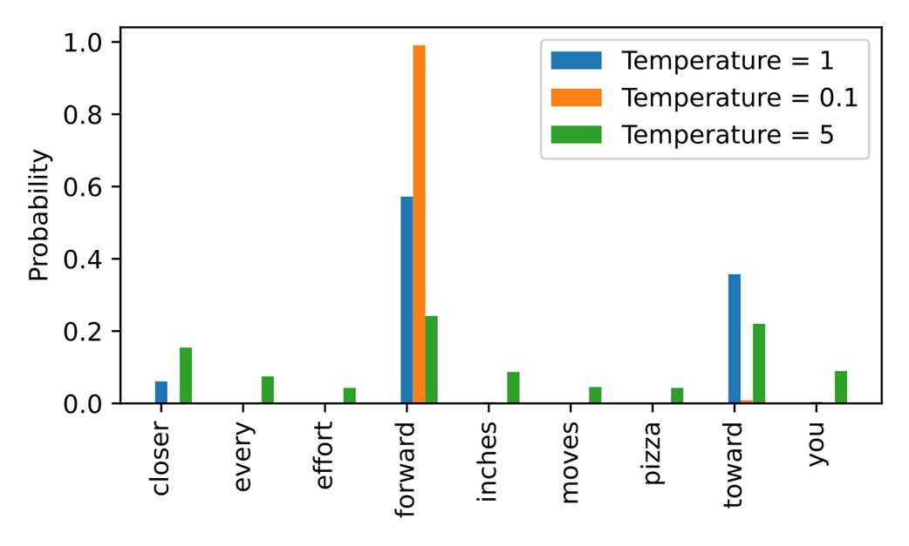
生成的图如图5.14所示。

图5.14中显示，温度为1时表示每个token的概率分数未进行缩放。将温度降低至0.1使分布更加尖锐，因此最可能的token（此处为“forward”）的概率得分会更高。相反，将温度升至5使分布更均匀。

温度为1时，将logits除以1，然后将其传递给softmax函数来计算概率分数。换句话说，使用温度1相当于不进行任何温度缩放。在这种情况下，通过PyTorch中的`multinomial`采样函数，token的选择概率等于原始softmax概率分数。例如，对于温度设置1，图5.14显示“forward”对应的token被选择的概率约为60%。

此外，图5.14显示，使用非常小的温度（如0.1）将导致分布更加尖锐，从而使`multinomial`函数的行为接近`argmax`，几乎100%地选择最可能的token（此处为“forward”）。相反，温度5的分布更均匀，其他token更频繁地被选择，这可以为生成的文本添加更多变化，但也更容易导致无意义的文本。例如，使用温度5时，“every effort moves you pizza”会以约4%的概率生成。

#### 练习5.1

使用`print_sampled_tokens`函数打印温度图5.13所示的softmax概率缩放后的采样频率。每种情况下“pizza”这个单词被采样的频率是多少？你能想到一种更快速且更准确的方法来确定“pizza”被采样的频率吗？


### 5.3.2 Top-k采样

在上一节中，我们实现了一种结合温度缩放的概率采样方法，以增加输出的多样性。我们看到，较高的温度值会使下一个token的概率分布更接近均匀分布，从而减少模型重复选择最可能token的概率，这使得生成过程可以探索那些概率较低但潜在更有趣和富有创造性的路径。然而，这种方法的一个缺点是，有时会生成语法不正确或完全无意义的内容，比如“every effort moves you pizza”。

在本节中，我们引入另一种称为Top-k采样的概念，将其与概率采样和温度缩放相结合，可以进一步改善文本生成效果。

在Top-k采样中，我们将采样限制在概率最高的前k个token内，排除所有其他token，并将它们的概率分数设为无穷小（如图5.15所示）。
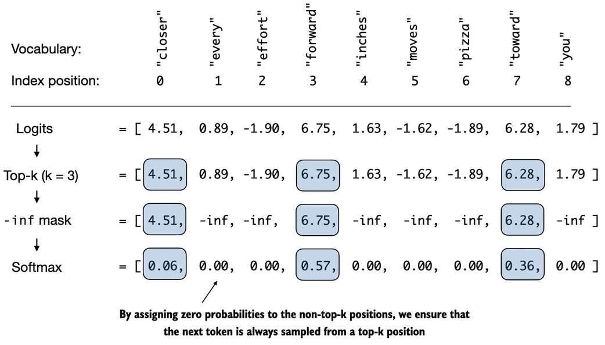
图5.15中展示了当k=3时使用Top-k采样的过程。我们仅关注与最高logits值关联的3个token，并在应用softmax函数之前将所有其他token的值设为负无穷（-inf）。这会生成一个概率分布，其中非Top-k token的概率值为0。

图5.15中的方法将所有未选择的logits值替换为负无穷值（-inf），因此在计算softmax值时，非Top-k token的概率为0，而剩余token的概率之和为1。（细心的读者可能会记得我们在3.5.1节的因果注意力掩码模块中也使用过这种掩码技巧。）

在代码中，我们可以按照图5.15所示实现Top-k过程，首先选择logits值最高的token：

```python
top_k = 3
top_logits, top_pos = torch.topk(next_token_logits, top_k)
print("Top logits:", top_logits)
print("Top positions:", top_pos)
```

前3个token的logits值和token ID（按降序排列）如下所示：

```css
Top logits: tensor([6.7500, 6.2800, 4.5100])
Top positions: tensor([3, 7, 0])
```

接着，我们使用PyTorch的`where`函数，将Top-k选择范围之外的token的logit值设为负无穷（-inf）：

```python
new_logits = torch.where(
    condition=next_token_logits < top_logits[-1],  #A
    input=torch.tensor(float('-inf')),  #B
    other=next_token_logits  #C
)
print(new_logits)
```

在这个9个token的词汇表中，下一token的logits结果如下：

```scss
tensor([4.5100, -inf, -inf, 6.7500, -inf, -inf, -inf, 6.2800, -inf])
```

最后，我们应用softmax函数将这些值转换为下一个token的概率：

```python
topk_probas = torch.softmax(new_logits, dim=0)
print(topk_probas)
```

可以看到，使用Top-3方法的结果是3个非零的概率分数：

```scss
tensor([0.0615, 0.0000, 0.0000, 0.5775, 0.0000, 0.0000, 0.0000, 0.3610, 0.0000])
```

现在我们可以应用温度缩放和前一节介绍的`multinomial`函数，在这3个非零概率分数中选择下一个token，以生成下一个token。在下一节中，我们将通过修改文本生成函数来实现这一功能。

### 5.3.3 修改文本生成函数

前两节介绍了增加LLM生成文本多样性的两个概念：温度采样和Top-k采样。本节中，我们将结合这些概念，修改之前用于LLM文本生成的`generate_simple`函数，创建一个新的生成函数：

**代码清单5.4** 一个更具多样性的文本生成函数

```python
def generate(model, idx, max_new_tokens, context_size, temperature, top_k=None):
    for _ in range(max_new_tokens):  #A
        idx_cond = idx[:, -context_size:]
        with torch.no_grad():
            logits = model(idx_cond)
            logits = logits[:, -1, :]
        if top_k is not None:  #B
            top_logits, _ = torch.topk(logits, top_k)
            min_val = top_logits[:, -1]
            logits = torch.where(
                logits < min_val,
                torch.tensor(float('-inf')).to(logits.device),
                logits
            )
        if temperature > 0.0:  #C
            logits = logits / temperature
            probs = torch.softmax(logits, dim=-1)
            idx_next = torch.multinomial(probs, num_samples=1)
        else:  #D
            idx_next = torch.argmax(logits, dim=-1, keepdim=True)
        idx = torch.cat((idx, idx_next), dim=1)
    return idx
```

现在让我们看看新的`generate`函数的效果：

```python
torch.manual_seed(123)
token_ids = generate(
    model=model,
    idx=text_to_token_ids("Every effort moves you", tokenizer),
    max_new_tokens=15,
    context_size=GPT_CONFIG_124M["context_length"],
    top_k=25,
    temperature=1.4
)
print("Output text:\n", token_ids_to_text(token_ids, tokenizer))
```

生成的文本如下：

```vbnet
Output text:
Every effort moves you stand to work on surprise, a one of us had gone with random
```

可以看到，生成的文本与我们在5.3节开始时通过`generate_simple`函数生成的文本非常不同（例如“Every effort moves you know,”...），后者是训练集中记忆的一段话。

#### 练习5.2

尝试使用不同的温度和Top-k设置。根据您的观察，您能想到哪些应用适合较低的温度和Top-k设置？相反，您能想到哪些应用适合较高的温度和Top-k设置吗？（建议在加载OpenAI的预训练权重后重新进行此练习。）

#### 练习5.3

有哪些不同的设置组合可以使`generate`函数表现出确定性行为，即禁用随机采样，使其始终生成与`generate_simple`函数类似的相同输出？

到目前为止，我们已经介绍了如何预训练LLM并使用它们生成文本。本章的最后两节将讨论如何保存和加载训练好的LLM，以及如何加载OpenAI的预训练权重。


## 5.4 在 PyTorch 中加载和保存模型权重

在本章中，我们讨论了如何通过数值评价训练进展并从零开始预训练LLM。虽然LLM和数据集都相对较小，但此练习表明，预训练LLM计算成本极高。因此，能够保存LLM非常重要，这样我们在新会话中使用它时，就不需要每次都重新运行训练过程。

如图5.16中的章节概述所示，本节我们将介绍如何保存和加载一个预训练模型。在接下来的章节中，我们将从OpenAI加载一个更强大的预训练GPT模型到我们的`GPTModel`实例中。

图5.16显示，在训练和检查模型后，保存模型以便以后使用或继续训练往往是有帮助的。本节讲述如何实现这一点，然后在本章最后一节中加载OpenAI的预训练模型权重。
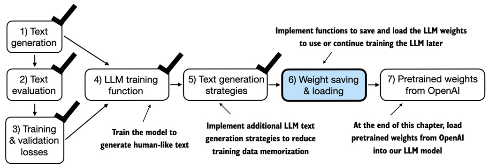
幸运的是，保存PyTorch模型相对简单。推荐的方法是保存模型的`state_dict`（状态字典），它是一个将每一层映射到其参数的字典，可以使用`torch.save`函数来实现：

```python
torch.save(model.state_dict(), "model.pth")
```

在上述代码中，`"model.pth"`是保存`state_dict`的文件名。`.pth`是PyTorch文件的常用扩展名，不过我们实际上可以使用任何文件扩展名。

然后，在通过`state_dict`保存模型权重后，我们可以将权重加载到一个新的`GPTModel`模型实例中：

```python
model = GPTModel(GPT_CONFIG_124M)
model.load_state_dict(torch.load("model.pth"))
model.eval()
```

如第4章所述，dropout通过在训练期间随机“丢弃”某些层的神经元，帮助模型避免对训练数据的过拟合。然而，在推理期间，我们不希望随机丢弃网络学到的信息。使用`model.eval()`将模型切换到评估模式，用于推理，这样可以禁用模型中的dropout层。

如果计划稍后继续预训练模型，例如使用本章定义的`train_model_simple`函数，建议同时保存优化器状态。

自适应优化器（如AdamW）为每个模型权重存储额外的参数。AdamW使用历史数据动态调整每个模型参数的学习率。没有这些数据，优化器会重置，导致模型可能无法有效学习，甚至无法正确收敛，从而失去生成连贯文本的能力。使用`torch.save`，我们可以同时保存模型和优化器的`state_dict`内容：

```python
torch.save({
    "model_state_dict": model.state_dict(),
    "optimizer_state_dict": optimizer.state_dict(),
}, "model_and_optimizer.pth")
```

然后，我们可以通过先使用`torch.load`加载保存的数据，再使用`load_state_dict`方法恢复模型和优化器状态：

```python
checkpoint = torch.load("model_and_optimizer.pth")
model = GPTModel(GPT_CONFIG_124M)
model.load_state_dict(checkpoint["model_state_dict"])
optimizer = torch.optim.AdamW(model.parameters(), lr=5e-4, weight_decay=0.1)
optimizer.load_state_dict(checkpoint["optimizer_state_dict"])
model.train()
```

### 练习 5.4

在保存权重后，在新的Python会话或Jupyter Notebook文件中加载模型和优化器，并使用`train_model_simple`函数继续预训练1个轮次。

## 5.5 从 OpenAI 加载预训练权重

在之前的内容中，为了教育目的，我们使用一个小型数据集（包括短篇故事书）训练了一个小型 GPT-2 模型。此方法使我们能够专注于基础内容，而无需消耗大量时间和计算资源。

幸运的是，OpenAI 公布了其 GPT-2 模型的权重，使得我们不必花费数十万甚至上百万美元在大规模语料库上重新训练模型。

在本节的其余部分中，我们将这些权重加载到我们的 `GPTModel` 类中，并使用模型进行文本生成。这里所指的权重是指存储在 PyTorch 的 `Linear` 和 `Embedding` 层的 `.weight` 属性中的参数。例如，在训练模型时我们通过 `model.parameters()` 访问了它们。

在接下来的章节中，我们将重新使用这些预训练权重，为文本分类任务微调模型，并使其遵循类似 ChatGPT 的指令。

请注意，OpenAI 最初是通过 TensorFlow 保存 GPT-2 权重的，因此我们需要安装 TensorFlow 才能在 Python 中加载这些权重。此外，以下代码将使用 `tqdm` 进度条工具来跟踪下载过程，也需要安装它。

你可以在终端中执行以下命令安装这些库：

```bash
pip install tensorflow>=2.15.0 tqdm>=4.66
```

下载代码相对较长，主要是一些固定模板代码，并不是特别有趣。因此，我们将直接从本章的在线资源库中下载 `gpt_download.py` Python 模块，而不是在本章中讨论如何通过 Python 从网络获取文件：

```python
import urllib.request
url = (
    "https://raw.githubusercontent.com/rasbt/"
    "LLMs-from-scratch/main/ch05/"
    "01_main-chapter-code/gpt_download.py"
)
filename = url.split('/')[-1]
urllib.request.urlretrieve(url, filename)
```

下载此文件后，建议读者简单检查文件内容，以确保文件保存正确且包含有效的 Python 代码。

现在，我们可以从 `gpt_download.py` 文件中导入 `download_and_load_gpt2` 函数，将 GPT-2 架构设置（`settings`）和权重参数（`params`）加载到 Python 会话中：

```python
from gpt_download import download_and_load_gpt2
settings, params = download_and_load_gpt2(model_size="124M", models_dir="gpt2")
```

执行上述代码后，以下与 124M 参数 GPT-2 模型相关的 7 个文件将被下载：

```bash
checkpoint: 100%|███████████████████████████| 77.0/77.0 [00:00<00:00, 63.9kiB/s]
encoder.json: 100%|█████████████████████████| 1.04M/1.04M [00:00<00:00, 2.20MiB/s]
hprams.json: 100%|██████████████████████████| 90.0/90.0 [00:00<00:00, 78.3kiB/s]
model.ckpt.data-00000-of-00001: 100%|███████| 498M/498M [01:09<00:00, 7.16MiB/s]
model.ckpt.index: 100%|█████████████████████| 5.21k/5.21k [00:00<00:00, 3.24MiB/s]
model.ckpt.meta: 100%|██████████████████████| 471k/471k [00:00<00:00, 2.46MiB/s]
vocab.bpe: 100%|████████████████████████████| 456k/456k [00:00<00:00, 1.70MiB/s]
```

#### 更新的下载说明

如果下载代码不起作用，可能是由于网络连接不稳定、服务器问题或 OpenAI 更改了 GPT-2 模型的共享方式。在这种情况下，请访问本章的在线代码资源库：<https://github.com/rasbt/LLMs-from-scratch>，以获取替代的更新说明，并在有疑问时访问 Manning 论坛寻求帮助。

完成以上代码执行后，我们可以检查 `settings` 和 `params` 的内容：

```python
print("Settings:", settings)
print("Parameter dictionary keys:", params.keys())
```

输出如下：

```css
Settings: {'n_vocab': 50257, 'n_ctx': 1024, 'n_embd': 768, 'n_head': 12, 'n_layer': 12}
Parameter dictionary keys: dict_keys(['blocks', 'b', 'g', 'wpe', 'wte'])
```

`settings` 和 `params` 都是 Python 字典。`settings` 字典存储了 LLM 架构设置，类似于我们手动定义的 `GPT_CONFIG_124M` 设置。`params` 字典包含实际的权重张量。我们仅打印了字典键，因为权重内容太多，如果需要可以通过打印整个字典查看或通过相应的字典键选择个别张量，例如嵌入层权重：

```python
print(params["wte"])
print("Token embedding weight tensor dimensions:", params["wte"].shape)
```

输出如下：

```yaml
Token embedding weight tensor dimensions: (50257, 768)
```

通过 `download_and_load_gpt2(model_size="124M", ...)` 设置，我们下载并加载了最小的 GPT-2 模型的权重。不过，OpenAI 还分享了更大模型的权重，如 "355M"、"774M" 和 "1558M"。这些大小不同的 GPT 模型的整体架构相同，如图5.17所示。

图5.17显示，不同大小的 GPT-2 模型的总体架构保持不变，只是某些结构元素重复的次数不同，嵌入大小不同。本章的其余代码也与这些更大的模型兼容。
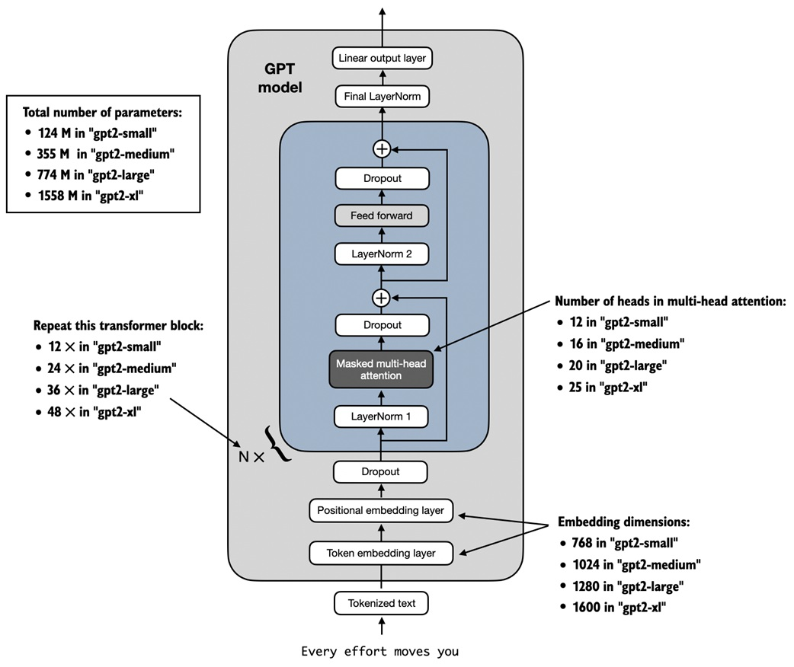
加载 GPT-2 模型权重到 Python 中后，我们仍需将其从 `settings` 和 `params` 字典传递到我们的 `GPTModel` 实例中。

首先，我们创建一个字典，列出不同 GPT 模型大小的差异，如图5.17所述：

```python
model_configs = {
    "gpt2-small (124M)": {"emb_dim": 768, "n_layers": 12, "n_heads": 12},
    "gpt2-medium (355M)": {"emb_dim": 1024, "n_layers": 24, "n_heads": 16},
    "gpt2-large (774M)": {"emb_dim": 1280, "n_layers": 36, "n_heads": 20},
    "gpt2-xl (1558M)": {"emb_dim": 1600, "n_layers": 48, "n_heads": 25},
}
```

假设我们想加载最小的模型，即 "gpt2-small (124M)"。我们可以使用 `model_configs` 表中的相应设置更新我们之前定义的完整 `GPT_CONFIG_124M`，如下所示：

```python
model_name = "gpt2-small (124M)"
NEW_CONFIG = GPT_CONFIG_124M.copy()
NEW_CONFIG.update(model_configs[model_name])
```

细心的读者可能会记得我们之前使用了256-token的长度，但OpenAI的原始GPT-2模型是用1024-token长度训练的，因此我们还需相应更新`NEW_CONFIG`：

```python
NEW_CONFIG.update({"context_length": 1024})
```

此外，OpenAI在多头注意力模块的线性层中使用了偏置向量来实现查询、键和值矩阵的计算。偏置向量在LLM中已不再常用，因为它们对建模性能没有明显提升，因此可以省略。不过，由于我们使用的是预训练权重，为保持一致性，需要启用这些偏置向量：

```python
NEW_CONFIG.update({"qkv_bias": True})
```

现在，我们可以使用更新后的`NEW_CONFIG`字典初始化一个新的`GPTModel`实例：

```python
gpt = GPTModel(NEW_CONFIG)
gpt.eval()
```

默认情况下，`GPTModel`实例会初始化用于预训练的随机权重。使用OpenAI的模型权重的最后一步是用`params`字典中加载的权重覆盖这些随机权重。

为此，我们首先定义一个小的`assign`工具函数，用于检查两个张量或数组（`left`和`right`）是否具有相同维度或形状，并将`right`张量返回为可训练的PyTorch参数：

```python
def assign(left, right):
    if left.shape != right.shape:
        raise ValueError(f"Shape mismatch. Left: {left.shape}, Right: {right.shape}")
    return torch.nn.Parameter(torch.tensor(right))
```

接下来，我们定义`load_weights_into_gpt`函数，将`params`字典中的权重加载到`GPTModel`实例`gpt`中：

**代码清单5.5** 将OpenAI的权重加载到我们的GPT模型代码中

```python
import numpy as np
def load_weights_into_gpt(gpt, params):
    gpt.pos_emb.weight = assign(gpt.pos_emb.weight, params['wpe'])  # A
    gpt.tok_emb.weight = assign(gpt.tok_emb.weight, params['wte'])
    for b in range(len(params["blocks"])):  # B
        q_w, k_w, v_w = np.split(  # C
            (params["blocks"][b]["attn"]["c_attn"])["w"], 3, axis=-1)
        gpt.trf_blocks[b].att.W_query.weight = assign(
            gpt.trf_blocks[b].att.W_query.weight, q_w.T)
        gpt.trf_blocks[b].att.W_key.weight = assign(
            gpt.trf_blocks[b].att.W_key.weight, k_w.T)
        gpt.trf_blocks[b].att.W_value.weight = assign(
            gpt.trf_blocks[b].att.W_value.weight, v_w.T)
        q_b, k_b, v_b = np.split(
            (params["blocks"][b]["attn"]["c_attn"])["b"], 3, axis=-1)
        gpt.trf_blocks[b].att.W_query.bias = assign(
            gpt.trf_blocks[b].att.W_query.bias, q_b)
        gpt.trf_blocks[b].att.W_key.bias = assign(
            gpt.trf_blocks[b].att.W_key.bias, k_b)
        gpt.trf_blocks[b].att.W_value.bias = assign(
            gpt.trf_blocks[b].att.W_value.bias, v_b)
        gpt.trf_blocks[b].att.out_proj.weight = assign(
            gpt.trf_blocks[b].att.out_proj.weight,
            params["blocks"][b]["attn"]["c_proj"]["w"].T)
        gpt.trf_blocks[b].att.out_proj.bias = assign(
            gpt.trf_blocks[b].att.out_proj.bias,
            params["blocks"][b]["attn"]["c_proj"]["b"])
        gpt.trf_blocks[b].ff.layers[0].weight = assign(
            gpt.trf_blocks[b].ff.layers[0].weight,
            params["blocks"][b]["mlp"]["c_fc"]["w"].T)
        gpt.trf_blocks[b].ff.layers[0].bias = assign(
            gpt.trf_blocks[b].ff.layers[0].bias,
            params["blocks"][b]["mlp"]["c_fc"]["b"])
        gpt.trf_blocks[b].ff.layers[2].weight = assign(
            gpt.trf_blocks[b].ff.layers[2].weight,
            params["blocks"][b]["mlp"]["c_proj"]["w"].T)
        gpt.trf_blocks[b].ff.layers[2].bias = assign(
            gpt.trf_blocks[b].ff.layers[2].bias,
            params["blocks"][b]["mlp"]["c_proj"]["b"])
        gpt.trf_blocks[b].norm1.scale = assign(
            gpt.trf_blocks[b].norm1.scale,
            params["blocks"][b]["ln_1"]["g"])
        gpt.trf_blocks[b].norm1.shift = assign(
            gpt.trf_blocks[b].norm1.shift,
            params["blocks"][b]["ln_1"]["b"])
        gpt.trf_blocks[b].norm2.scale = assign(
            gpt.trf_blocks[b].norm2.scale,
            params["blocks"][b]["ln_2"]["g"])
        gpt.trf_blocks[b].norm2.shift = assign(
            gpt.trf_blocks[b].norm2.shift,
            params["blocks"][b]["ln_2"]["b"])
    gpt.final_norm.scale = assign(gpt.final_norm.scale, params["g"])
    gpt.final_norm.shift = assign(gpt.final_norm.shift, params["b"])
    gpt.out_head.weight = assign(gpt.out_head.weight, params["wte"])  # D
```

在`load_weights_into_gpt`函数中，我们仔细匹配OpenAI实现中的权重和我们的`GPTModel`实现。比如，OpenAI将第一个transformer块的输出投影层的权重张量存储为`params["blocks"][0]["attn"]["c_proj"]["w"]`。在我们的实现中，该权重张量对应于`gpt.trf_blocks[b].att.out_proj.weight`，其中`gpt`是一个`GPTModel`实例。

开发`load_weights_into_gpt`函数花费了大量时间，因为OpenAI使用的命名方式与我们的略有不同。但是，如果我们尝试匹配两个形状不同的张量，`assign`函数会发出警告。此外，如果我们在此函数中出错，结果GPT模型将无法生成连贯的文本，我们可以通过测试输出来验证是否正确加载了模型权重。

接下来，我们将`load_weights_into_gpt`应用于实践，将OpenAI的模型权重加载到我们的`GPTModel`实例`gpt`中：

```python
load_weights_into_gpt(gpt, params)
gpt.to(device)
```

如果模型加载成功，我们现在可以使用它并通过之前的`generate`函数生成新文本：

```python
torch.manual_seed(123)
token_ids = generate(
    model=gpt,
    idx=text_to_token_ids("Every effort moves you", tokenizer),
    max_new_tokens=25,
    context_size=NEW_CONFIG["context_length"],
    top_k=50,
    temperature=1.5
)
print("Output text:\n", token_ids_to_text(token_ids, tokenizer))
```

生成的文本如下：

```vbnet
Output text:
Every effort moves you toward finding an ideal new way to practice something!
What makes us want to be on top of that?
```

我们可以确认模型权重已正确加载，因为模型能够生成连贯的文本。在这一过程中，即使有微小的错误也会导致模型无法正常生成。

在接下来的章节中，我们将进一步处理此预训练模型，并微调它以用于文本分类和遵循指令。

#### 练习 5.5

计算具有OpenAI预训练权重的`GPTModel`在“`The Verdict`”数据集上的训练和验证集损失。

#### 练习 5.6

建议读者尝试使用不同大小的 GPT-2 模型，例如最大的1558M参数模型，并将生成的文本与本章加载的124M模型进行比较。


## 5.6 总结

-   当大语言模型 (LLM) 生成文本时，它是逐个token地生成的。
-   默认情况下，下一个token的生成是通过将模型输出转换为概率分数，并从词汇表中选择对应于最高概率分数的token，这称为“贪婪解码”。
-   通过使用概率采样和温度缩放，我们可以影响生成文本的多样性和连贯性。
-   在训练过程中，训练集和验证集的损失可以用来评估LLM生成文本的质量。
-   预训练LLM的过程涉及调整模型权重以最小化训练损失。
-   LLM的训练循环是深度学习中的标准流程，使用传统的交叉熵损失和AdamW优化器。
-   在大型文本语料库上预训练LLM需要大量时间和资源，因此，我们可以加载OpenAI公开提供的权重，作为在大型数据集上自行预训练模型的替代方案。