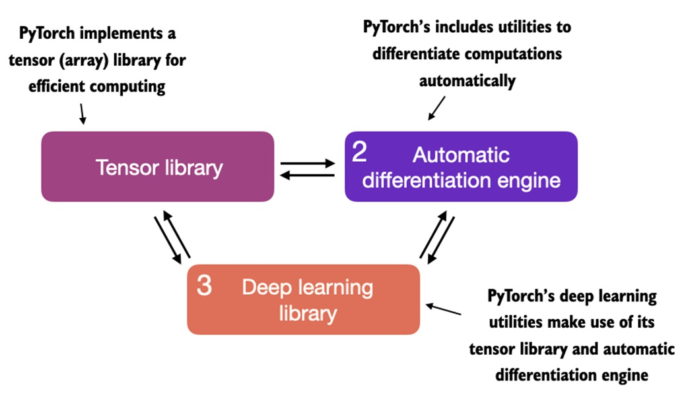
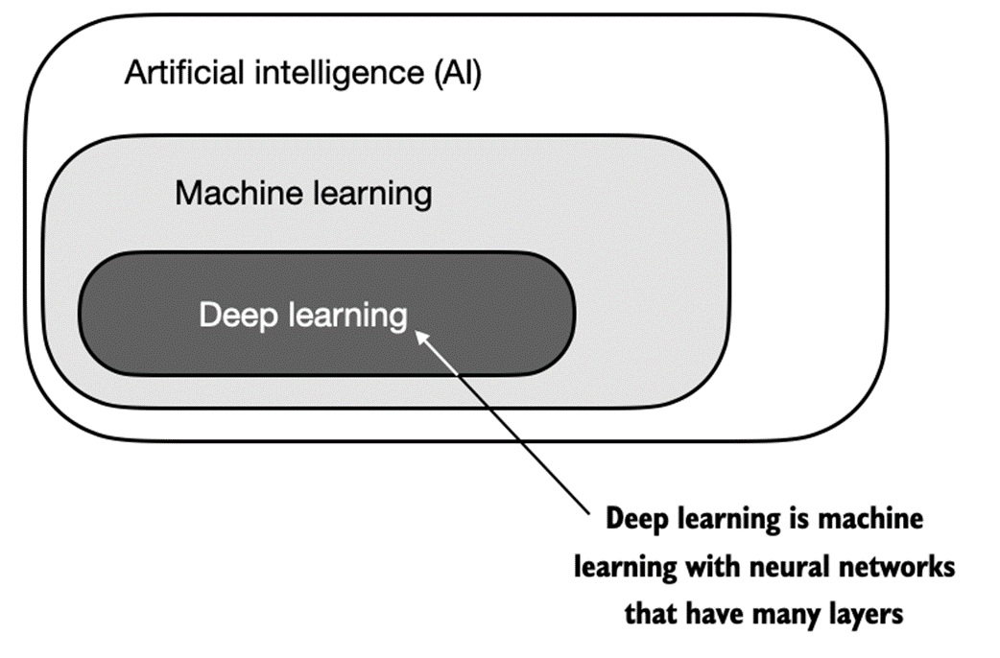
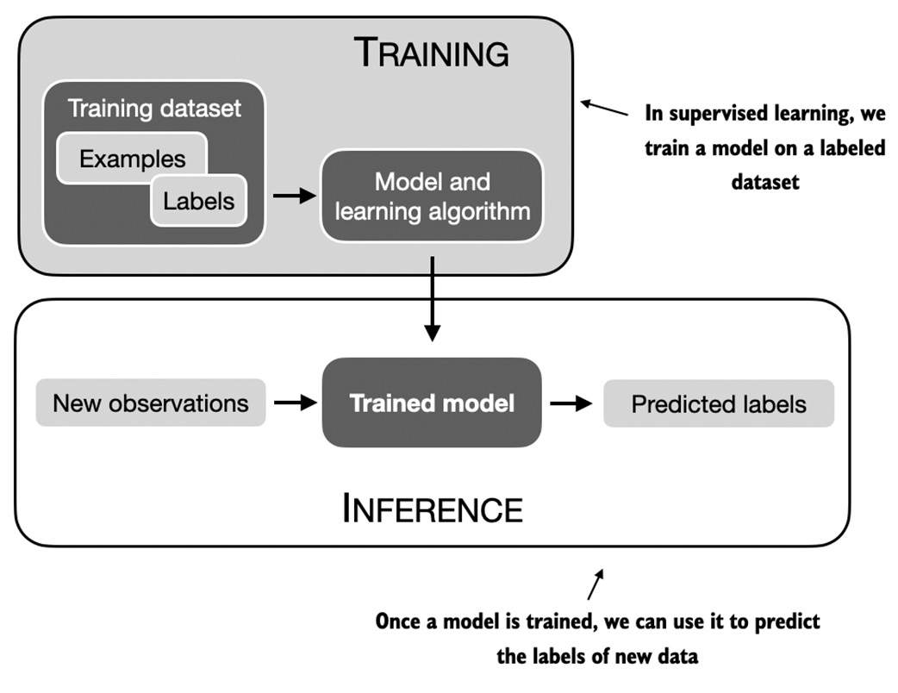
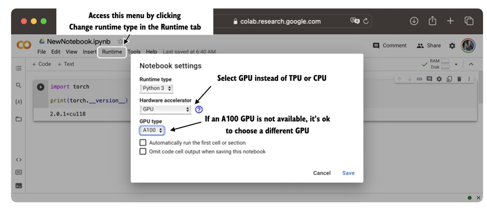
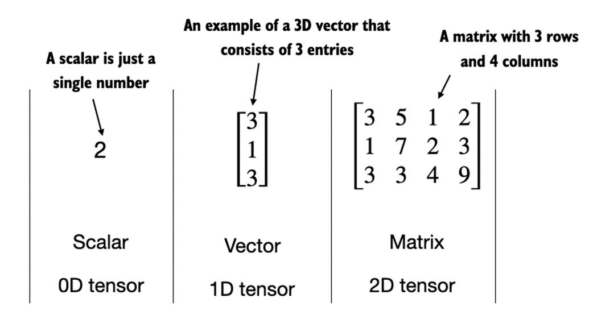
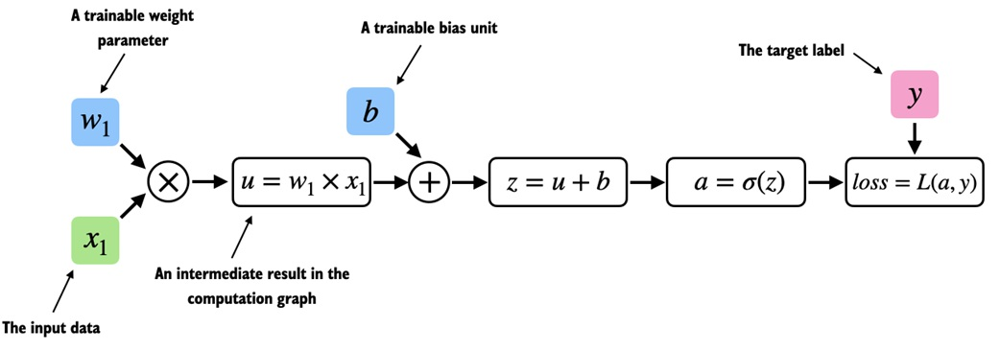
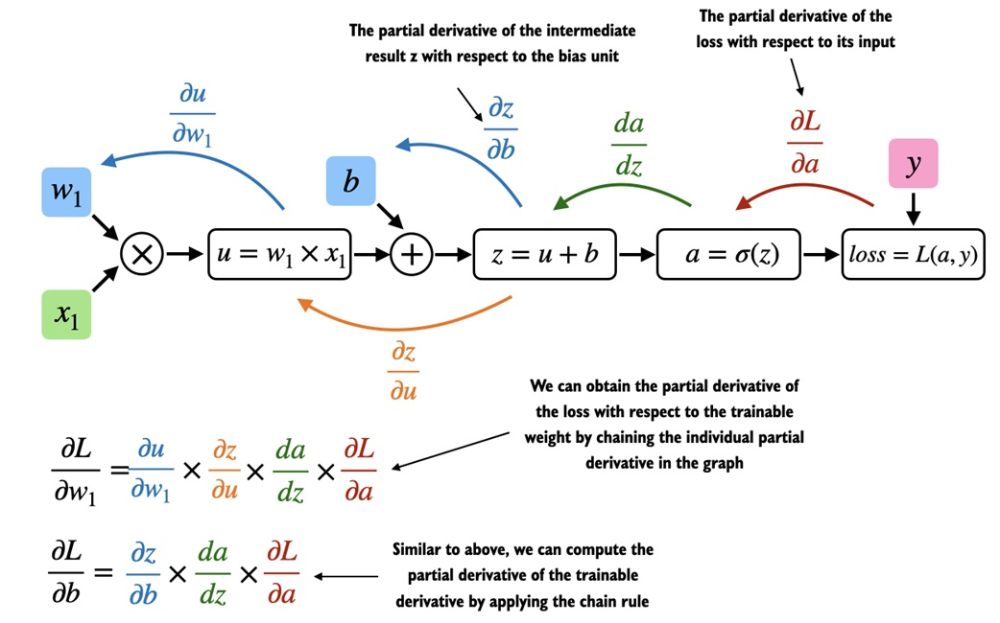
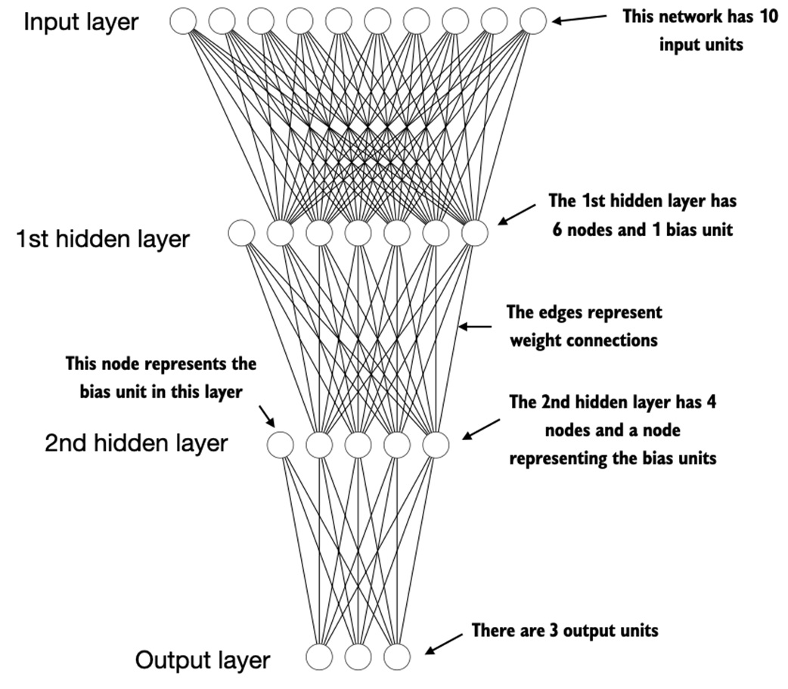
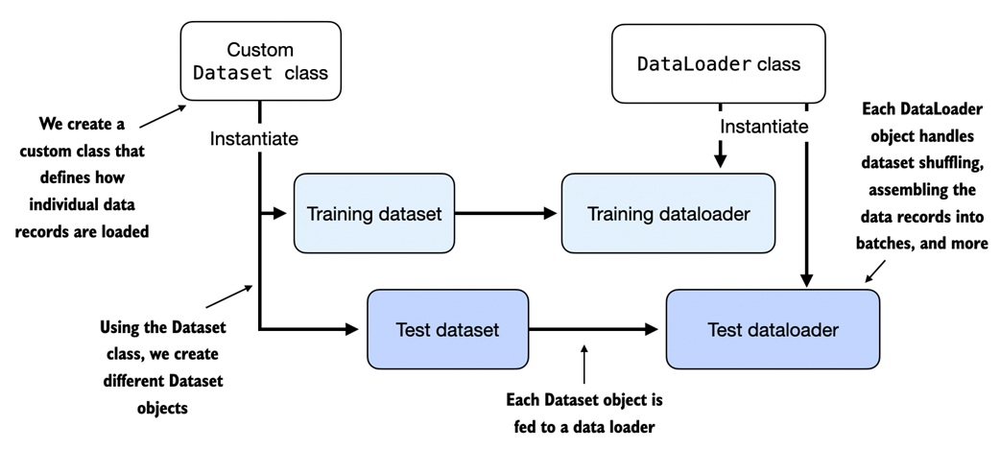
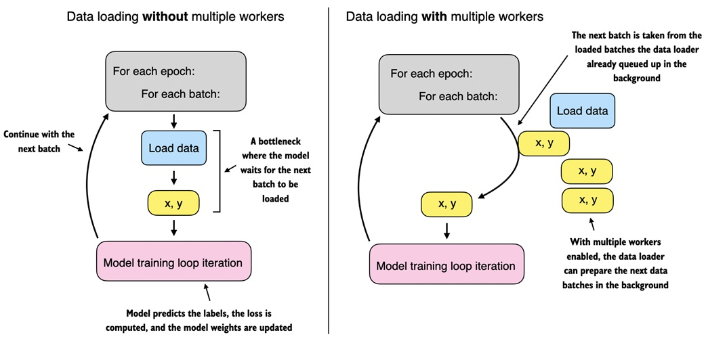

# 附录 A. PyTorch 简介

## 本章内容

-   PyTorch 深度学习库概述
-   设置深度学习环境和工作空间
-   作为深度学习基础数据结构的张量
-   深度神经网络的训练机制
-   在 GPU 上训练模型

本章旨在让你具备将深度学习付诸实践的必要技能和知识，并从零开始实现大语言模型 (LLM)。

我们将介绍 PyTorch，这是一款基于 Python 的流行深度学习库，也是本书余下内容的主要工具。本章还将指导你如何设置一个配备了 PyTorch 和 GPU 支持的深度学习工作空间。

接下来，你将学习张量这一基础概念及其在 PyTorch 中的应用。我们还将深入了解 PyTorch 的自动微分引擎，这一特性使我们能够方便高效地使用反向传播，这是神经网络训练的重要环节。

请注意，本章为 PyTorch 深度学习的新手提供入门知识。虽然本章从零开始介绍 PyTorch，但并不是对 PyTorch 库的全面覆盖，而是重点讲解我们将在本书中用于实现 LLM 的 PyTorch 基础知识。如果你已经熟悉深度学习，可以跳过本附录，直接进入第2章，学习文本数据处理。

## A.1 什么是 PyTorch

PyTorch（<https://pytorch.org/>）是一个开源的基于 Python 的深度学习库。根据 Papers With Code（<https://paperswithcode.com/trends>），这是一个追踪和分析研究论文的平台，自2019年以来，PyTorch 一直是研究领域中最广泛使用的深度学习库。而根据 2022 年的 Kaggle 数据科学和机器学习调查（<https://www.kaggle.com/c/kaggle-survey-2022>），使用 PyTorch 的受访者约占 40%，且每年持续增长。

PyTorch 之所以如此受欢迎，部分原因在于其用户友好的界面和高效性。尽管它易于上手，但在灵活性上没有妥协，能够为高级用户提供调节模型底层细节的能力，以实现自定义和优化。简而言之，对许多从业者和研究人员来说，PyTorch 在易用性和功能之间实现了理想的平衡。

在接下来的小节中，我们将定义 PyTorch 所提供的主要功能。

### A.1.1 PyTorch 的三个核心组件

PyTorch 是一个相对全面的库，可以从其三个主要组件来理解它，这些组件在图A.1中进行了总结。

**图A.1** PyTorch 的三大核心组件包括作为计算基础的张量库、用于模型优化的自动微分功能，以及深度学习实用函数，使得实现和训练深度神经网络模型更加容易。

首先，PyTorch 是一个张量库，扩展了以数组为导向的编程库 NumPy，并增加了在 GPU 上加速计算的功能，从而实现了在 CPU 和 GPU 之间无缝切换。

其次，PyTorch 是一个自动微分引擎，也称为 autograd，可以自动计算张量操作的梯度，简化了反向传播和模型优化。

最后，PyTorch 也是一个深度学习库，提供模块化、灵活且高效的构建模块（包括预训练模型、损失函数和优化器），用于设计和训练各种深度学习模型，满足研究人员和开发者的需求。

在接下来的两个小节中定义深度学习并安装 PyTorch 后，本章将详细介绍 PyTorch 的这三个核心组件，并结合代码示例进行实际操作。

### A.1.2 定义深度学习

新闻中通常将大语言模型（LLMs）称为 AI 模型。然而，正如第1章第1节（1.1 什么是 LLM？）所示，LLMs 也是一种深度神经网络，而 PyTorch 是一个深度学习库。这听起来有些混乱？在继续之前，我们简要总结一下这些术语之间的关系。

AI（人工智能）主要是指创建能够执行通常需要人类智能的任务的计算机系统。这些任务包括理解自然语言、识别模式和进行决策。（尽管取得了显著进展，AI 仍远未达到人类的通用智能水平。）

机器学习是 AI 的一个子领域（如图A.2所示），专注于开发和改进学习算法。机器学习的核心理念是使计算机能够从数据中学习并进行预测或决策，而无需显式编程。这涉及开发能够识别模式、从历史数据中学习的算法，并随着数据和反馈的增加逐步提高性能。

**图A.2** 深度学习是机器学习的一个子类别，专注于深度神经网络的实现。机器学习则是 AI 的一个子类别，致力于开发从数据中学习的算法。AI 是一个更广泛的概念，指的是机器能够执行通常需要人类智能的任务。

机器学习在 AI 的发展中发挥了关键作用，推动了今天许多技术的进步，包括 LLM。机器学习技术还驱动了诸如在线零售和流媒体服务中的推荐系统、电子邮件垃圾过滤、虚拟助手中的语音识别，甚至自动驾驶汽车等技术。机器学习的引入和进步极大地增强了 AI 的能力，使 AI 不再局限于严格的基于规则的系统，而能够适应新的输入或变化的环境。

深度学习是机器学习的一个子类别，专注于深度神经网络的训练和应用。这些深度神经网络最初的灵感来源于人脑的工作方式，特别是大量神经元之间的互连关系。深度学习中的“深度”指的是包含多个隐藏层的人工神经元或节点，这些隐藏层能够对数据中的复杂、非线性关系建模。

与擅长简单模式识别的传统机器学习技术不同，深度学习特别适合处理图像、音频或文本等非结构化数据，因此深度学习非常适合 LLM 的训练。

机器学习和深度学习中的典型预测建模工作流程（也称为监督学习）总结如图A.3所示。

**图A.3** 监督学习的预测建模工作流程包括训练阶段，模型在训练数据集中带标签的示例上进行训练。训练好的模型可用于预测新观测的标签。

通过一种学习算法，模型在包含示例及其对应标签的训练数据集上进行训练。例如，在电子邮件垃圾邮件分类器的情况下，训练数据集包括电子邮件及其由人类标识的“垃圾邮件”和“非垃圾邮件”标签。然后，训练好的模型可以用于新观测（新电子邮件）以预测其未知标签（垃圾邮件或非垃圾邮件）。

当然，我们也希望在训练和推理阶段之间添加模型评估，以确保模型在实际应用之前达到我们的性能标准。

请注意，如果我们训练 LLM 来对文本进行分类，那么训练和使用 LLM 的工作流程与图A.3所示的工作流程相似。而如果我们希望训练 LLM 来生成文本（本书的主要关注点），图A.3 仍然适用。在这种情况下，预训练中的标签可以从文本本身推导出来（即第1章介绍的下一个单词预测任务）。在推理阶段，LLM 将根据输入提示生成全新的文本（而不是预测标签）。

### A.1.3 安装 PyTorch

PyTorch 的安装方式类似于其他 Python 库或包。然而，由于 PyTorch 是一个支持 CPU 和 GPU 的综合库，因此安装可能需要一些额外说明。

#### Python 版本

许多科学计算库无法立即支持最新的 Python 版本。因此，安装 PyTorch 时，建议使用较新的前一或两个版本的 Python。例如，如果最新的 Python 版本是 3.13，推荐使用 Python 3.10 或 3.11。

PyTorch 有两个版本：一个是只支持 CPU 的精简版本，另一个支持 CPU 和 GPU。如果你的计算机有一个 CUDA 兼容的 GPU（例如 NVIDIA T4、RTX 2080 Ti 或更高），建议安装 GPU 版本。无论如何，安装 PyTorch 的默认命令如下：

```bash
pip install torch
```

如果你的计算机支持 CUDA 兼容的 GPU，并且当前 Python 环境已安装必要的依赖项（如 `pip`），上述命令将自动安装支持 GPU 加速的 PyTorch 版本。

#### 使用 AMD GPU 进行深度学习

在撰写本文时，PyTorch 已通过 ROCm 实验性支持 AMD GPU。请访问 <https://pytorch.org> 以获取更多安装说明。

为了明确安装 CUDA 兼容的 PyTorch 版本，通常最好指定所需的 CUDA 版本。PyTorch 的官网（<https://pytorch.org>）提供了在不同操作系统上安装支持 CUDA 的 PyTorch 的命令，如图A.4所示。

**图A.4** 请访问 <https://pytorch.org> 以获取 PyTorch 的安装推荐，以便为您的系统定制和选择安装命令。

> 注意：图A.4中显示的命令还会安装 `torchvision` 和 `torchaudio` 库，对于本书来说，这些是可选的。

在撰写本文时，本书基于 PyTorch 2.0.1，因此建议使用以下命令来安装确切版本，以保证与本书兼容：

```bash
pip install torch==2.0.1
```

不过，如前所述，安装命令可能会因操作系统的不同而略有差异。因此，建议访问 <https://pytorch.org> 网站，使用安装菜单（参见图A.4）选择适合您操作系统的安装命令，并将命令中的 `torch` 替换为 `torch==2.0.1`。

在 PyTorch 中可以通过以下代码检查 PyTorch 的版本：

```python
import torch
torch.__version__
```

这将输出：

```arduino
'2.0.1'
```

#### PyTorch 和 Torch

请注意，Python 库的名称是“torch”，因为它是 Torch 库的延续，但适配了 Python（因此称为“PyTorch”）。“torch”这一名称承认了该库起源于 Torch，这是一种支持多种机器学习算法的科学计算框架，最初是用 Lua 编程语言创建的。

如果你需要有关设置 Python 环境或安装本书后续章节使用的其他库的更多建议和说明，建议访问本书的补充 GitHub 资源库：<https://github.com/rasbt/LLMs-from-scratch>。

#### 检查 GPU 是否被识别

安装 PyTorch 后，可以在 Python 中运行以下代码检查安装是否识别了内置的 NVIDIA GPU：

```python
import torch
torch.cuda.is_available()
```

输出为：

```graphql
True
```

如果命令返回 `True`，则说明一切准备就绪；如果返回 `False`，则可能是因为计算机没有兼容的 GPU，或者 PyTorch 未识别到 GPU。虽然本书前几章主要关注用于教学目的的 LLM 实现，不需要 GPU，但 GPU 可以显著加速深度学习相关的计算。

如果没有 GPU，可以选择一些云计算提供商，在这些平台上可以按小时成本运行 GPU 计算。一个流行的类 Jupyter 笔记本环境是 Google Colab（<https://colab.research.google.com>），在撰写本文时，它提供了限时的 GPU 访问。在“Runtime”菜单中，可以选择 GPU，如图A.5所示。

**图A.5** 在 Google Colab 中选择 GPU 设备，路径为 Runtime > Change runtime type 菜单。

#### 在 Apple Silicon 上使用 PyTorch

如果你有一台配备 Apple Silicon 芯片（如 M1、M2、M3 或更新型号）的 Apple Mac，可以利用其加速 PyTorch 代码执行的能力。要在 PyTorch 中使用 Apple Silicon 芯片，首先需要按照常规方式安装 PyTorch。然后可以运行以下代码检查你的 Mac 是否支持利用 Apple Silicon 芯片加速 PyTorch：

```python
print(torch.backends.mps.is_available())
```

如果返回 `True`，则说明你的 Mac 有一个可用于加速 PyTorch 代码的 Apple Silicon 芯片。

### 练习 A.1

在你的计算机上安装并设置 PyTorch。

### 练习 A.2

运行[第2章代码的补充部分](https://github.com/rasbt/LLMs-from-scratch)，检查你的环境是否设置正确。


## A.2 理解张量

张量是一种数学概念，能够将向量和矩阵推广到更高维度。换句话说，张量是可以通过其阶数（或秩）来定义的数学对象，阶数表示维度的数量。例如，标量（一个数）是阶为0的张量，向量是阶为1的张量，矩阵是阶为2的张量，如图A.6所示。

**图A.6** 不同阶数的张量示例。0D 对应阶数0，1D对应阶数1，2D对应阶数2。注意，包含3个元素的3维向量仍然是一个阶为1的张量。

从计算角度来看，张量是数据容器。例如，张量可以包含多维数据，每个维度表示不同的特征。张量库（如 PyTorch）可以高效地创建、操作和计算这些多维数组。在这个上下文中，张量库的功能类似于数组库。

PyTorch张量类似于 NumPy 数组，但增加了对深度学习非常重要的一些特性。例如，PyTorch 提供了自动微分引擎，使得梯度计算更为简便（后续在2.4节中详细讨论）。PyTorch张量还支持GPU计算，加速深度神经网络训练（在2.8节中会详细介绍）。

#### PyTorch 的 NumPy 类 API

正如你在接下来的章节中将看到的，PyTorch 采用了大部分 NumPy 数组 API 和语法来进行张量操作。如果你是 NumPy 的新手，可以通过我的文章《[Scientific Computing in Python: Introduction to NumPy and Matplotlib](https://sebastianraschka.com/blog/2020/numpy-intro.html)》快速了解最相关的概念。

接下来的小节将介绍 PyTorch 张量库的基本操作，包括如何创建简单的张量及一些基本操作。

### A.2.1 标量、向量、矩阵和张量

如前所述，PyTorch 张量是数组结构的数据容器。标量是 0 维张量（例如单个数字），向量是 1 维张量，矩阵是 2 维张量。对于更高维度的张量没有特定的术语，因此我们通常称 3 维张量为 3D 张量，依此类推。

我们可以使用 `torch.tensor` 函数创建 PyTorch 的 Tensor 类对象，如下所示：

**代码清单 A.1 创建 PyTorch 张量**

```python
import torch
tensor0d = torch.tensor(1) #A
tensor1d = torch.tensor([1, 2, 3]) #B
tensor2d = torch.tensor([[1, 2], [3, 4]]) #C
tensor3d = torch.tensor([[[1, 2], [3, 4]], [[5, 6], [7, 8]]]) #D
```

### A.2.2 张量数据类型

在上一节中，我们从 Python 整数创建了张量。在这种情况下，PyTorch 默认采用 64 位整数数据类型。我们可以通过张量的 `.dtype` 属性访问张量的数据类型：

```python
tensor1d = torch.tensor([1, 2, 3])
print(tensor1d.dtype)
```

输出为：

```go
torch.int64
```

如果我们从 Python 浮点数创建张量，PyTorch 默认会创建精度为 32 位的张量，如下所示：

```python
floatvec = torch.tensor([1.0, 2.0, 3.0])
print(floatvec.dtype)
```

输出为：

```go
torch.float32
```

选择 32 位浮点数主要是为了在精度和计算效率之间取得平衡。32 位浮点数在大多数深度学习任务中提供了足够的精度，同时比 64 位浮点数占用更少的内存和计算资源。此外，GPU 架构针对 32 位计算进行了优化，使用这种数据类型可以显著加快模型训练和推理。

此外，可以使用张量的 `.to` 方法轻松更改张量的精度。以下代码演示了如何将 64 位整数张量转换为 32 位浮点张量：

```python
floatvec = tensor1d.to(torch.float32)
print(floatvec.dtype)
```

这将返回：

```go
torch.float32
```

有关 PyTorch 中可用的不同张量数据类型的更多信息，建议查阅官方文档：<https://pytorch.org/docs/stable/tensors.html>。

### A.2.3 常见的 PyTorch 张量操作

本书无法全面覆盖 PyTorch 的所有张量操作和命令，不过我们会在书中逐步介绍相关操作。在进入下一节（关于计算图的概念）之前，以下是 PyTorch 张量中一些最基本的操作。

我们已经介绍过使用 `torch.tensor()` 函数创建新张量：

```python
tensor2d = torch.tensor([[1, 2, 3], [4, 5, 6]])
print(tensor2d)
```

输出为：

```lua
tensor([[1, 2, 3],
        [4, 5, 6]])
```

此外，`.shape` 属性允许我们访问张量的形状：

```python
print(tensor2d.shape)
```

输出为：

```css
torch.Size([2, 3])
```

如上所示，`.shape` 返回 `[2, 3]`，意味着该张量有2行3列。要将张量重塑为 3x2 张量，可以使用 `.reshape` 方法：

```python
print(tensor2d.reshape(3, 2))
```

输出为：

```lua
tensor([[1, 2],
        [3, 4],
        [5, 6]])
```

不过，在 PyTorch 中更常用的重塑张量命令是 `.view()`：

```python
print(tensor2d.view(3, 2))
```

输出为：

```lua
tensor([[1, 2],
        [3, 4],
        [5, 6]])
```

类似于 `.reshape` 和 `.view`，PyTorch 提供了多种语法选项来实现相同的计算。这是因为 PyTorch 最初遵循了 Lua Torch 的语法惯例，后来根据用户需求添加了更接近 NumPy 的语法。

接下来，我们可以使用 `.T` 转置张量，即沿其对角线进行翻转。如下所示，转置和重塑的结果不同：

```python
print(tensor2d.T)
```

输出为：

```lua
tensor([[1, 4],
        [2, 5],
        [3, 6]])
```

最后，在 PyTorch 中矩阵相乘的常用方法是 `.matmul`：

```python
print(tensor2d.matmul(tensor2d.T))
```

输出为：

```lua
tensor([[14, 32],
        [32, 77]])
```

此外，还可以使用 `@` 操作符，以更简洁的方式实现相同功能：

```python
print(tensor2d @ tensor2d.T)
```

输出为：

```lua
tensor([[14, 32],
        [32, 77]])
```

如前所述，本书会在需要时引入其他操作。如果你想浏览 PyTorch 中所有的张量操作（大部分我们不会使用），可以参考官方文档：<https://pytorch.org/docs/stable/tensors.html>。

## A.3 将模型视为计算图

在上一节中，我们介绍了 PyTorch 的三个主要组件之一——张量库。接下来是 PyTorch 的自动微分引擎（也称为 autograd）。PyTorch 的 autograd 系统提供了在动态计算图中自动计算梯度的功能。但在深入讨论计算梯度之前，首先让我们定义一下计算图的概念。

计算图（或称计算图）是一个有向图，它可以用来表示和可视化数学表达式。在深度学习的背景下，计算图展示了神经网络中计算输出所需的计算步骤——稍后我们将需要这个图来计算反向传播所需的梯度，这是神经网络的主要训练算法。

让我们通过一个具体示例来说明计算图的概念。以下代码实现了简单逻辑回归分类器的前向传播（预测步骤），它可以看作是一个单层神经网络，返回一个0到1之间的分数，在计算损失时将其与真实标签（0或1）进行比较：

**代码清单 A.2 逻辑回归前向传播**

```python
import torch.nn.functional as F #A
y = torch.tensor([1.0]) #B
x1 = torch.tensor([1.1]) #C
w1 = torch.tensor([2.2]) #D
b = torch.tensor([0.0]) #E
z = x1 * w1 + b #F
a = torch.sigmoid(z) #G
loss = F.binary_cross_entropy(a, y)
```

如果上面的代码中的所有内容都不太理解，不必担心。本示例的目的是为了说明我们如何将一系列计算视为计算图，如图A.7所示。

**图A.7** 逻辑回归的前向传播作为计算图。输入特征 `x1` 与模型权重 `w1` 相乘，并在加上偏置后通过激活函数 σ。通过将模型输出 `a` 与给定标签 `y` 比较来计算损失。

实际上，PyTorch 会在后台构建这样的计算图，我们可以利用它来计算损失函数相对于模型参数（这里是 `w1` 和 `b`）的梯度，从而训练模型。这将是接下来几节的主题。


## A.4 自动微分简化计算

在前一节中，我们介绍了计算图的概念。如果在 PyTorch 中进行计算，当其终端节点之一的 `requires_grad` 属性设置为 `True` 时，PyTorch 默认会在后台构建这样的图。这在需要计算梯度时非常有用。训练神经网络时，通过反向传播算法计算梯度。反向传播可以看作是对神经网络应用微积分中的链式法则，正如图A.8所示。

**图A.8** 计算图中计算损失梯度的最常用方式是从右向左应用链式法则，也称为反向模式自动微分或反向传播。这意味着从输出层（或损失本身）开始，向后遍历网络直到输入层，以计算损失相对于网络中每个参数（权重和偏置）的梯度，从而为训练过程中参数的更新提供依据。

#### 偏导数和梯度

图A.8显示了偏导数，即衡量函数相对于其一个变量变化率的量。梯度是包含多元函数（具有多个变量作为输入）所有偏导数的向量。

如果你不熟悉或记不清偏导数、梯度或链式法则，不用担心。从高层次来说，本书需要你了解的是链式法则用于计算损失函数相对于计算图中模型参数的梯度。这为通过梯度下降等方法更新每个参数以最小化损失函数提供了必要的信息。我们将在2.7节的典型训练循环中重新讨论这种训练循环的实现。

接下来，PyTorch 库的自动微分引擎（autograd）如何在实际中发挥作用？通过跟踪在张量上执行的每一个操作，PyTorch 的 autograd 引擎在后台构建计算图。然后，调用 `grad` 函数时，可以计算损失相对于模型参数 `w1` 的梯度，如下所示：

**代码清单 A.3 使用 autograd 计算梯度**

```python
import torch.nn.functional as F
from torch.autograd import grad
y = torch.tensor([1.0])
x1 = torch.tensor([1.1])
w1 = torch.tensor([2.2], requires_grad=True)
b = torch.tensor([0.0], requires_grad=True)
z = x1 * w1 + b
a = torch.sigmoid(z)
loss = F.binary_cross_entropy(a, y)
grad_L_w1 = grad(loss, w1, retain_graph=True)  # A
grad_L_b = grad(loss, b, retain_graph=True)
```

我们可以打印模型参数的损失梯度值：

```python
print(grad_L_w1)
print(grad_L_b)
```

输出为：

```css
(tensor([-0.0898]),)
(tensor([-0.0817]),)
```

在上例中，我们“手动”使用 `grad` 函数，这在实验、调试和概念演示中很有用。但在实际操作中，PyTorch 提供了更高级的工具来自动化这一过程。例如，我们可以直接在 `loss` 上调用 `.backward`，PyTorch 会计算图中所有叶节点的梯度，并将其存储在张量的 `.grad` 属性中：

```python
loss.backward()
print(w1.grad)
print(b.grad)
```

输出为：

```css
(tensor([-0.0898]),)
(tensor([-0.0817]),)
```

如果这一节内容包含大量信息，并且你对微积分的概念感到不太理解，也不必担心。尽管介绍了微积分的术语，这一节主要是为了说明 PyTorch 的 autograd 组件。只需记住，PyTorch 的 `.backward` 方法会自动处理计算过程中的微积分，我们无需手动计算导数或梯度。

## A.5 实现多层神经网络

在前几节中，我们介绍了 PyTorch 的张量和自动微分组件。本节将重点介绍 PyTorch 作为实现深度神经网络的库。

为了给出具体示例，我们以多层感知机（MLP）为例，这是一个全连接神经网络，如图A.9所示。

**图A.9** 具有两个隐藏层的多层感知机示意图。每个节点代表对应层中的一个单元。为了便于说明，每层的节点数量设置得较少。

在 PyTorch 中实现神经网络时，通常需要继承 `torch.nn.Module` 类来定义自定义的网络结构。这个 `Module` 基类提供了许多功能，使得构建和训练模型更为便捷。例如，它允许我们封装层和操作并跟踪模型的参数。

在这个子类中，我们在 `__init__` 构造函数中定义网络层，并在 `forward` 方法中指定它们的相互作用。`forward` 方法描述了输入数据如何在网络中传递并构成计算图。

相比之下，`backward` 方法通常不需要我们自己实现，而是在训练过程中用来计算损失函数相对于模型参数的梯度，我们将在2.7节典型训练循环中看到这一点。

以下代码实现了一个具有两个隐藏层的经典多层感知机，演示了 `Module` 类的典型用法：

**代码清单 A.4 具有两个隐藏层的多层感知机**

```python
class NeuralNetwork(torch.nn.Module):
    def __init__(self, num_inputs, num_outputs):  # A
        super().__init__()
        self.layers = torch.nn.Sequential(
            # 第1隐藏层
            torch.nn.Linear(num_inputs, 30),  # B
            torch.nn.ReLU(),  # C
            # 第2隐藏层
            torch.nn.Linear(30, 20),  # D
            torch.nn.ReLU(),
            # 输出层
            torch.nn.Linear(20, num_outputs),
        )

    def forward(self, x):
        logits = self.layers(x)
        return logits  # E
```

我们可以如下实例化一个新的神经网络对象：

```python
model = NeuralNetwork(50, 3)
```

使用 `print` 查看模型结构可以帮助了解模型：

```python
print(model)
```

输出为：

```scss
NeuralNetwork(
  (layers): Sequential(
    (0): Linear(in_features=50, out_features=30, bias=True)
    (1): ReLU()
    (2): Linear(in_features=30, out_features=20, bias=True)
    (3): ReLU()
    (4): Linear(in_features=20, out_features=3, bias=True)
  )
)
```

这里我们使用了 `Sequential` 类实现 `NeuralNetwork` 类。使用 `Sequential` 并不是必须的，但当有多个要按特定顺序执行的层时，它可以简化代码。在 `__init__` 构造函数中实例化 `self.layers = Sequential(...)` 后，只需调用 `self.layers`，而不必在 `NeuralNetwork` 的 `forward` 方法中逐一调用每个层。

接下来，让我们检查模型的可训练参数总数：

```python
num_params = sum(p.numel() for p in model.parameters() if p.requires_grad)
print("Total number of trainable model parameters:", num_params)
```

输出为：

```yaml
Total number of trainable model parameters: 2213
```

我们多层神经网络模型的可训练参数包含在 `torch.nn.Linear` 层中。线性层将输入与权重矩阵相乘并加上偏置向量。这有时也被称为前馈层或全连接层。

基于上面执行的 `print(model)` 调用，我们可以看到 `layers` 属性中第一个 `Linear` 层位于索引位置 `0`。我们可以访问对应的权重参数矩阵，如下所示：

```python
print(model.layers[0].weight)
```

这将输出一个包含许多元素的大矩阵。为了简便，可以使用 `.shape` 属性查看其维度：

```python
print(model.layers[0].weight.shape)
```

输出结果为：

```css
torch.Size([30, 50])
```

在深度学习中，用小的随机数初始化模型权重是有利的，这样可以在训练过程中打破对称性，使网络可以学习输入与输出的复杂映射。

然而，如果需要保持每次初始化的随机数一致，可以通过设置随机种子来使随机数生成器可复现：

```python
torch.manual_seed(123)
model = NeuralNetwork(50, 3)
print(model.layers[0].weight)
```

接下来，执行模型的前向传播：

```python
torch.manual_seed(123)
X = torch.rand((1, 50))
out = model(X)
print(out)
```

结果为：

```lua
tensor([[-0.1262, 0.1080, -0.1792]], grad_fn=<AddmmBackward0>)
```

此输出包含了 `grad_fn` 值，表示在计算图中用于计算变量的最后一个函数。PyTorch 在反向传播计算梯度时会使用该信息。

在预测或推理时，最好使用 `torch.no_grad()` 上下文管理器，以节省内存和计算资源：

```python
with torch.no_grad():
    out = model(X)
    print(out)
```

最后，如果我们想要计算类别概率，可以显式调用 `softmax` 函数：

```python
with torch.no_grad():
    out = torch.softmax(model(X), dim=1)
    print(out)
```

输出为：

```lua
tensor([[0.3113, 0.3934, 0.2952]])
```

这些值可以解释为类别概率，总和为 1。这种随机输出在未经训练的模型中是预期的。

接下来两节将介绍如何设置高效的数据加载器并训练模型。


## A.6 设置高效的数据加载器

在上一节中，我们定义了一个自定义神经网络模型。在训练模型之前，需要简要讨论如何在 PyTorch 中创建高效的数据加载器，训练模型时将使用这些加载器进行数据迭代。图A.10概述了 PyTorch 数据加载的基本理念。

**图A.10** PyTorch 实现了 `Dataset` 和 `DataLoader` 类。`Dataset` 类用于实例化对象，定义如何加载每条数据记录；`DataLoader` 则处理数据的随机化和批量组装。

根据图A.10中的流程，本节将实现一个自定义 `Dataset` 类，用于创建训练和测试数据集，随后利用这些数据集创建数据加载器。

首先，我们创建一个包含五个训练样本的简单玩具数据集，每个样本有两个特征。与训练样本对应的是一个包含类标签的张量：其中三条数据属于类别0，两条数据属于类别1。此外，还创建了一个包含两个样本的测试集。以下代码用于创建此数据集。

**代码清单 A.5 创建一个小型玩具数据集**

```python
X_train = torch.tensor([
    [-1.2, 3.1],
    [-0.9, 2.9],
    [-0.5, 2.6],
    [2.3, -1.1],
    [2.7, -1.5]
])
y_train = torch.tensor([0, 0, 0, 1, 1])

X_test = torch.tensor([
    [-0.8, 2.8],
    [2.6, -1.6],
])
y_test = torch.tensor([0, 1])
```

#### 类标签编号

PyTorch 要求类标签从标签 0 开始，且最大类标签值不超过输出节点数量减 1（因为 Python 从 0 开始计数）。例如，如果类标签为 0, 1, 2, 3, 和 4，神经网络的输出层应该包含 5 个节点。

接下来，我们通过继承 PyTorch 的 `Dataset` 父类来创建一个自定义数据集类 `ToyDataset`，如下所示。

**代码清单 A.6 定义自定义 `Dataset` 类**

```python
from torch.utils.data import Dataset

class ToyDataset(Dataset):
    def __init__(self, X, y):
        self.features = X
        self.labels = y

    def __getitem__(self, index):  # A
        one_x = self.features[index]  # A
        one_y = self.labels[index]    # A
        return one_x, one_y           # A

    def __len__(self):  # B
        return self.labels.shape[0]
```

```python
train_ds = ToyDataset(X_train, y_train)
test_ds = ToyDataset(X_test, y_test)
```

`ToyDataset` 类用于实例化 PyTorch 的 `DataLoader`，但在此之前，让我们简要介绍 `ToyDataset` 的一般结构。

在 PyTorch 中，自定义 `Dataset` 类的三个主要组成部分是：`__init__` 构造函数、`__getitem__` 方法和 `__len__` 方法，如上面代码清单 A.6 所示。

-   在 `__init__` 方法中，我们设置了在 `__getitem__` 和 `__len__` 方法中可以访问的属性，这些属性可能是文件路径、文件对象、数据库连接等。对于内存中的张量数据集，只需将 `X` 和 `y` 分配给这些属性。
-   `__getitem__` 方法定义了如何通过索引返回数据集中的单个样本，即对应一个训练示例或测试实例的特征和标签。
-   `__len__` 方法则用于返回数据集的长度。在训练数据集中，我们有五行数据，可以通过以下代码验证：

```python
print(len(train_ds))
```

输出为：

```yaml
5
```

现在我们定义了一个 PyTorch 数据集类，可以用于我们的玩具数据集。接下来使用 PyTorch 的 `DataLoader` 类来采样数据集，如下所示：

**代码清单 A.7 实例化数据加载器**

```python
from torch.utils.data import DataLoader
torch.manual_seed(123)

train_loader = DataLoader(
    dataset=train_ds,   # A
    batch_size=2,
    shuffle=True,       # B
    num_workers=0       # C
)

test_loader = DataLoader(
    dataset=test_ds,
    batch_size=2,
    shuffle=False,      # D
    num_workers=0
)
```

实例化训练数据加载器后，可以如下迭代访问（测试加载器的迭代方式类似，出于简洁考虑不再赘述）：

```python
for idx, (x, y) in enumerate(train_loader):
    print(f"Batch {idx+1}:", x, y)
```

输出为：

```lua
Batch 1: tensor([[-1.2000, 3.1000],
                [-0.5000, 2.6000]]) tensor([0, 0])
Batch 2: tensor([[ 2.3000, -1.1000],
                [-0.9000, 2.9000]]) tensor([1, 0])
Batch 3: tensor([[ 2.7000, -1.5000]]) tensor([1])
```

如上输出所示，`train_loader` 在训练数据集上遍历，每个训练示例访问一次，即一个训练 epoch。由于我们使用了 `torch.manual_seed(123)` 来设置随机数生成器种子，因此可以获得与上述相同的训练样本顺序。不过，如果再次遍历数据集，洗牌顺序将会变化，这有助于防止神经网络在训练过程中陷入重复更新周期。

注意，我们设置了批量大小为2，但第3批仅包含一个样本。这是因为共有5个训练示例，不能被2整除。在实际训练中，最后一个批次大小过小会影响收敛性，为此建议设置 `drop_last=True` 以丢弃最后一个批次，如下所示：

**代码清单 A.8 丢弃最后一个批次的训练加载器**

```python
train_loader = DataLoader(
    dataset=train_ds,
    batch_size=2,
    shuffle=True,
    num_workers=0,
    drop_last=True
)
```

此时，迭代训练加载器时可以看到最后一个批次被忽略：

```python
for idx, (x, y) in enumerate(train_loader):
    print(f"Batch {idx+1}:", x, y)
```

输出为：

```lua
Batch 1: tensor([[-0.9000, 2.9000],
                [ 2.3000, -1.1000]]) tensor([0, 1])
Batch 2: tensor([[ 2.7000, -1.5000],
                [-0.5000, 2.6000]]) tensor([1, 0])
```

#### `num_workers=0` 设置

`DataLoader` 中的 `num_workers` 参数是并行加载和预处理数据的关键。当 `num_workers` 设置为0时，数据加载将在主进程中完成，可能导致模型训练时产生显著的速度瓶颈，尤其是训练较大网络时。因为 CPU 除了需要加载和预处理数据外，还要进行深度学习模型的处理，这样 GPU 可能在等待数据加载时处于闲置状态。

若将 `num_workers` 设置为大于 0，则会启动多个工作进程以并行加载数据，从而释放主进程专注于训练模型，充分利用系统资源，图A.11对此进行了说明。

**图A.11** 在未使用多个工作进程（`num_workers=0`）的情况下，数据加载会导致瓶颈，因为模型会等待下一批数据的加载，如左侧所示。若启用多个工作进程，数据加载器可在后台准备下一个批次，如右侧所示。

但若数据集较小，`num_workers` 设置为1或更大可能并无必要，因为总训练时间可能仅需几秒钟。此外，在使用小型数据集或交互式环境（如 Jupyter notebook）时，增大 `num_workers` 可能无法带来明显的速度提升，反而可能引发问题，如创建多个工作进程的开销甚至可能超过实际的数据加载时间。

在 Jupyter notebook 中，`num_workers` 大于0可能会导致进程资源共享相关的问题，从而引发错误或 notebook 崩溃。因此，理解权衡并在设置 `num_workers` 参数时进行合理选择至关重要。合理使用时，该工具能提升效率，但应根据数据集大小和计算环境进行适配，以获得最佳效果。

在实际中，将 `num_workers` 设置为4通常能在许多真实数据集中取得最佳性能，但具体设置需视硬件和 `Dataset` 类中加载训练示例的代码而定。


## A.7 典型的训练循环

到目前为止，我们已经讨论了训练神经网络所需的所有内容：PyTorch 的张量库、自动微分、模块 API 和高效的数据加载器。现在，让我们将这些知识结合起来，在上一节的玩具数据集上训练一个神经网络。代码清单 A.9 展示了训练代码。

**代码清单 A.9 PyTorch 中的神经网络训练**

```python
import torch.nn.functional as F
torch.manual_seed(123)

model = NeuralNetwork(num_inputs=2, num_outputs=2)  # A
optimizer = torch.optim.SGD(model.parameters(), lr=0.5)  # B
num_epochs = 3

for epoch in range(num_epochs):
    model.train()
    for batch_idx, (features, labels) in enumerate(train_loader):
        logits = model(features)
        loss = F.cross_entropy(logits, labels)

        optimizer.zero_grad()  # C
        loss.backward()        # D
        optimizer.step()        # E

        ### LOGGING
        print(f"Epoch: {epoch+1:03d}/{num_epochs:03d}"
              f" | Batch {batch_idx:03d}/{len(train_loader):03d}"
              f" | Train Loss: {loss:.2f}")
model.eval()
```

运行代码将得到以下输出：

```yaml
Epoch: 001/003 | Batch 000/002 | Train Loss: 0.75
Epoch: 001/003 | Batch 001/002 | Train Loss: 0.65
Epoch: 002/003 | Batch 000/002 | Train Loss: 0.44
Epoch: 002/003 | Batch 001/002 | Train Loss: 0.13
Epoch: 003/003 | Batch 000/002 | Train Loss: 0.03
Epoch: 003/003 | Batch 001/002 | Train Loss: 0.00
```

可以看到，在3个 epoch 后，损失值降至0，表明模型在训练集上收敛了。在评估模型预测之前，我们先简要回顾代码细节：

首先，我们初始化了一个有两个输入和两个输出的模型，这是因为上一节的玩具数据集有两个输入特征和两个类别标签。我们使用了学习率为 0.5 的随机梯度下降（SGD）优化器。学习率是一个超参数，需要通过观察损失值进行调整。理想情况下，我们希望选择一个学习率，使得损失在一定数量的 epoch 后收敛。epoch 的数量也是一个需要选择的超参数。

#### 练习 A.3

该节开始处介绍的神经网络有多少参数？

在实践中，我们通常使用第三个数据集，即验证集，用于寻找最佳的超参数设置。验证集类似于测试集，但我们通常会多次使用它来调整模型设置，而测试集通常只在最终评估时使用一次，以避免偏差。

代码中还使用了 `model.train()` 和 `model.eval()` 设置。顾名思义，这些设置用于将模型置于训练或评估模式下。某些组件在训练和推理时行为不同，例如 dropout 层或 batch normalization 层。虽然在这里的 `NeuralNetwork` 类中没有这些组件，但养成使用 `model.train()` 和 `model.eval()` 的习惯有助于避免在更复杂模型中出现意外行为。

我们将 logits 直接传递给 `cross_entropy` 损失函数，后者会内部应用 softmax 函数以提高效率和数值稳定性。调用 `loss.backward()` 计算 PyTorch 背景计算图中的梯度。`optimizer.step()` 方法使用这些梯度更新模型参数，以最小化损失。在 SGD 优化器中，这意味着梯度乘以学习率后，将负梯度按比例添加到参数中。

#### 防止不期望的梯度累积

重要的是，每轮更新中都要调用 `optimizer.zero_grad()`，以将梯度重置为零。否则，梯度会累积，可能导致不期望的效果。

训练完成后，可以使用模型进行预测：

```python
model.eval()
with torch.no_grad():
    outputs = model(X_train)
    print(outputs)
```

输出如下：

```css
tensor([[ 2.8569, -4.1618],
        [ 2.5382, -3.7548],
        [ 2.0944, -3.1820],
        [-1.4814,  1.4816],
        [-1.7176,  1.7342]])
```

要获得类别概率，可以使用 PyTorch 的 `softmax` 函数：

```python
torch.set_printoptions(sci_mode=False)
probas = torch.softmax(outputs, dim=1)
print(probas)
```

输出为：

```css
tensor([[ 0.9991, 0.0009],
        [ 0.9982, 0.0018],
        [ 0.9949, 0.0051],
        [ 0.0491, 0.9509],
        [ 0.0307, 0.9693]])
```

例如，第一行的输出表示该训练样本属于类别0的概率为99.91%，属于类别1的概率为0.09%。

可以用 `argmax` 函数将概率值转换为类别预测：

```python
predictions = torch.argmax(probas, dim=1)
print(predictions)
```

输出为：

```scss
tensor([0, 0, 0, 1, 1])
```

实际上，为了获得类别标签，不需要计算 softmax 概率。可以直接对 logits 应用 `argmax`：

```python
predictions = torch.argmax(outputs, dim=1)
print(predictions)
```

输出为：

```scss
tensor([0, 0, 0, 1, 1])
```

上面我们计算了训练集的预测标签，由于训练集较小，可以手动与真实标签进行比较，发现模型100%正确。可以用 `==` 比较运算符进行验证：

```python
predictions == y_train
```

输出为：

```graphql
tensor([True, True, True, True, True])
```

可以用 `torch.sum` 统计正确预测的数量：

```python
torch.sum(predictions == y_train)
```

输出为：

```
5
```

因为数据集中有5个训练样本，所以5个样本全部预测正确，预测准确率为100%。

为了通用化准确率的计算，可以实现一个 `compute_accuracy` 函数：

**代码清单 A.10 计算预测准确率的函数**

```python
def compute_accuracy(model, dataloader):
    model = model.eval()
    correct = 0.0
    total_examples = 0

    for idx, (features, labels) in enumerate(dataloader):
        with torch.no_grad():
            logits = model(features)
            predictions = torch.argmax(logits, dim=1)
            compare = labels == predictions  # A
            correct += torch.sum(compare)    # B
            total_examples += len(compare)

    return (correct / total_examples).item()  # C
```

代码清单中的函数对数据加载器进行迭代，以计算正确预测的数量和比例。对于大数据集，这种方式确保在每次迭代中，模型接收的数据块大小等于训练时的批次大小。`compute_accuracy` 函数可以扩展到任意大小的数据集。

然后可以将该函数应用于训练集：

```python
print(compute_accuracy(model, train_loader))
```

输出为：

```

1.0
```

同样，可以应用于测试集：

```python
print(compute_accuracy(model, test_loader))
```

输出为：

```

1.0
```

在本节中，我们学习了如何使用 PyTorch 训练神经网络。接下来，将学习如何保存和恢复训练后的模型。


## A.8 模型的保存与加载

在上一节中，我们成功训练了一个模型。现在让我们看看如何保存训练后的模型，以便日后重用。

以下是推荐的在 PyTorch 中保存和加载模型的方法：

```python
torch.save(model.state_dict(), "model.pth")
```

模型的 `state_dict` 是一个 Python 字典对象，它将模型中的每一层映射到其可训练参数（权重和偏置）。请注意，文件名 `"model.pth"` 是任意的，可以随意命名文件并选择文件后缀，但 `.pth` 和 `.pt` 是最常用的约定。

保存模型后，可以按以下方式从磁盘恢复它：

```python
model = NeuralNetwork(2, 2)
model.load_state_dict(torch.load("model.pth"))
```

`torch.load("model.pth")` 函数读取文件 `"model.pth"` 并重新构建包含模型参数的 Python 字典对象，而 `model.load_state_dict()` 则将这些参数应用到模型中，有效地恢复了保存时模型的学习状态。

请注意，`model = NeuralNetwork(2, 2)` 这一行在与保存模型相同的会话中执行此代码时并非严格必要。不过这里包括此行是为了说明我们需要一个模型实例来应用保存的参数。这里的 `NeuralNetwork(2, 2)` 结构必须与保存的原始模型完全匹配。

* * *

## A.9 使用 GPU 优化训练性能

在本章的最后一节中，我们将介绍如何利用 GPU，这将显著加速深度神经网络的训练过程。我们将首先介绍 PyTorch 中 GPU 计算的核心概念，然后展示如何在单个 GPU 上训练模型，最后讨论如何使用多个 GPU 进行分布式训练。

### A.9.1 PyTorch 中的 GPU 计算

如您所见，修改第 2.7 节的训练循环以在 GPU 上运行相对简单，仅需更改几行代码。

在进行修改之前，了解 PyTorch 中 GPU 计算的主要概念至关重要。首先，我们需要介绍设备（device）的概念。在 PyTorch 中，设备是执行计算并存储数据的地方。CPU 和 GPU 是设备的示例。一个 PyTorch 张量驻留在设备中，其操作在同一设备上执行。

假设您安装了支持 GPU 的 PyTorch 版本，可以通过以下代码检查运行时是否支持 GPU 计算：

```python
print(torch.cuda.is_available())
```

结果应该为：

```graphql
True
```

接下来，我们可以使用 `.to()` 方法将张量移动到 GPU 上并在 GPU 上执行加法：

```python
tensor_1 = torch.tensor([1., 2., 3.])
tensor_2 = torch.tensor([4., 5., 6.])

tensor_1 = tensor_1.to("cuda")
tensor_2 = tensor_2.to("cuda")
print(tensor_1 + tensor_2)
```

输出如下：

```scss
tensor([5., 7., 9.], device='cuda:0')
```

如果机器有多个 GPU，可以在传输命令中指定设备 ID，例如 `.to("cuda:0")`, `.to("cuda:1")` 等。

需要注意的是，所有张量必须位于同一设备上，否则计算会失败。例如，以下代码会报错，因为 `tensor_1` 在 CPU 上，而 `tensor_2` 在 GPU 上：

```python
tensor_1 = tensor_1.to("cpu")
print(tensor_1 + tensor_2)
```

结果是：

```vbnet
RuntimeError: Expected all tensors to be on the same device, but found at least two devices, cuda:0 and cpu!
```

只需将张量移动到同一 GPU 设备，PyTorch 就能自动完成计算。

### A.9.2 单 GPU 训练

了解了如何将张量移动到 GPU 后，可以将第 2.7 节的训练循环修改为在 GPU 上运行。以下是代码清单 A.11 中的代码，仅需更改几行代码。

**代码清单 A.11 在 GPU 上的训练循环**

```python
torch.manual_seed(123)
model = NeuralNetwork(num_inputs=2, num_outputs=2)
device = torch.device("cuda")  # A
model = model.to(device)       # B
optimizer = torch.optim.SGD(model.parameters(), lr=0.5)
num_epochs = 3

for epoch in range(num_epochs):
    model.train()
    for batch_idx, (features, labels) in enumerate(train_loader):
        features, labels = features.to(device), labels.to(device)  # C
        logits = model(features)
        loss = F.cross_entropy(logits, labels)  # 损失函数

        optimizer.zero_grad()
        loss.backward()
        optimizer.step()

        ### LOGGING
        print(f"Epoch: {epoch+1:03d}/{num_epochs:03d}"
              f" | Batch {batch_idx:03d}/{len(train_loader):03d}"
              f" | Train/Val Loss: {loss:.2f}")
model.eval()
# 可选的模型评估
```

运行上述代码将输出以下结果，与之前在 CPU 上获得的结果相似：

```yaml
Epoch: 001/003 | Batch 000/002 | Train/Val Loss: 0.75
Epoch: 001/003 | Batch 001/002 | Train/Val Loss: 0.65
Epoch: 002/003 | Batch 000/002 | Train/Val Loss: 0.44
Epoch: 002/003 | Batch 001/002 | Train/Val Loss: 0.13
Epoch: 003/003 | Batch 000/002 | Train/Val Loss: 0.03
Epoch: 003/003 | Batch 001/002 | Train/Val Loss: 0.00
```

在上述代码中，如果 GPU 不可用，可以使用以下代码将设备设置为 CPU，以便代码在无 GPU 的机器上也可运行：

```python
device = torch.device("cuda" if torch.cuda.is_available() else "cpu")
```

#### Mac 上的 PyTorch

在使用 Apple Silicon 芯片的 Mac 上（如 M1、M2、M3 或更新的型号），您可以将以下代码：

```python
device = torch.device("cuda" if torch.cuda.is_available() else "cpu")
```

更改为：

```python
device = torch.device("mps" if torch.backends.mps.is_available() else "cpu")
```

以利用芯片的计算能力。

#### 练习 A.4

将矩阵乘法在 CPU 和 GPU 上的运行时间进行比较。


### A.9.3 使用多GPU进行训练

在本节中，我们将简要介绍分布式训练的概念。  
分布式训练是指将模型训练过程分布到多个GPU和机器上进行。

为什么我们需要这样做呢？即使在单个GPU或机器上可以完成模型的训练，训练过程可能会非常耗时。  
通过将训练过程分配到多个机器（每个机器上可能有多个GPU），可以显著减少训练时间。  
这在模型开发的实验阶段尤为关键，因为可能需要多次训练迭代来微调模型参数和架构。

#### 多GPU计算是可选的

对于本书的学习内容来说，不要求具备多GPU的访问权限或使用条件。  
本节的内容是为那些对PyTorch中多GPU计算工作原理感兴趣的读者准备的。

在本节中，我们将了解分布式训练的最基本情况：PyTorch的DistributedDataParallel（DDP）策略。  
DDP通过在可用设备上分割输入数据，并同时处理这些数据子集，从而实现并行计算。

这是如何工作的呢？PyTorch会在每个GPU上启动一个单独的进程，每个进程会接收到并保留模型的一个副本——这些副本在训练期间会保持同步。  
为了说明这一点，假设我们有两个GPU要用于训练一个神经网络，如图A.12所示。

**图A.12** 在DDP中，模型和数据传输包含两个关键步骤。首先，我们在每个GPU上创建一个模型副本。  
然后我们将输入数据分成不同的迷你批次（minibatch），并传递给每个模型副本。

每个GPU将接收到一个模型的副本。  
然后，在每个训练迭代中，每个模型将从数据加载器中接收到一个迷你批次（或称为批次）。  
我们可以使用`DistributedSampler`来确保在使用DDP时，每个GPU接收的批次是不同的、非重叠的。

由于每个模型副本将看到不同的训练数据样本，因此模型副本在前向传播阶段会产生不同的输出（logits），并在反向传播阶段计算不同的梯度。  
这些梯度会在训练期间被平均并同步，以更新模型的权重。这样，我们可以确保模型不会产生分歧，如图A.13所示。

**图A.13** 在DDP中，前向和反向传播在每个GPU上独立执行，并处理其对应的数据子集。  
一旦前向和反向传播完成，每个模型副本（在每个GPU上）的梯度会在所有GPU上同步。  
这样可以确保每个模型副本具有相同的更新权重。

使用DDP的好处在于，相比于单GPU，其处理数据集的速度更快。  
除了使用DDP带来的少量设备间的通信开销外，理论上使用两个GPU可以将训练一个epoch的时间缩短一半。  
这种时间效率会随着GPU数量的增加而线性扩展：如果使用八个GPU，则可以将处理一个epoch的速度提高到八倍，以此类推。

#### 交互式环境中的多GPU计算

DDP在交互式Python环境（例如Jupyter notebook）中无法正常运行，因为它与独立的Python脚本处理多进程的方式不同。  
因此，以下代码应作为脚本执行，而不是在Jupyter界面中运行。  
这是因为DDP需要生成多个进程，每个进程都应该拥有自己的Python解释器实例。

现在，让我们看看这在实践中如何实现。为了简洁起见，我们将仅关注之前代码中需要调整的核心部分，以实现DDP训练。  
不过，对于希望在自己多GPU机器或云实例上运行代码的读者，推荐使用本书GitHub仓库中的独立脚本，地址为：<https://github.com/rasbt/LLMs-from-scratch>。

首先，我们需要导入一些分布式训练所需的子模块、类和函数，如代码清单A.12所示。

**代码清单A.12** PyTorch分布式训练的工具

```python
import torch.multiprocessing as mp
from torch.utils.data.distributed import DistributedSampler
from torch.nn.parallel import DistributedDataParallel as DDP
from torch.distributed import init_process_group, destroy_process_group
```

在深入了解使训练兼容DDP所需的更改之前，我们先简要介绍这些新导入的工具和`DistributedDataParallel`类的用途。

PyTorch的`multiprocessing`子模块包含如`multiprocessing.spawn`这样的函数，我们将使用它来生成多个进程，并将一个函数应用到多个输入上以并行执行。  
我们将使用它来为每个GPU生成一个训练进程。

如果我们生成多个训练进程，则需要一种方法来将数据集划分到这些不同的进程中。  
为此，我们将使用`DistributedSampler`。

`init_process_group`和`destroy_process_group`用于初始化和退出分布式训练模式。  
`init_process_group`函数应在训练脚本开始时调用，以初始化分布式设置中的每个进程的进程组；而`destroy_process_group`应在训练脚本结束时调用，以销毁给定的进程组并释放其资源。

以下代码清单A.13展示了如何使用这些新组件来实现我们之前实现的神经网络模型的DDP训练。

**代码清单A.13** 使用DistributedDataParallel策略进行模型训练

```python
def ddp_setup(rank, world_size):
    os.environ["MASTER_ADDR"] = "localhost"  # A
    os.environ["MASTER_PORT"] = "12345"  # B
    init_process_group(
        backend="nccl",  # C
        rank=rank,  # D
        world_size=world_size  # E
    )
    torch.cuda.set_device(rank)  # F
```

**注解**

-   `A` 设置主节点地址为“localhost”。
-   `B` 设置主节点端口为“12345”。
-   `C` `backend="nccl"` 表示使用NCCL（用于GPU到GPU通信）。
-   `D` `rank=rank` 表示当前进程的ID，用于标识每个进程。
-   `E` `world_size=world_size` 表示进程总数。
-   `F` `torch.cuda.set_device(rank)` 设置当前进程的GPU设备。

```python
def prepare_dataset():
    ...
    train_loader = DataLoader(
        dataset=train_ds,
        batch_size=2,
        shuffle=False,  # G
        pin_memory=True,  # H
        drop_last=True,
        sampler=DistributedSampler(train_ds)  # I
    )
    return train_loader, test_loader
```

**注解**

-   `G` `shuffle=False` 禁止随机打乱数据。
-   `H` `pin_memory=True` 固定内存以提高数据传输性能。
-   `I` `sampler=DistributedSampler(train_ds)` 设置分布式采样器，确保不同进程获取不同数据。

```python
def main(rank, world_size, num_epochs):  # J
    ddp_setup(rank, world_size)
    train_loader, test_loader = prepare_dataset()
    model = NeuralNetwork(num_inputs=2, num_outputs=2)
    model.to(rank)
    optimizer = torch.optim.SGD(model.parameters(), lr=0.5)
    model = DDP(model, device_ids=[rank])
    for epoch in range(num_epochs):
        for features, labels in train_loader:
            features, labels = features.to(rank), labels.to(rank)
            ...
            print(f"[GPU{rank}] Epoch: {epoch+1:03d}/{num_epochs:03d}"
                  f" | Batchsize {labels.shape[0]:03d}"
                  f" | Train/Val Loss: {loss:.2f}")
    model.eval()
    train_acc = compute_accuracy(model, train_loader, device=rank)
    print(f"[GPU{rank}] Training accuracy", train_acc)
    test_acc = compute_accuracy(model, test_loader, device=rank)
    print(f"[GPU{rank}] Test accuracy", test_acc)
    destroy_process_group()  # L
```

**注解**

-   `J` 定义`main`函数，该函数进行分布式训练。
-   `L` `destroy_process_group()` 销毁进程组，释放资源。

```python
if __name__ == "__main__":
    print("Number of GPUs available:", torch.cuda.device_count())
    torch.manual_seed(123)
    num_epochs = 3
    world_size = torch.cuda.device_count()
    mp.spawn(main, args=(world_size, num_epochs), nprocs=world_size)  # M
```

**注解**

-   `M` `mp.spawn()` 用于生成多个进程，每个进程负责一个GPU。

## A.10 总结

PyTorch 是一个开源库，包含三个核心组件：一个张量库、自动微分功能以及深度学习工具。  
PyTorch 的张量库类似于NumPy等数组库。

在PyTorch中，张量是一种类似数组的数据结构，用于表示标量、向量、矩阵以及更高维的数组。  
PyTorch张量可以在CPU上执行，但其张量格式的一个主要优势是对GPU的支持，可以加速计算。

PyTorch中的自动微分（autograd）功能允许我们通过反向传播便捷地训练神经网络，而无需手动计算梯度。  
PyTorch中的深度学习工具提供了构建自定义深度神经网络的模块。

PyTorch包含`Dataset`和`DataLoader`类，用于设置高效的数据加载管道。  
在CPU或单GPU上训练模型是最简单的。

如果有多个GPU，使用`DistributedDataParallel`是加速训练的最简单方法。

## A.11 延伸阅读

本章内容足以帮助你掌握基础内容；此外，如果你想了解更全面的深度学习入门资料，推荐以下书籍：

-   **《Machine Learning with PyTorch and Scikit-Learn》** (2022) 作者：Sebastian Raschka, Hayden Liu, Vahid Mirjalili. ISBN 978-1801819312
-   **《Deep Learning with PyTorch》** (2021) 作者：Eli Stevens, Luca Antiga, Thomas Viehmann. ISBN 978-1617295263

对于张量概念的更深入介绍，读者可以观看我录制的15分钟视频教程：  
**Lecture 4.1: Tensors in Deep Learning**, <https://www.youtube.com/watch?v=JXfDlgrfOBY>

如果想了解更多关于机器学习模型评估的内容，推荐我的文章：  
**Model Evaluation, Model Selection, and Algorithm Selection in Machine Learning** (2018) 作者：Sebastian Raschka, <https://arxiv.org/abs/1811.12808>

对于需要微积分复习或入门的读者，我写了一个免费章节，介绍了微积分的基础内容，可以在我的网站上找到：  
**Introduction to Calculus** 作者：Sebastian Raschka, <https://sebastianraschka.com/pdf/supplementary/calculus.pdf>

为什么PyTorch没有自动为我们调用`optimizer.zero_grad()`？  
在某些情况下，累积梯度可能是有利的，PyTorch将此功能保留为选项。  
如果你想了解更多关于梯度累积的信息，请参阅以下文章：  
**Finetuning Large Language Models On A Single GPU Using Gradient Accumulation** 作者：Sebastian Raschka, <https://sebastianraschka.com/blog/2023/llm-grad-accumulation.html>

本章介绍了DDP，它是一种在多个GPU上训练深度学习模型的流行方法。  
对于更高级的用例，如单个模型无法完全放入一个GPU，你还可以考虑使用PyTorch的完全分片数据并行（FSDP）方法。  
FSDP可以执行分布式数据并行，并将大型层分配到不同的GPU上。详情请参见此概述及相关API文档链接：  
**Introducing PyTorch Fully Sharded Data Parallel (FSDP) API**, [https://pytorch.org/blog/introducing-pytorch-fully-sharded-data-parallel-api/]()

## A.12 练习答案

### 练习 A.3：

这个网络有2个输入和2个输出。此外，还有2个隐藏层，分别有30个和20个节点。我们可以通过编程方式计算参数数量，如下所示：

```python
model = NeuralNetwork(2, 2)
num_params = sum(p.numel() for p in model.parameters() if p.requires_grad)
print("Total number of trainable model parameters:", num_params)
```

输出结果为：

```

752
```

我们也可以手动计算如下：

-   第一个隐藏层：2个输入 * 30个隐藏单元 + 30个偏置单元
-   第二个隐藏层：30个输入单元 * 20个节点 + 20个偏置单元
-   输出层：20个输入节点 * 2个输出节点 + 2个偏置单元

然后，将每层的参数相加，结果为：`2×30+30 + 30×20+20 + 20×2+2 = 752`

### 练习 A.4：

确切的运行时间将取决于用于该实验的硬件。  
在我的实验中，即使是小型矩阵乘法操作，在使用Google Colab连接的V100 GPU时也观察到显著的加速效果：

```python
a = torch.rand(100, 200)
b = torch.rand(200, 300)
%timeit a@b
```

在CPU上执行结果为：

```

63.8 µs ± 8.7 µs 每次循环
```

在GPU上执行的代码为：

```python
a, b = a.to("cuda"), b.to("cuda")
%timeit a @ b
```

结果为：

```

13.8 µs ± 425 ns 每次循环
```

在这种情况下，在V100 GPU上，计算速度约快四倍。

[1] 这与我们之前在2.2.2节“张量数据类型”中使用的`.to()`方法相同，用于改变张量的数据类型。