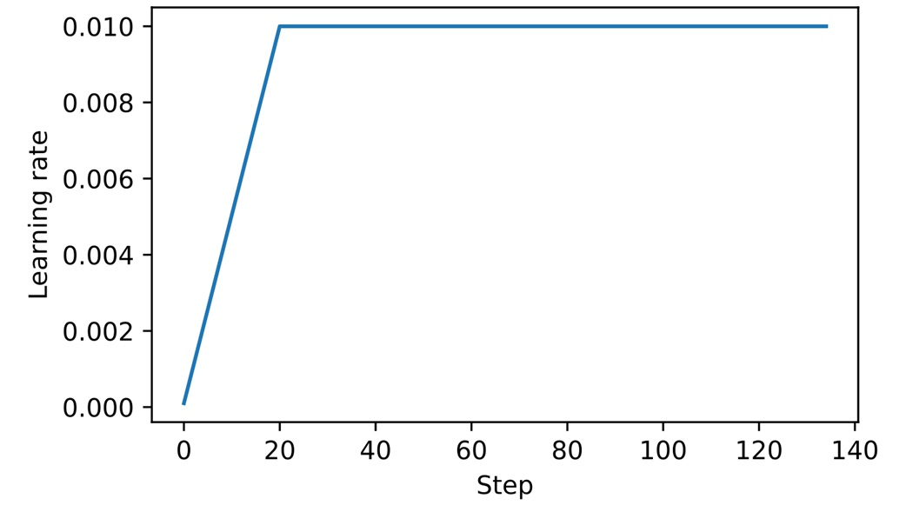
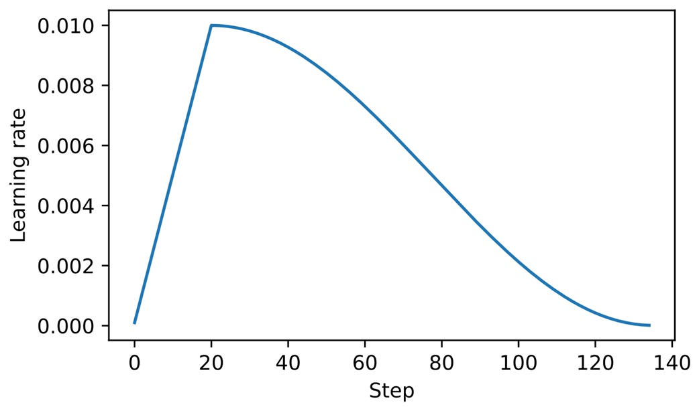
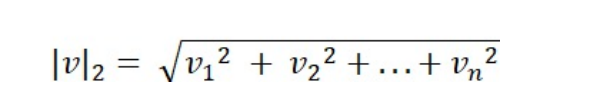
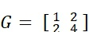
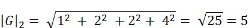
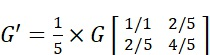

# 附录 D. 为训练循环添加增强功能

在本附录中，我们将改进第5至7章中用于预训练和微调的训练函数。本附录特别涵盖学习率预热、余弦衰减和梯度裁剪等技术的实现。  
最后一节将这些技术整合到第5章中开发的训练函数中，并进行LLM的预训练。

为了使本附录的代码独立运行，我们需要重新初始化第5章中训练的模型。

```python
import torch
from previous_chapters import GPTModel

GPT_CONFIG_124M = {
    "vocab_size": 50257,  # 词汇表大小
    "ctx_len": 256,       # 缩短的上下文长度（原始为1024）
    "emb_dim": 768,       # 嵌入维度
    "n_heads": 12,        # 注意力头数量
    "n_layers": 12,       # 层数
    "drop_rate": 0.1,     # Dropout率
    "qkv_bias": False     # 查询-键-值的偏置
}

device = torch.device("cuda" if torch.cuda.is_available() else "cpu")
torch.manual_seed(123)
model = GPTModel(GPT_CONFIG_124M)
model.eval()
```

初始化模型后，还需要初始化第5章中使用的数据加载器。首先，我们加载"The Verdict"短篇小说：

```python
import os
import urllib.request

file_path = "the-verdict.txt"
url = "https://raw.githubusercontent.com/rasbt/LLMs-from-scratch/main/ch02/01_main-chapter-code/the-verdict.txt"

if not os.path.exists(file_path):
    with urllib.request.urlopen(url) as response:
        text_data = response.read().decode('utf-8')
    with open(file_path, "w", encoding="utf-8") as file:
        file.write(text_data)
else:
    with open(file_path, "r", encoding="utf-8") as file:
        text_data = file.read()
```

接下来，将`text_data`加载到数据加载器中：

```python
from previous_chapters import create_dataloader_v1

train_ratio = 0.90
split_idx = int(train_ratio * len(text_data))
torch.manual_seed(123)

train_loader = create_dataloader_v1(
    text_data[:split_idx],
    batch_size=2,
    max_length=GPT_CONFIG_124M["ctx_len"],
    stride=GPT_CONFIG_124M["ctx_len"],
    drop_last=True,
    shuffle=True
)

val_loader = create_dataloader_v1(
    text_data[split_idx:],
    batch_size=2,
    max_length=GPT_CONFIG_124M["ctx_len"],
    stride=GPT_CONFIG_124M["ctx_len"],
    drop_last=False,
    shuffle=False
)
```

现在，我们已经重新实例化了第5章中使用的模型和数据加载器，接下来将介绍训练函数的增强功能。

## D.1 学习率预热

我们引入的第一个技术是学习率预热。实现学习率预热可以稳定训练复杂模型（如LLM）。  
这一过程通过逐渐将学习率从非常低的初始值（`initial_lr`）提高到用户指定的最大值（`peak_lr`）。训练初期使用较小的权重更新，可以降低模型在训练过程中遇到较大、不稳定更新的风险。

假设我们计划训练一个LLM，训练15个epoch，初始学习率为0.0001，最高提高到0.01。我们还定义了20个预热步骤，以在前20个训练步骤中将学习率从0.0001提高到0.01：

```python
n_epochs = 15
initial_lr = 0.0001
peak_lr = 0.01
warmup_steps = 20
```

接下来，我们实现一个简单的训练循环模板来说明预热过程：

```python
optimizer = torch.optim.AdamW(model.parameters(), weight_decay=0.1)
lr_increment = (peak_lr - initial_lr) / warmup_steps  # A
global_step = -1
track_lrs = []

for epoch in range(n_epochs):  # B
    for input_batch, target_batch in train_loader:
        optimizer.zero_grad()
        global_step += 1
        if global_step < warmup_steps:  # C
            lr = initial_lr + global_step * lr_increment
        else:
            lr = peak_lr
        for param_group in optimizer.param_groups:  # D
            param_group["lr"] = lr
        track_lrs.append(optimizer.param_groups[0]["lr"])  # E
```

运行上述代码后，我们可以通过绘制学习率变化图来验证预热是否按预期工作：

```python
import matplotlib.pyplot as plt

plt.ylabel("Learning rate")
plt.xlabel("Step")
total_training_steps = len(train_loader) * n_epochs
plt.plot(range(total_training_steps), track_lrs)
plt.show()
```

**图D.1** 学习率预热在前20个训练步骤中逐步提高学习率。20步后，学习率达到峰值0.01，并在剩余训练中保持恒定。

如图D.1所示，学习率从较低的初始值开始，经过20步上升到最大值。在下一节中，我们将进一步调整学习率，使其在达到最大值后逐渐下降，从而进一步提高模型训练效果。

## D.2 余弦衰减

另一个广泛采用的复杂深度神经网络和LLM的训练技术是余弦衰减。该方法在训练过程中以余弦曲线的方式调节学习率。

在一种常见的变体中，余弦衰减将学习率逐渐减少至接近零，模仿半余弦周期的轨迹。余弦衰减的逐渐减速更新有助于在训练后期保持训练的稳定性，减少超出损失最小值的风险。

我们可以在上一节的训练循环模板中添加余弦衰减功能，代码如下：

```python
import math

min_lr = 0.1 * initial_lr
track_lrs = []
lr_increment = (peak_lr - initial_lr) / warmup_steps
global_step = -1

for epoch in range(n_epochs):
    for input_batch, target_batch in train_loader:
        optimizer.zero_grad()
        global_step += 1
        if global_step < warmup_steps:
            lr = initial_lr + global_step * lr_increment
        else:  # B
            progress = ((global_step - warmup_steps) /
                        (total_training_steps - warmup_steps))
            lr = min_lr + (peak_lr - min_lr) * 0.5 * (1 + math.cos(math.pi * progress))
        for param_group in optimizer.param_groups:
            param_group["lr"] = lr
        track_lrs.append(optimizer.param_groups[0]["lr"])
```

再次绘制学习率图以验证学习率的变化：

```python
plt.ylabel("Learning rate")
plt.xlabel("Step")
plt.plot(range(total_training_steps), track_lrs)
plt.show()
```

**图D.2** 前20步线性学习率预热后，进入余弦衰减，逐渐降低学习率，直至训练结束时达到最低点。

如图D.2所示，学习率以线性预热阶段开始，在20步后达到最大值。接下来余弦衰减生效，学习率逐步降低，直到达到最低值。


## D.3 梯度裁剪
在本节中，我们引入了梯度裁剪，这是一种增强LLM训练稳定性的关键技术。该方法通过设置一个阈值，将超过该阈值的梯度缩小到预设的最大值。这一过程确保模型参数在反向传播期间的更新幅度保持在可控范围内。

例如，在PyTorch中使用clip_grad_norm_函数设置max_norm=1.0，可以确保梯度的范数不超过1.0。这里“范数”表示梯度向量在模型参数空间中的长度或幅度，特指L2范数（即欧几里得范数）。

数学上，对于一个由分量v = [v1, v2, ..., vn]组成的向量v，其L2范数描述为：


 
​
 
这一计算方法同样适用于矩阵。

例如，假设梯度矩阵为G。如果我们将这些梯度裁剪到max_norm=1，首先计算这些梯度的L2范数；如果范数超过1，就通过比例缩小它们，使得最终的范数正好等于1。

为了演示梯度裁剪过程，我们先初始化一个新模型并为一个训练批次计算损失，就像标准训练循环中的过程一样：

```python
from previous_chapters import calc_loss_batch

torch.manual_seed(123)
model = GPTModel(GPT_CONFIG_124M)
loss = calc_loss_batch(input_batch, target_batch, model, device)
loss.backward()
```
调用.backward()方法后，PyTorch计算损失梯度，并将它们存储在每个模型权重（参数）张量的.grad属性中。

为了演示，我们可以定义一个find_highest_gradient函数，在调用.backward()后扫描模型权重的.grad属性，找到最大的梯度值：

```python
def find_highest_gradient(model):
    max_grad = None
    for param in model.parameters():
        if param.grad is not None:
            grad_values = param.grad.data.flatten()
            max_grad_param = grad_values.max()
            if max_grad is None or max_grad_param > max_grad:
                max_grad = max_grad_param
    return max_grad

print(find_highest_gradient(model))
```
在上面的代码中，最大梯度值为：

```scss
tensor(0.0373)
```
接下来，我们应用梯度裁剪，这只需一行代码，并查看这对最大梯度值的影响：

```python
torch.nn.utils.clip_grad_norm_(model.parameters(), max_norm=1.0)
print(find_highest_gradient(model))
```
裁剪后，最大梯度值明显减小：

```scss
tensor(0.0166)
```
在下一节中，我们将把本附录中涉及的所有概念整合进LLM训练函数中。

D.4 修改后的训练函数
在本附录的最后一节中，我们改进了第5章的train_model_simple训练函数，增加了三种增强方法：线性预热、余弦衰减和梯度裁剪。这些方法共同有助于稳定LLM的训练。

以下是代码，对比train_model_simple的修改之处用注释标出：

```python
from previous_chapters import evaluate_model, generate_and_print_sample

def train_model(model, train_loader, val_loader, optimizer, device, n_epochs,
                eval_freq, eval_iter, start_context, warmup_steps=10,
                initial_lr=3e-05, min_lr=1e-6):
    train_losses, val_losses, track_tokens_seen, track_lrs = [], [], [], []
    tokens_seen, global_step = 0, -1
    peak_lr = optimizer.param_groups[0]["lr"]  # A
    total_training_steps = len(train_loader) * n_epochs  # B
    lr_increment = (peak_lr - initial_lr) / warmup_steps  # C

    for epoch in range(n_epochs):
        model.train()
        for input_batch, target_batch in train_loader:
            optimizer.zero_grad()
            global_step += 1
            if global_step < warmup_steps:  # D
                lr = initial_lr + global_step * lr_increment
            else:
                progress = ((global_step - warmup_steps) /
                            (total_training_steps - warmup_steps))
                lr = min_lr + (peak_lr - min_lr) * 0.5 * (
                    1 + math.cos(math.pi * progress))
            for param_group in optimizer.param_groups:  # E
                param_group["lr"] = lr
            track_lrs.append(lr)

            loss = calc_loss_batch(input_batch, target_batch, model, device)
            loss.backward()
            if global_step > warmup_steps:  # F
                torch.nn.utils.clip_grad_norm_(model.parameters(), max_norm=1.0)  # G
            optimizer.step()

            tokens_seen += input_batch.numel()
            if global_step % eval_freq == 0:
                train_loss, val_loss = evaluate_model(
                    model, train_loader, val_loader,
                    device, eval_iter
                )
                train_losses.append(train_loss)
                val_losses.append(val_loss)
                track_tokens_seen.append(tokens_seen)
                print(f"Ep {epoch+1} (Iter {global_step:06d}): "
                      f"Train loss {train_loss:.3f}, Val loss {val_loss:.3f}")
                generate_and_print_sample(
                    model, train_loader.dataset.tokenizer,
                    device, start_context
                )

    return train_losses, val_losses, track_tokens_seen, track_lrs
```
定义好train_model函数后，可以像第5章的train_model_simple方法那样用它来训练模型：

```python
torch.manual_seed(123)
model = GPTModel(GPT_CONFIG_124M)
model.to(device)
peak_lr = 5e-4
optimizer = torch.optim.AdamW(model.parameters(), weight_decay=0.1)
n_epochs = 15

train_losses, val_losses, tokens_seen, lrs = train_model(
    model, train_loader, val_loader, optimizer, device, n_epochs=n_epochs,
    eval_freq=5, eval_iter=1, start_context="Every effort moves you",
    warmup_steps=10, initial_lr=1e-5, min_lr=1e-5
)
```
在MacBook Air或类似的笔记本电脑上，训练大约需要5分钟，并输出如下内容：

```sql
Ep 1 (Iter 000000): Train loss 10.934, Val loss 10.939
Ep 1 (Iter 000005): Train loss 8.529, Val loss 8.843
Every effort moves you,,,,,,,,,,,,,,,,,,,,,,,,,,,,,,,,,,,,,,,,,,,,,,,,,,
Ep 2 (Iter 000010): Train loss 6.400, Val loss 6.825
Ep 2 (Iter 000015): Train loss 6.116, Val loss 6.861
Every effort moves you,,,,,,,,,,,,,,,,,,,,,,,,,,,,,,,,,,,,,,,,,,,,,,,,,,
...
the irony. She wanted him vindicated--and by me!" He laughed again, and threw back his head to look up at the sketch of the donkey. "There were days when I
Ep 15 (Iter 000130): Train loss 0.101, Val loss 6.707
Every effort moves you?" "Yes--quite insensible to the irony. She wanted him vindicated--and by me!" He laughed again, and threw back his head to look up at the sketch of the donkey. "There were days when I
```
与第5章一样，由于数据集很小并多次迭代，模型在几个epoch后开始过拟合。然而，从结果可以看出训练函数有效地降低了训练集的损失。

建议读者使用更大的文本数据集来训练模型，并将此更复杂的训练函数的结果与第5章的train_model_simple函数的结果进行比较。