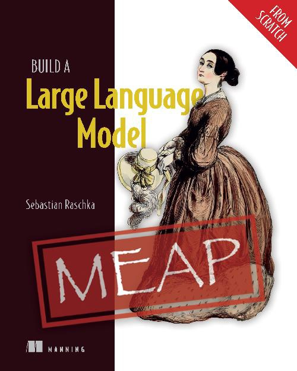

---
# https://vitepress.dev/reference/default-theme-home-page
layout: home

hero:
  name: "大模型知识库"
  text: "汇聚大模型相关的书籍、文章和资源"
  tagline: "探索前沿，理解大模型的世界"
  actions:
    - theme: brand
      text: "书籍与资料"
      link: /books-resources
    - theme: alt
      text: "文章与研究"
      link: /articles-research
---

# 书籍列表

  

    
    
这是一本关于技术主题的书，包含详细的技术文章。

  

---